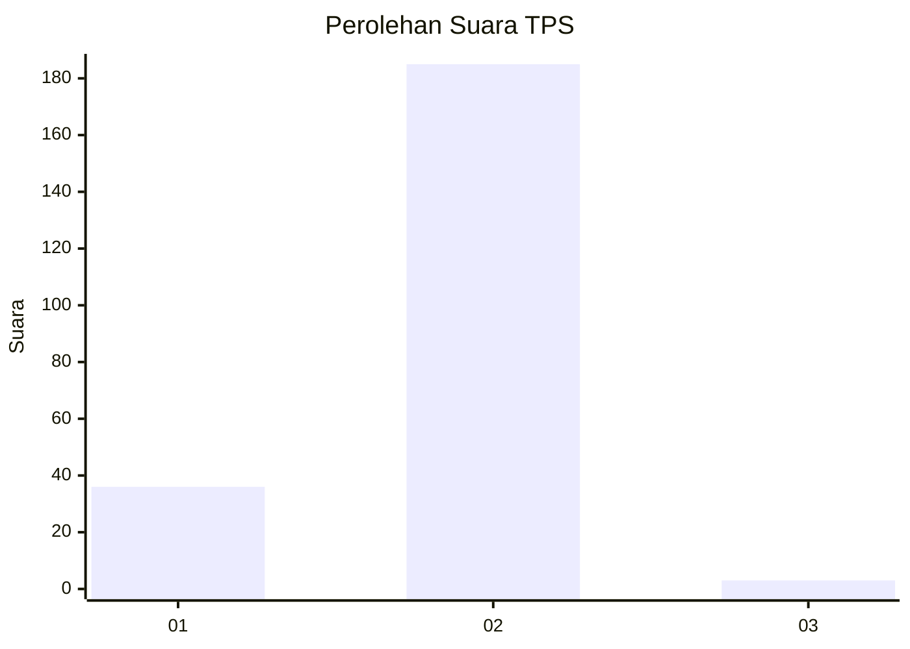
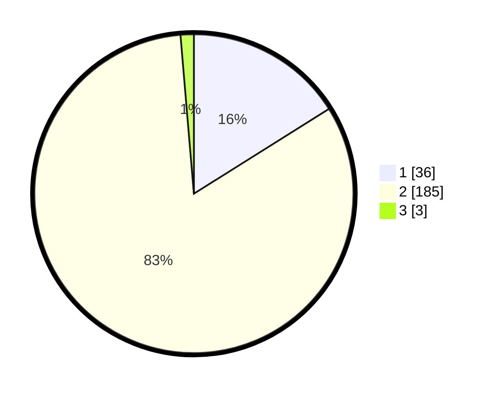

# Hasil

## Grafik

## Tabel

| No. | Nama Paslon    | Suara | Suara (raw) | Persentase |
|:--- |:-------------- | -----:| -----------:| ----------:|
| 1   | ANIES MUHAIMIN | 36    | [36][p-1]   | 16,07      |
| 2   | PRABOWO GIBRAN | 185   | [185][p-2]  | 82,59      |
| 3   | GANJAR MAHFUD  | 3     | [3][p-3]    | 1,34       |

[p-1]: https://github.com/gigit-pemilu/pemilu-2024-11-aceh/blob/main/pilpres/hitung-suara/sub/11-aceh/sub/03-aceh-timur/sub/13-indra-makmu/sub/2013-perkebunan-julok-rayeuk-utara/sub/002-tps/sub/paslon-1.txt
[p-2]: https://github.com/gigit-pemilu/pemilu-2024-11-aceh/blob/main/pilpres/hitung-suara/sub/11-aceh/sub/03-aceh-timur/sub/13-indra-makmu/sub/2013-perkebunan-julok-rayeuk-utara/sub/002-tps/sub/paslon-2.txt
[p-3]: https://github.com/gigit-pemilu/pemilu-2024-11-aceh/blob/main/pilpres/hitung-suara/sub/11-aceh/sub/03-aceh-timur/sub/13-indra-makmu/sub/2013-perkebunan-julok-rayeuk-utara/sub/002-tps/sub/paslon-3.txt

## Foto C Plano

https://sirekap-obj-formc.kpu.go.id/3bf6/pemilu/ppwp/11/03/13/20/13/1103132013002-20240215-123256--382c56c7-b76b-4c3f-bf6d-44bec3a8b7b1.jpg

https://sirekap-obj-formc.kpu.go.id/3bf6/pemilu/ppwp/11/03/13/20/13/1103132013002-20240215-123412--03c6e8f4-e8fb-4c3c-b764-1f2efd9f506c.jpg

https://sirekap-obj-formc.kpu.go.id/3bf6/pemilu/ppwp/11/03/13/20/13/1103132013002-20240215-123610--0ccfc3cd-50b2-4920-9204-482a760db25e.jpg

## Metadata

| Key        | Value               |
| ---------- | ------------------- |
| Time Stamp | 2024-02-19 06:16:00 |

## DATA PEMILIH TETAP

Jumlah pemilih dalam DPT: **289**.
 * L: **154**.
 * P: **135**.

## DATA PENGGUNA HAK PILIH

Jumlah pengguna hak pilih dalam DPT: **221**.
 * L: **116**.
 * P: **105**.

Jumlah pengguna hak pilih dalam DPTb: **2**.
 * L: **1**.
 * P: **1**.

Jumlah pengguna hak pilih dalam DPK: **1**.
 * L: **1**.
 * P: **0**.

Jumlah pengguna hak pilih: **224**.
 * L: **118**.
 * P: **106**.

## JUMLAH SUARA SAH DAN TIDAK SAH

JUMLAH SELURUH SUARA SAH: **224**.

JUMLAH SUARA TIDAK SAH: **0**.

JUMLAH SELURUH SUARA SAH DAN SUARA TIDAK SAH: **224**.

