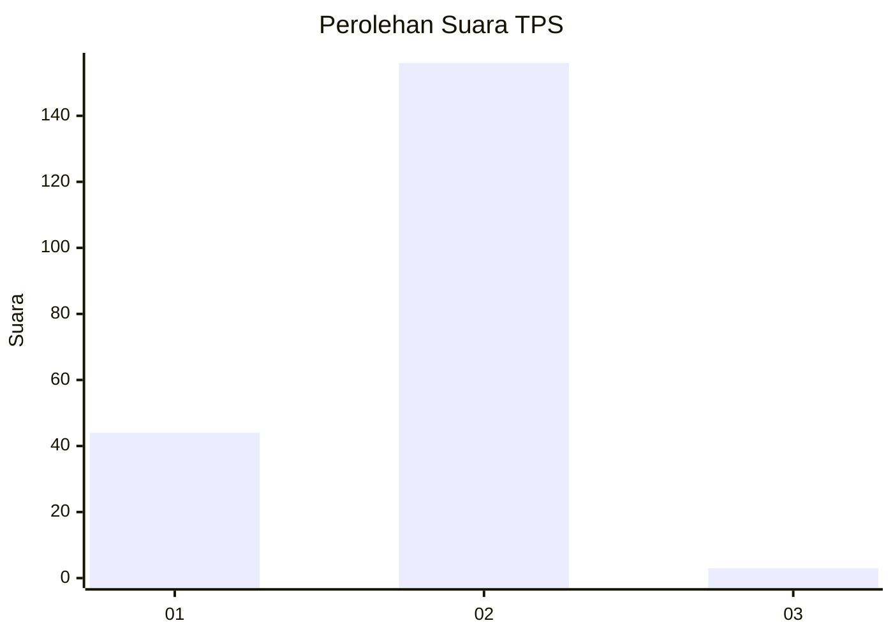
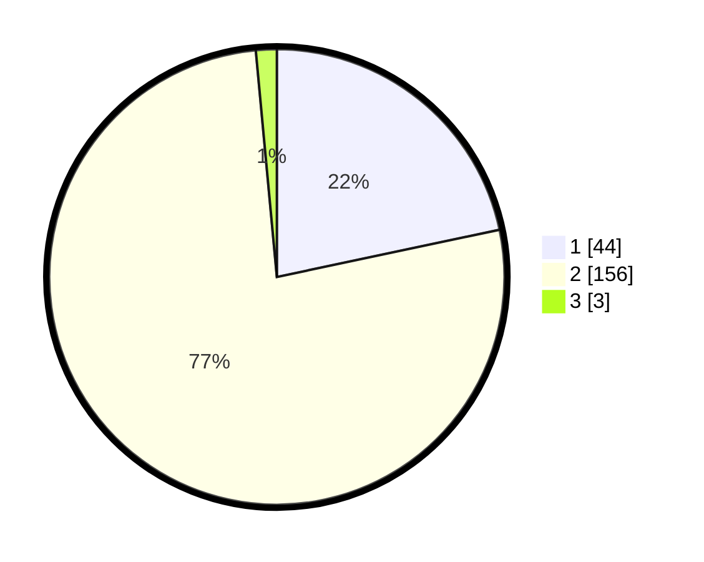

# Hasil

## Grafik

## Tabel

| No. | Nama Paslon    | Suara | Suara (raw) | Persentase |
|:--- |:-------------- | -----:| -----------:| ----------:|
| 1   | ANIES MUHAIMIN | 44    | [44][p-1]   | 21,67      |
| 2   | PRABOWO GIBRAN | 156   | [156][p-2]  | 76,85      |
| 3   | GANJAR MAHFUD  | 3     | [3][p-3]    | 1,48       |

[p-1]: https://github.com/gigit-pemilu/pemilu-2024-11-aceh/blob/main/pilpres/hitung-suara/sub/11-aceh/sub/03-aceh-timur/sub/13-indra-makmu/sub/2013-perkebunan-julok-rayeuk-utara/sub/003-tps/sub/paslon-1.txt
[p-2]: https://github.com/gigit-pemilu/pemilu-2024-11-aceh/blob/main/pilpres/hitung-suara/sub/11-aceh/sub/03-aceh-timur/sub/13-indra-makmu/sub/2013-perkebunan-julok-rayeuk-utara/sub/003-tps/sub/paslon-2.txt
[p-3]: https://github.com/gigit-pemilu/pemilu-2024-11-aceh/blob/main/pilpres/hitung-suara/sub/11-aceh/sub/03-aceh-timur/sub/13-indra-makmu/sub/2013-perkebunan-julok-rayeuk-utara/sub/003-tps/sub/paslon-3.txt

## Foto C Plano

https://sirekap-obj-formc.kpu.go.id/69b2/pemilu/ppwp/11/03/13/20/13/1103132013003-20240214-213519--ab75e596-0837-448b-9833-1dce4ae7b8cd.jpg

https://sirekap-obj-formc.kpu.go.id/69b2/pemilu/ppwp/11/03/13/20/13/1103132013003-20240214-202346--7a0f080f-6800-4dfb-9785-097bcabacc6d.jpg

https://sirekap-obj-formc.kpu.go.id/69b2/pemilu/ppwp/11/03/13/20/13/1103132013003-20240214-203143--87d96d1c-6820-4aa6-a89d-b8607263f1c8.jpg

## Metadata

| Key        | Value               |
| ---------- | ------------------- |
| Time Stamp | 2024-02-21 14:00:00 |

