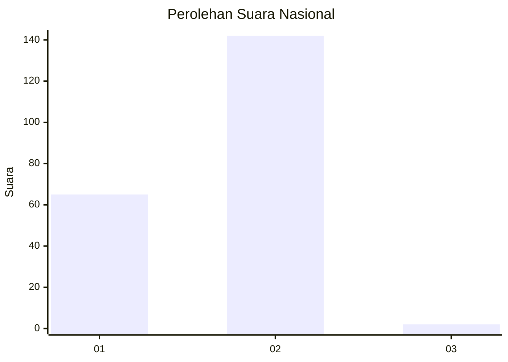
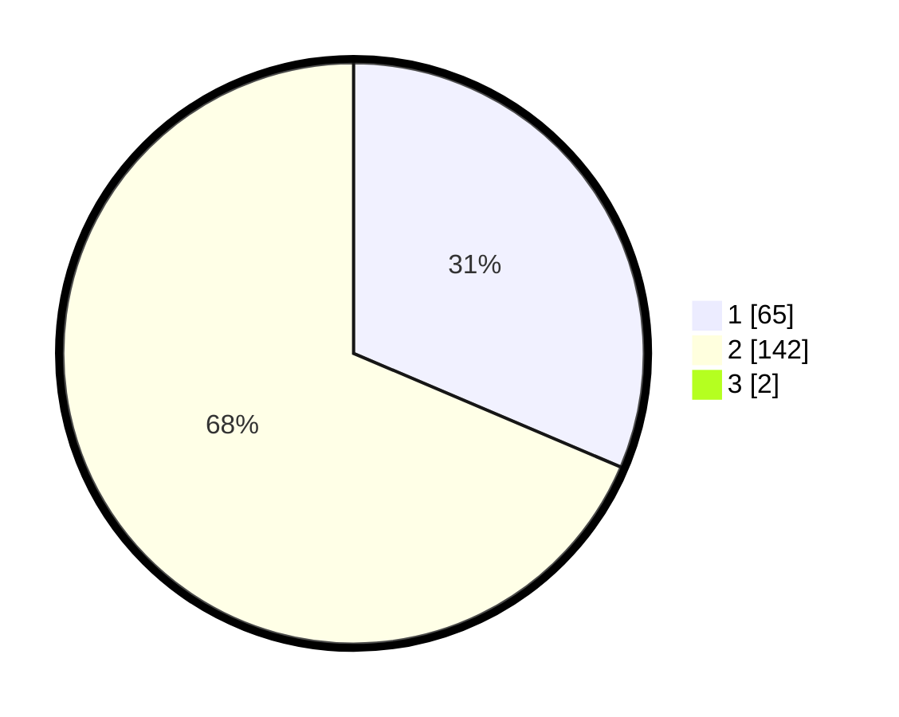

# Hasil

## Grafik

## Tabel

| No. | Nama Paslon    | Suara | Suara (raw) | Persentase |
|:--- |:-------------- | -----:| -----------:| ----------:|
| 1   | ANIES MUHAIMIN | 65    | [65][p-1]   | 31,10      |
| 2   | PRABOWO GIBRAN | 142   | [142][p-2]  | 67,94      |
| 3   | GANJAR MAHFUD  | 2     | [2][p-3]    | 0,96       |

[p-1]: https://github.com/gigit-pemilu/pemilu-2024/blob/main/pilpres/hitung-suara/sub/11-aceh/sub/03-aceh-timur/sub/13-indra-makmu/sub/2013-perkebunan-julok-rayeuk-utara/sub/004-tps/sub/paslon-1.txt
[p-2]: https://github.com/gigit-pemilu/pemilu-2024/blob/main/pilpres/hitung-suara/sub/11-aceh/sub/03-aceh-timur/sub/13-indra-makmu/sub/2013-perkebunan-julok-rayeuk-utara/sub/004-tps/sub/paslon-2.txt
[p-3]: https://github.com/gigit-pemilu/pemilu-2024/blob/main/pilpres/hitung-suara/sub/11-aceh/sub/03-aceh-timur/sub/13-indra-makmu/sub/2013-perkebunan-julok-rayeuk-utara/sub/004-tps/sub/paslon-3.txt

## Foto C Plano

https://sirekap-obj-formc.kpu.go.id/63e2/pemilu/ppwp/11/03/13/20/13/1103132013004-20240215-085150--bd536c74-ffde-4810-ac10-89417147b051.jpg

https://sirekap-obj-formc.kpu.go.id/63e2/pemilu/ppwp/11/03/13/20/13/1103132013004-20240215-085248--ec54535b-42cb-4f4b-ba1d-ae685e40cec3.jpg

https://sirekap-obj-formc.kpu.go.id/63e2/pemilu/ppwp/11/03/13/20/13/1103132013004-20240215-085354--6b498580-3dfb-4ecb-8257-5c5b74d2a32e.jpg

## Metadata

| Key        | Value               |
| ---------- | ------------------- |
| Time Stamp | 2024-02-19 06:16:00 |

