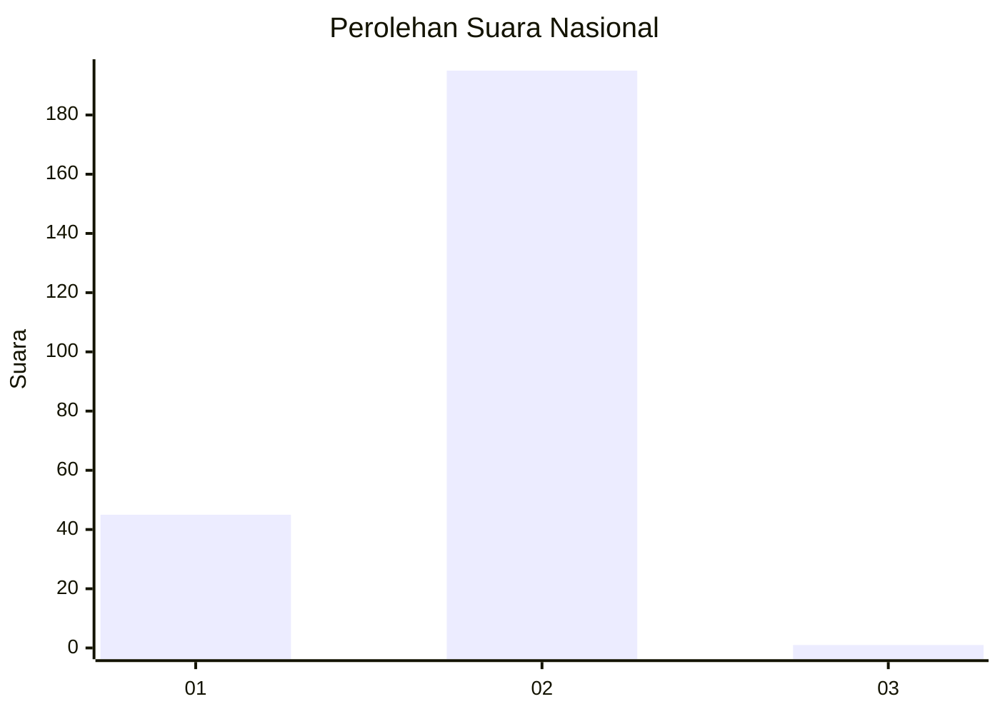
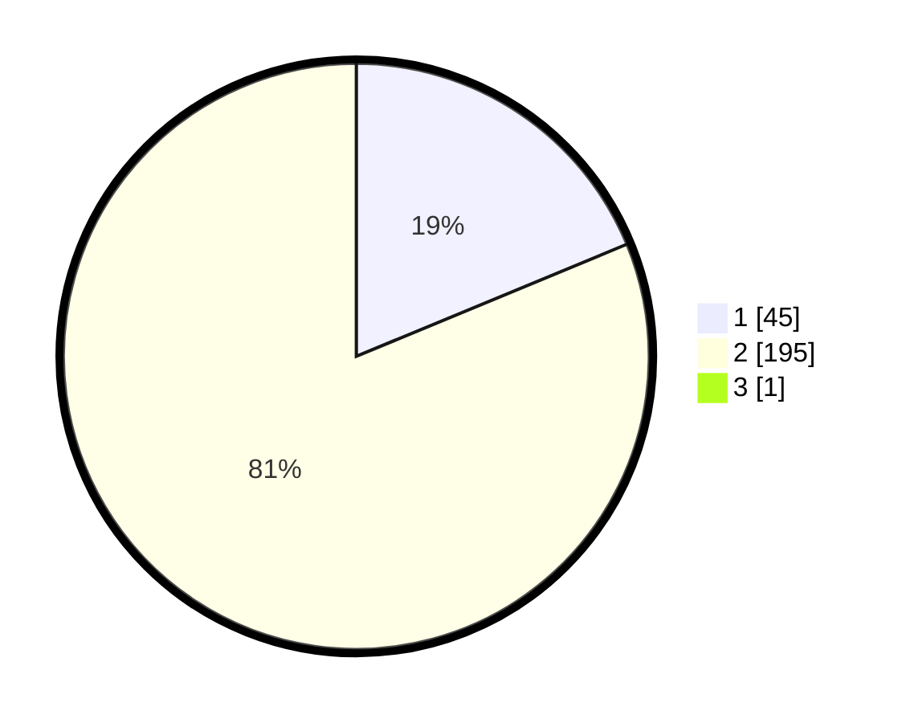

# Hasil

## Grafik

## Tabel

| No. | Nama Paslon    | Suara | Suara (raw) | Persentase |
|:--- |:-------------- | -----:| -----------:| ----------:|
| 1   | ANIES MUHAIMIN | 45    | [45][p-1]   | 18,67      |
| 2   | PRABOWO GIBRAN | 195   | [195][p-2]  | 80,91      |
| 3   | GANJAR MAHFUD  | 1     | [1][p-3]    | 0,41       |

[p-1]: https://github.com/gigit-pemilu/pemilu-2024/blob/main/pilpres/hitung-suara/sub/11-aceh/sub/03-aceh-timur/sub/13-indra-makmu/sub/2013-perkebunan-julok-rayeuk-utara/sub/005-tps/sub/paslon-1.txt
[p-2]: https://github.com/gigit-pemilu/pemilu-2024/blob/main/pilpres/hitung-suara/sub/11-aceh/sub/03-aceh-timur/sub/13-indra-makmu/sub/2013-perkebunan-julok-rayeuk-utara/sub/005-tps/sub/paslon-2.txt
[p-3]: https://github.com/gigit-pemilu/pemilu-2024/blob/main/pilpres/hitung-suara/sub/11-aceh/sub/03-aceh-timur/sub/13-indra-makmu/sub/2013-perkebunan-julok-rayeuk-utara/sub/005-tps/sub/paslon-3.txt

## Foto C Plano

https://sirekap-obj-formc.kpu.go.id/851d/pemilu/ppwp/11/03/13/20/13/1103132013005-20240221-155954--16ba1a1a-4fc2-4a4e-a49a-81ae542559f3.jpg

https://sirekap-obj-formc.kpu.go.id/851d/pemilu/ppwp/11/03/13/20/13/1103132013005-20240221-160106--c357c538-4323-4eaa-90e8-d9fbc379c5a7.jpg

https://sirekap-obj-formc.kpu.go.id/851d/pemilu/ppwp/11/03/13/20/13/1103132013005-20240221-160436--ef85e971-f186-4613-a32b-58a5d7749c71.jpg

## Metadata

| Key        | Value               |
| ---------- | ------------------- |
| Time Stamp | 2024-02-24 22:31:28 |

