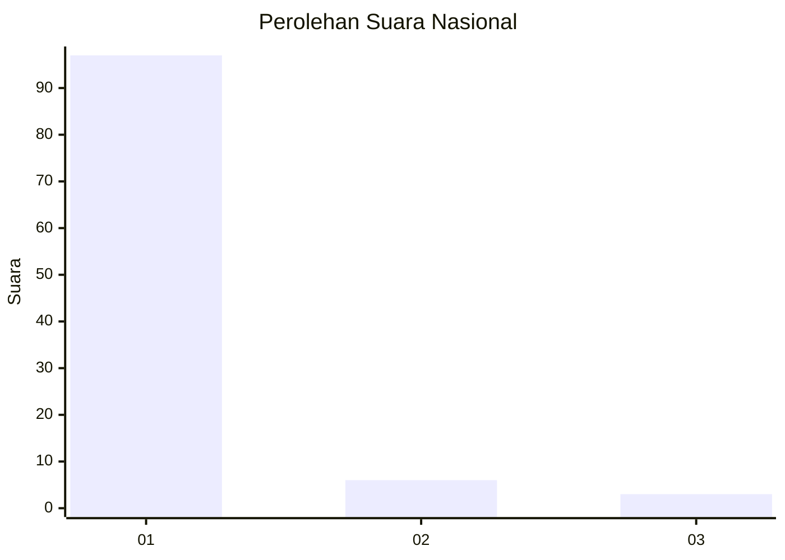
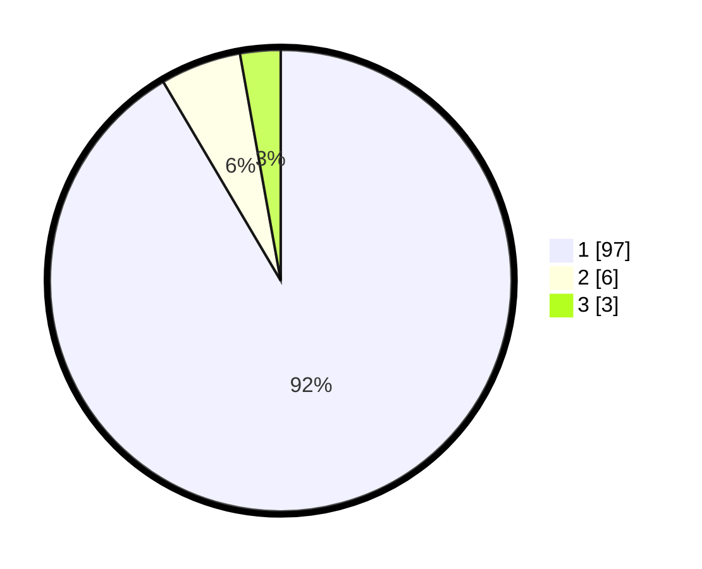

# Hasil

## Grafik

## Tabel

| No. | Nama Paslon    | Suara | Suara (raw) | Persentase |
|:--- |:-------------- | -----:| -----------:| ----------:|
| 1   | ANIES MUHAIMIN | 97    | [97][p-1]   | 91,51      |
| 2   | PRABOWO GIBRAN | 6     | [6][p-2]    | 5,66       |
| 3   | GANJAR MAHFUD  | 3     | [3][p-3]    | 2,83       |

[p-1]: https://github.com/gigit-pemilu/pemilu-2024/blob/main/pilpres/hitung-suara/sub/11-aceh/sub/03-aceh-timur/sub/14-idi-tunong/sub/2002-seuneubok-baro/sub/001-tps/sub/paslon-1.txt
[p-2]: https://github.com/gigit-pemilu/pemilu-2024/blob/main/pilpres/hitung-suara/sub/11-aceh/sub/03-aceh-timur/sub/14-idi-tunong/sub/2002-seuneubok-baro/sub/001-tps/sub/paslon-2.txt
[p-3]: https://github.com/gigit-pemilu/pemilu-2024/blob/main/pilpres/hitung-suara/sub/11-aceh/sub/03-aceh-timur/sub/14-idi-tunong/sub/2002-seuneubok-baro/sub/001-tps/sub/paslon-3.txt

## Foto C Plano

https://sirekap-obj-formc.kpu.go.id/176d/pemilu/ppwp/11/03/14/20/02/1103142002001-20240222-152954--eb974f2c-3fc2-4b96-9527-da05ac282ad7.jpg

https://sirekap-obj-formc.kpu.go.id/176d/pemilu/ppwp/11/03/14/20/02/1103142002001-20240222-153122--7189edaa-4ea0-4326-9f2a-039d2758d251.jpg

https://sirekap-obj-formc.kpu.go.id/176d/pemilu/ppwp/11/03/14/20/02/1103142002001-20240222-153257--4f554d8d-c3bc-4dee-aa41-0cb5c9f998b7.jpg

## Metadata

| Key        | Value               |
| ---------- | ------------------- |
| Time Stamp | 2024-02-24 22:31:28 |

## DATA PEMILIH TETAP

Jumlah pemilih dalam DPT: **122**.
 * L: **57**.
 * P: **65**.

## DATA PENGGUNA HAK PILIH

Jumlah pengguna hak pilih dalam DPT: **110**.
 * L: **49**.
 * P: **61**.

Jumlah pengguna hak pilih dalam DPTb: **0**.
 * L: **0**.
 * P: **0**.

Jumlah pengguna hak pilih dalam DPK: **0**.
 * L: **0**.
 * P: **0**.

Jumlah pengguna hak pilih: **110**.
 * L: **49**.
 * P: **61**.

## JUMLAH SUARA SAH DAN TIDAK SAH

JUMLAH SELURUH SUARA SAH: **106**.

JUMLAH SUARA TIDAK SAH: **4**.

JUMLAH SELURUH SUARA SAH DAN SUARA TIDAK SAH: **110**.

