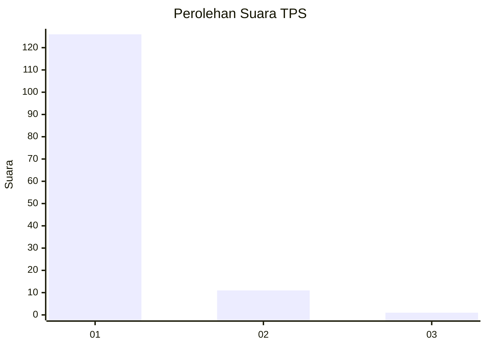
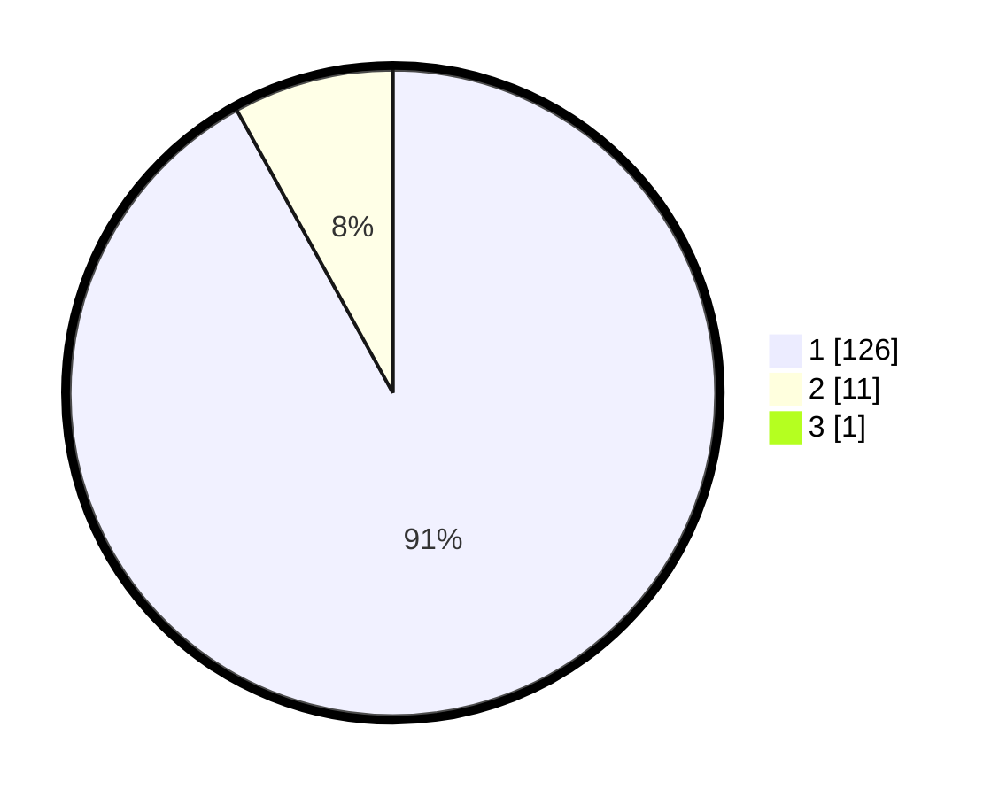

# Hasil

## Grafik

## Tabel

| No. | Nama Paslon    | Suara | Suara (raw) | Persentase |
|:--- |:-------------- | -----:| -----------:| ----------:|
| 1   | ANIES MUHAIMIN | 126   | [126][p-1]  | 91,30      |
| 2   | PRABOWO GIBRAN | 11    | [11][p-2]   | 7,97       |
| 3   | GANJAR MAHFUD  | 1     | [1][p-3]    | 0,72       |

[p-1]: https://github.com/gigit-pemilu/pemilu-2024-11-aceh/blob/main/pilpres/hitung-suara/sub/11-aceh/sub/03-aceh-timur/sub/14-idi-tunong/sub/2003-seuneubok-meureudu/sub/002-tps/sub/paslon-1.txt
[p-2]: https://github.com/gigit-pemilu/pemilu-2024-11-aceh/blob/main/pilpres/hitung-suara/sub/11-aceh/sub/03-aceh-timur/sub/14-idi-tunong/sub/2003-seuneubok-meureudu/sub/002-tps/sub/paslon-2.txt
[p-3]: https://github.com/gigit-pemilu/pemilu-2024-11-aceh/blob/main/pilpres/hitung-suara/sub/11-aceh/sub/03-aceh-timur/sub/14-idi-tunong/sub/2003-seuneubok-meureudu/sub/002-tps/sub/paslon-3.txt

## Foto C Plano

https://sirekap-obj-formc.kpu.go.id/2ba0/pemilu/ppwp/11/03/14/20/03/1103142003002-20240222-173359--0b8f0810-8ae2-4e0d-ab72-c6c05552eb4e.jpg

https://sirekap-obj-formc.kpu.go.id/2ba0/pemilu/ppwp/11/03/14/20/03/1103142003002-20240222-173454--7acc295f-8812-48ac-8ddd-dfab0f12624d.jpg

https://sirekap-obj-formc.kpu.go.id/2ba0/pemilu/ppwp/11/03/14/20/03/1103142003002-20240222-173738--8fea0cd8-473d-4267-91c8-2236b8e6a221.jpg

## Metadata

| Key        | Value               |
| ---------- | ------------------- |
| Time Stamp | 2024-02-24 22:31:28 |

