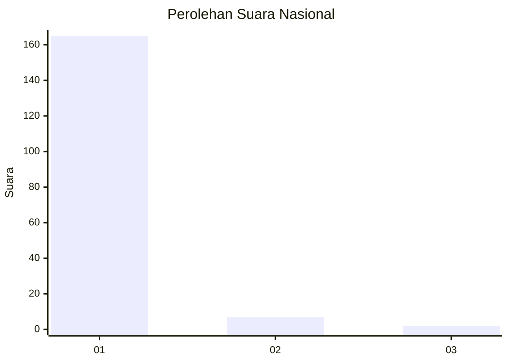
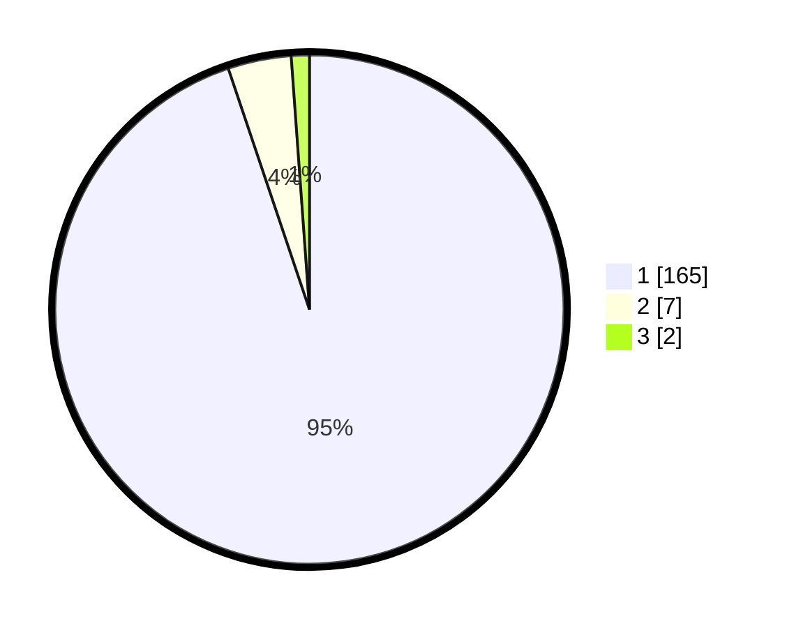

# Hasil

## Grafik

## Tabel

| No. | Nama Paslon    | Suara | Suara (raw) | Persentase |
|:--- |:-------------- | -----:| -----------:| ----------:|
| 1   | ANIES MUHAIMIN | 165   | [165][p-1]  | 94,83      |
| 2   | PRABOWO GIBRAN | 7     | [7][p-2]    | 4,02       |
| 3   | GANJAR MAHFUD  | 2     | [2][p-3]    | 1,15       |

[p-1]: https://github.com/gigit-pemilu/pemilu-2024/blob/main/pilpres/hitung-suara/sub/11-aceh/sub/03-aceh-timur/sub/14-idi-tunong/sub/2004-seuneubok-teupin-panah/sub/001-tps/sub/paslon-1.txt
[p-2]: https://github.com/gigit-pemilu/pemilu-2024/blob/main/pilpres/hitung-suara/sub/11-aceh/sub/03-aceh-timur/sub/14-idi-tunong/sub/2004-seuneubok-teupin-panah/sub/001-tps/sub/paslon-2.txt
[p-3]: https://github.com/gigit-pemilu/pemilu-2024/blob/main/pilpres/hitung-suara/sub/11-aceh/sub/03-aceh-timur/sub/14-idi-tunong/sub/2004-seuneubok-teupin-panah/sub/001-tps/sub/paslon-3.txt

## Foto C Plano

https://sirekap-obj-formc.kpu.go.id/489f/pemilu/ppwp/11/03/14/20/04/1103142004001-20240214-215836--4e2cf952-6c2b-4068-9156-3adc82d51b7f.jpg

https://sirekap-obj-formc.kpu.go.id/489f/pemilu/ppwp/11/03/14/20/04/1103142004001-20240214-215703--6b60c431-a191-4deb-9162-90c2fa3846b1.jpg

https://sirekap-obj-formc.kpu.go.id/489f/pemilu/ppwp/11/03/14/20/04/1103142004001-20240214-215759--f7f788b5-cf83-4300-a767-2faf316d6f1e.jpg

## Metadata

| Key        | Value               |
| ---------- | ------------------- |
| Time Stamp | 2024-02-21 12:00:00 |

## DATA PEMILIH TETAP

Jumlah pemilih dalam DPT: **225**.
 * L: **118**.
 * P: **107**.

## DATA PENGGUNA HAK PILIH

Jumlah pengguna hak pilih dalam DPT: **174**.
 * L: **80**.
 * P: **94**.

Jumlah pengguna hak pilih dalam DPTb: **2**.
 * L: **0**.
 * P: **2**.

Jumlah pengguna hak pilih dalam DPK: **1**.
 * L: **1**.
 * P: **0**.

Jumlah pengguna hak pilih: **177**.
 * L: **81**.
 * P: **96**.

## JUMLAH SUARA SAH DAN TIDAK SAH

JUMLAH SELURUH SUARA SAH: **174**.

JUMLAH SUARA TIDAK SAH: **3**.

JUMLAH SELURUH SUARA SAH DAN SUARA TIDAK SAH: **177**.

