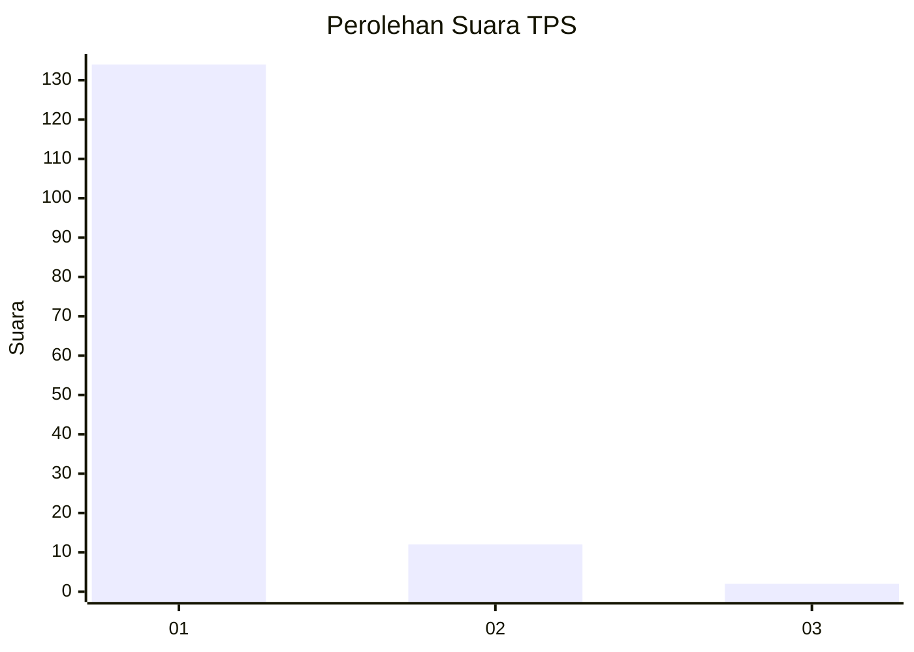
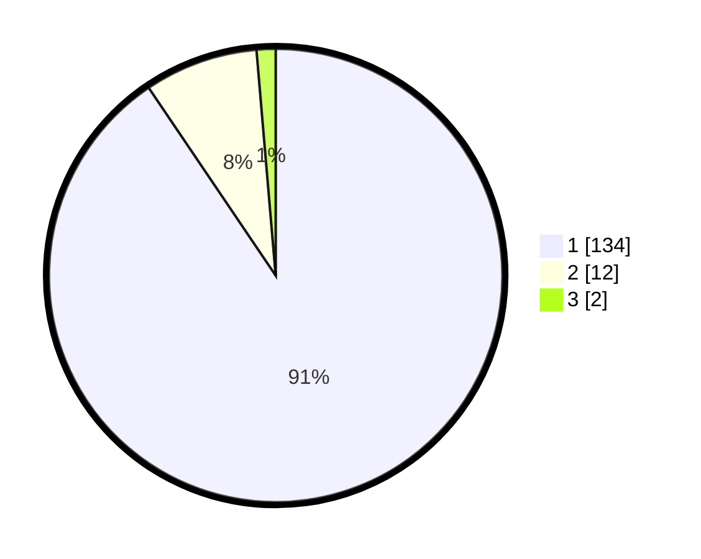

# Hasil

## Grafik

## Tabel

| No. | Nama Paslon    | Suara | Suara (raw) | Persentase |
|:--- |:-------------- | -----:| -----------:| ----------:|
| 1   | ANIES MUHAIMIN | 134   | [134][p-1]  | 90,54      |
| 2   | PRABOWO GIBRAN | 12    | [12][p-2]   | 8,11       |
| 3   | GANJAR MAHFUD  | 2     | [2][p-3]    | 1,35       |

[p-1]: https://github.com/gigit-pemilu/pemilu-2024-11-aceh/blob/main/pilpres/hitung-suara/sub/11-aceh/sub/03-aceh-timur/sub/14-idi-tunong/sub/2005-teupin-panah/sub/001-tps/sub/paslon-1.txt
[p-2]: https://github.com/gigit-pemilu/pemilu-2024-11-aceh/blob/main/pilpres/hitung-suara/sub/11-aceh/sub/03-aceh-timur/sub/14-idi-tunong/sub/2005-teupin-panah/sub/001-tps/sub/paslon-2.txt
[p-3]: https://github.com/gigit-pemilu/pemilu-2024-11-aceh/blob/main/pilpres/hitung-suara/sub/11-aceh/sub/03-aceh-timur/sub/14-idi-tunong/sub/2005-teupin-panah/sub/001-tps/sub/paslon-3.txt

## Foto C Plano

https://sirekap-obj-formc.kpu.go.id/49ad/pemilu/ppwp/11/03/14/20/05/1103142005001-20240215-030030--91139793-d78d-43a8-9313-9e4606200f36.jpg

https://sirekap-obj-formc.kpu.go.id/49ad/pemilu/ppwp/11/03/14/20/05/1103142005001-20240214-235144--c70cc357-07b0-4b38-a3e4-bee35756c5d9.jpg

## Metadata

| Key        | Value               |
| ---------- | ------------------- |
| Time Stamp | 2024-02-19 06:16:00 |

