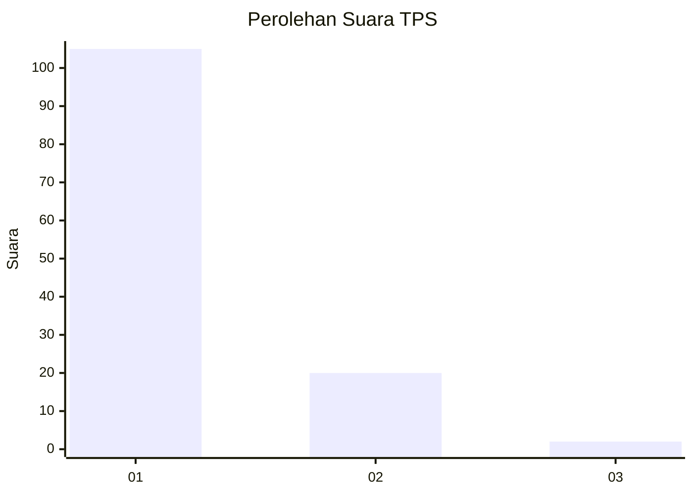
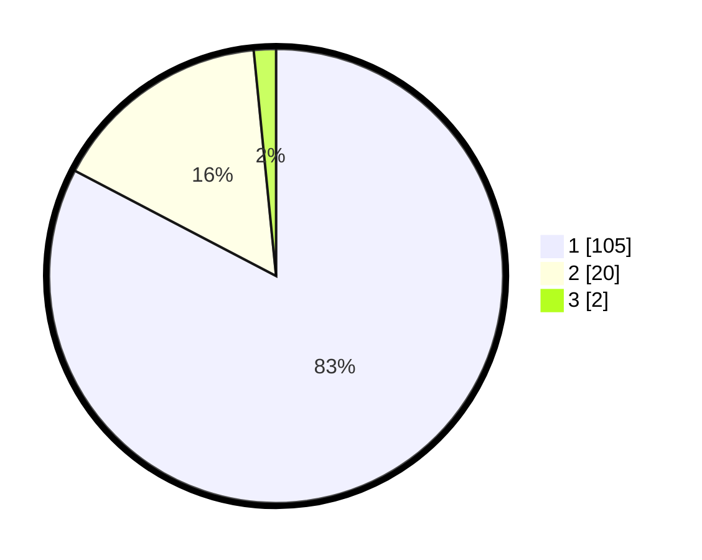

# Hasil

## Grafik

## Tabel

| No. | Nama Paslon    | Suara | Suara (raw) | Persentase |
|:--- |:-------------- | -----:| -----------:| ----------:|
| 1   | ANIES MUHAIMIN | 105   | [105][p-1]  | 82,68      |
| 2   | PRABOWO GIBRAN | 20    | [20][p-2]   | 15,75      |
| 3   | GANJAR MAHFUD  | 2     | [2][p-3]    | 1,57       |

[p-1]: https://github.com/gigit-pemilu/pemilu-2024-11-aceh/blob/main/pilpres/hitung-suara/sub/11-aceh/sub/03-aceh-timur/sub/14-idi-tunong/sub/2006-gampong-keumuneng/sub/001-tps/sub/paslon-1.txt
[p-2]: https://github.com/gigit-pemilu/pemilu-2024-11-aceh/blob/main/pilpres/hitung-suara/sub/11-aceh/sub/03-aceh-timur/sub/14-idi-tunong/sub/2006-gampong-keumuneng/sub/001-tps/sub/paslon-2.txt
[p-3]: https://github.com/gigit-pemilu/pemilu-2024-11-aceh/blob/main/pilpres/hitung-suara/sub/11-aceh/sub/03-aceh-timur/sub/14-idi-tunong/sub/2006-gampong-keumuneng/sub/001-tps/sub/paslon-3.txt

## Foto C Plano

https://sirekap-obj-formc.kpu.go.id/d069/pemilu/ppwp/11/03/14/20/06/1103142006001-20240222-140346--97418dc9-a11a-45ba-be9a-a9c637c3b42a.jpg

https://sirekap-obj-formc.kpu.go.id/d069/pemilu/ppwp/11/03/14/20/06/1103142006001-20240222-140701--50cfdb92-0bee-4ea1-86f7-27fe8e6e2f97.jpg

https://sirekap-obj-formc.kpu.go.id/d069/pemilu/ppwp/11/03/14/20/06/1103142006001-20240222-141304--2c2d7c11-31c0-4b97-b32b-213bf6f9fced.jpg

## Metadata

| Key        | Value               |
| ---------- | ------------------- |
| Time Stamp | 2024-02-22 15:00:00 |

## DATA PEMILIH TETAP

Jumlah pemilih dalam DPT: **167**.
 * L: **77**.
 * P: **90**.

## DATA PENGGUNA HAK PILIH

Jumlah pengguna hak pilih dalam DPT: **127**.
 * L: **52**.
 * P: **75**.

Jumlah pengguna hak pilih dalam DPTb: **2**.
 * L: **1**.
 * P: **1**.

Jumlah pengguna hak pilih dalam DPK: **2**.
 * L: **2**.
 * P: **0**.

Jumlah pengguna hak pilih: **131**.
 * L: **55**.
 * P: **76**.

## JUMLAH SUARA SAH DAN TIDAK SAH

JUMLAH SELURUH SUARA SAH: **127**.

JUMLAH SUARA TIDAK SAH: **4**.

JUMLAH SELURUH SUARA SAH DAN SUARA TIDAK SAH: **131**.

