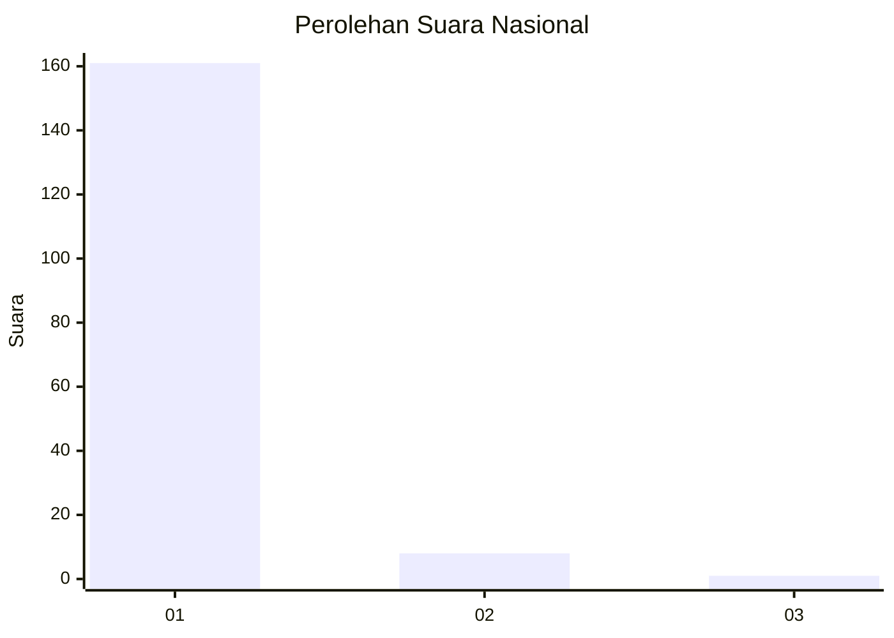
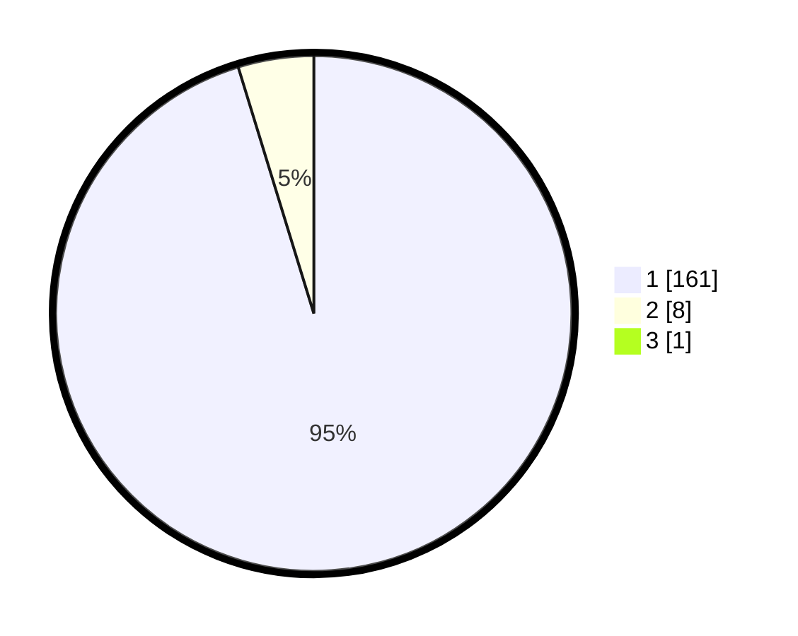

# Hasil

## Grafik

## Tabel

| No. | Nama Paslon    | Suara | Suara (raw) | Persentase |
|:--- |:-------------- | -----:| -----------:| ----------:|
| 1   | ANIES MUHAIMIN | 161   | [161][p-1]  | 94,71      |
| 2   | PRABOWO GIBRAN | 8     | [8][p-2]    | 4,71       |
| 3   | GANJAR MAHFUD  | 1     | [1][p-3]    | 0,59       |

[p-1]: https://github.com/gigit-pemilu/pemilu-2024/blob/main/pilpres/hitung-suara/sub/11-aceh/sub/03-aceh-timur/sub/14-idi-tunong/sub/2009-paya-awee/sub/001-tps/sub/paslon-1.txt
[p-2]: https://github.com/gigit-pemilu/pemilu-2024/blob/main/pilpres/hitung-suara/sub/11-aceh/sub/03-aceh-timur/sub/14-idi-tunong/sub/2009-paya-awee/sub/001-tps/sub/paslon-2.txt
[p-3]: https://github.com/gigit-pemilu/pemilu-2024/blob/main/pilpres/hitung-suara/sub/11-aceh/sub/03-aceh-timur/sub/14-idi-tunong/sub/2009-paya-awee/sub/001-tps/sub/paslon-3.txt

## Foto C Plano

https://sirekap-obj-formc.kpu.go.id/7f18/pemilu/ppwp/11/03/14/20/09/1103142009001-20240214-193824--db5f1a15-6a5d-4a28-8a6a-93acf39642f2.jpg

https://sirekap-obj-formc.kpu.go.id/7f18/pemilu/ppwp/11/03/14/20/09/1103142009001-20240217-171743--e84e7494-d21e-420a-9f28-8f0517311fea.jpg

https://sirekap-obj-formc.kpu.go.id/7f18/pemilu/ppwp/11/03/14/20/09/1103142009001-20240215-204819--55651d35-fe17-48ed-97f8-185b27a77f8e.jpg

## Metadata

| Key        | Value               |
| ---------- | ------------------- |
| Time Stamp | 2024-02-19 06:16:00 |

