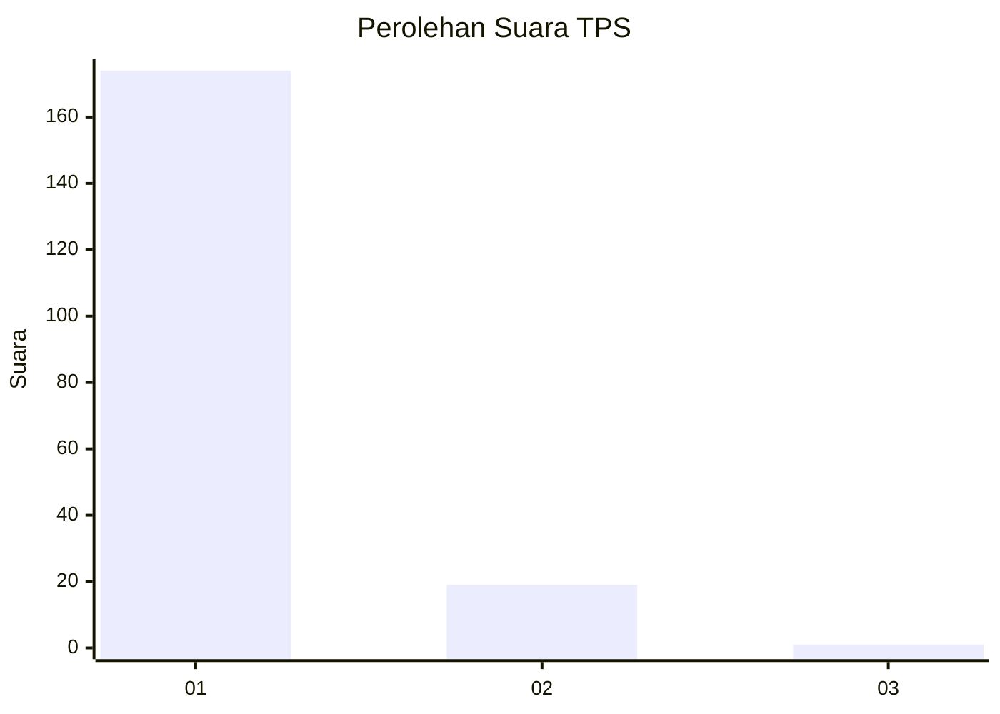
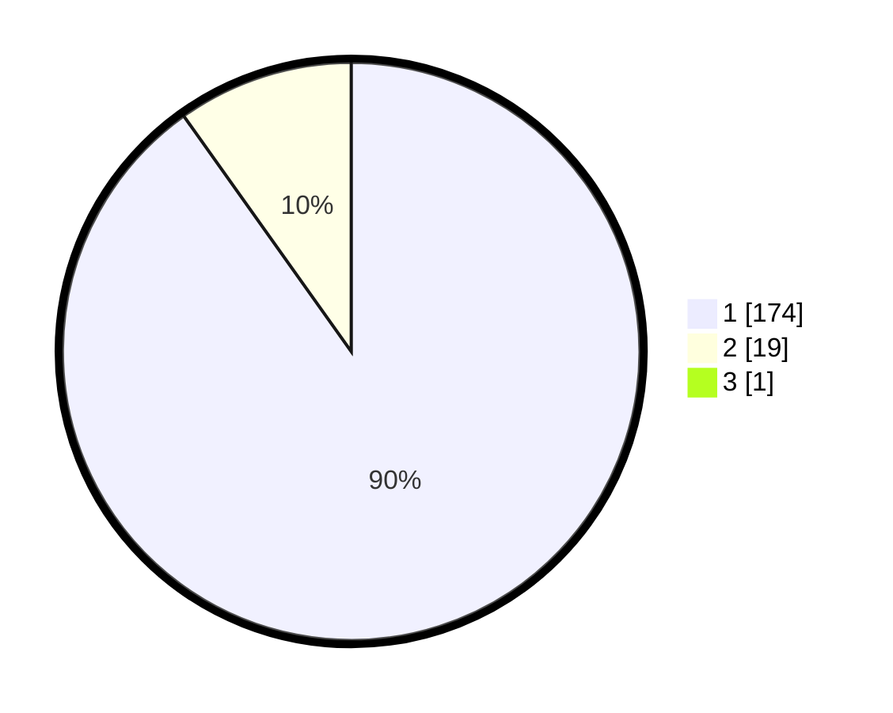

# Hasil

## Grafik

## Tabel

| No. | Nama Paslon    | Suara | Suara (raw) | Persentase |
|:--- |:-------------- | -----:| -----------:| ----------:|
| 1   | ANIES MUHAIMIN | 174   | [174][p-1]  | 89,69      |
| 2   | PRABOWO GIBRAN | 19    | [19][p-2]   | 9,79       |
| 3   | GANJAR MAHFUD  | 1     | [1][p-3]    | 0,52       |

[p-1]: https://github.com/gigit-pemilu/pemilu-2024-11-aceh/blob/main/pilpres/hitung-suara/sub/11-aceh/sub/03-aceh-timur/sub/14-idi-tunong/sub/2012-buket-teukuh/sub/002-tps/sub/paslon-1.txt
[p-2]: https://github.com/gigit-pemilu/pemilu-2024-11-aceh/blob/main/pilpres/hitung-suara/sub/11-aceh/sub/03-aceh-timur/sub/14-idi-tunong/sub/2012-buket-teukuh/sub/002-tps/sub/paslon-2.txt
[p-3]: https://github.com/gigit-pemilu/pemilu-2024-11-aceh/blob/main/pilpres/hitung-suara/sub/11-aceh/sub/03-aceh-timur/sub/14-idi-tunong/sub/2012-buket-teukuh/sub/002-tps/sub/paslon-3.txt

## Foto C Plano

https://sirekap-obj-formc.kpu.go.id/82f0/pemilu/ppwp/11/03/14/20/12/1103142012002-20240215-143825--3396b901-2fdd-4626-aab8-e26538b0d92f.jpg

https://sirekap-obj-formc.kpu.go.id/82f0/pemilu/ppwp/11/03/14/20/12/1103142012002-20240215-143953--da26011d-1419-43cc-aef7-74ac41f5f77d.jpg

https://sirekap-obj-formc.kpu.go.id/82f0/pemilu/ppwp/11/03/14/20/12/1103142012002-20240215-144111--d150cb1a-cacb-46b8-a6dc-de29716827e8.jpg

## Metadata

| Key        | Value               |
| ---------- | ------------------- |
| Time Stamp | 2024-02-19 06:16:00 |

