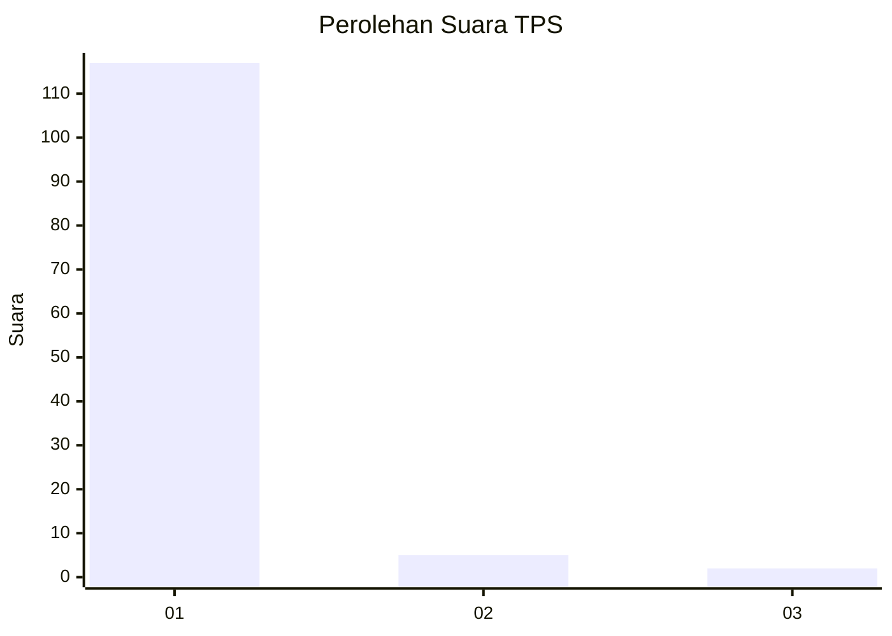
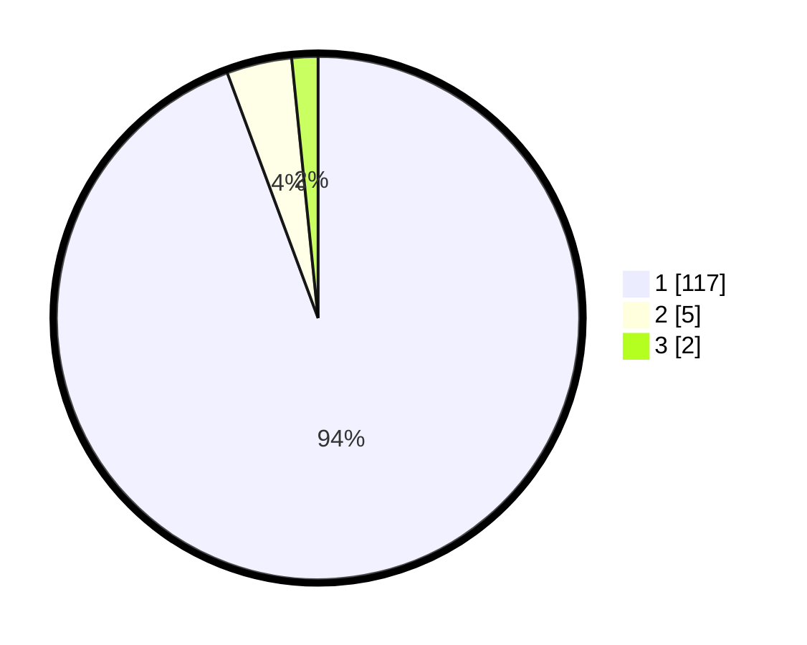

# Hasil

## Grafik

## Tabel

| No. | Nama Paslon    | Suara | Suara (raw) | Persentase |
|:--- |:-------------- | -----:| -----------:| ----------:|
| 1   | ANIES MUHAIMIN | 117   | [117][p-1]  | 94,35      |
| 2   | PRABOWO GIBRAN | 5     | [5][p-2]    | 4,03       |
| 3   | GANJAR MAHFUD  | 2     | [2][p-3]    | 1,61       |

[p-1]: https://github.com/gigit-pemilu/pemilu-2024-11-aceh/blob/main/pilpres/hitung-suara/sub/11-aceh/sub/03-aceh-timur/sub/14-idi-tunong/sub/2019-seuneubok-drien/sub/001-tps/sub/paslon-1.txt
[p-2]: https://github.com/gigit-pemilu/pemilu-2024-11-aceh/blob/main/pilpres/hitung-suara/sub/11-aceh/sub/03-aceh-timur/sub/14-idi-tunong/sub/2019-seuneubok-drien/sub/001-tps/sub/paslon-2.txt
[p-3]: https://github.com/gigit-pemilu/pemilu-2024-11-aceh/blob/main/pilpres/hitung-suara/sub/11-aceh/sub/03-aceh-timur/sub/14-idi-tunong/sub/2019-seuneubok-drien/sub/001-tps/sub/paslon-3.txt

## Foto C Plano

https://sirekap-obj-formc.kpu.go.id/6e62/pemilu/ppwp/11/03/14/20/19/1103142019001-20240215-054925--ae7f529b-a368-4c89-8928-687da9f9c70d.jpg

https://sirekap-obj-formc.kpu.go.id/6e62/pemilu/ppwp/11/03/14/20/19/1103142019001-20240214-204939--a50c3857-4654-4daf-8d9b-d3dc241c7f26.jpg

https://sirekap-obj-formc.kpu.go.id/6e62/pemilu/ppwp/11/03/14/20/19/1103142019001-20240214-205332--8c3fb33a-b763-4182-b212-2e05da3b9e50.jpg

## Metadata

| Key        | Value               |
| ---------- | ------------------- |
| Time Stamp | 2024-02-19 06:16:00 |

