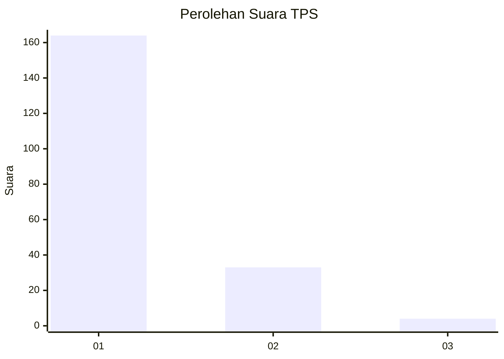
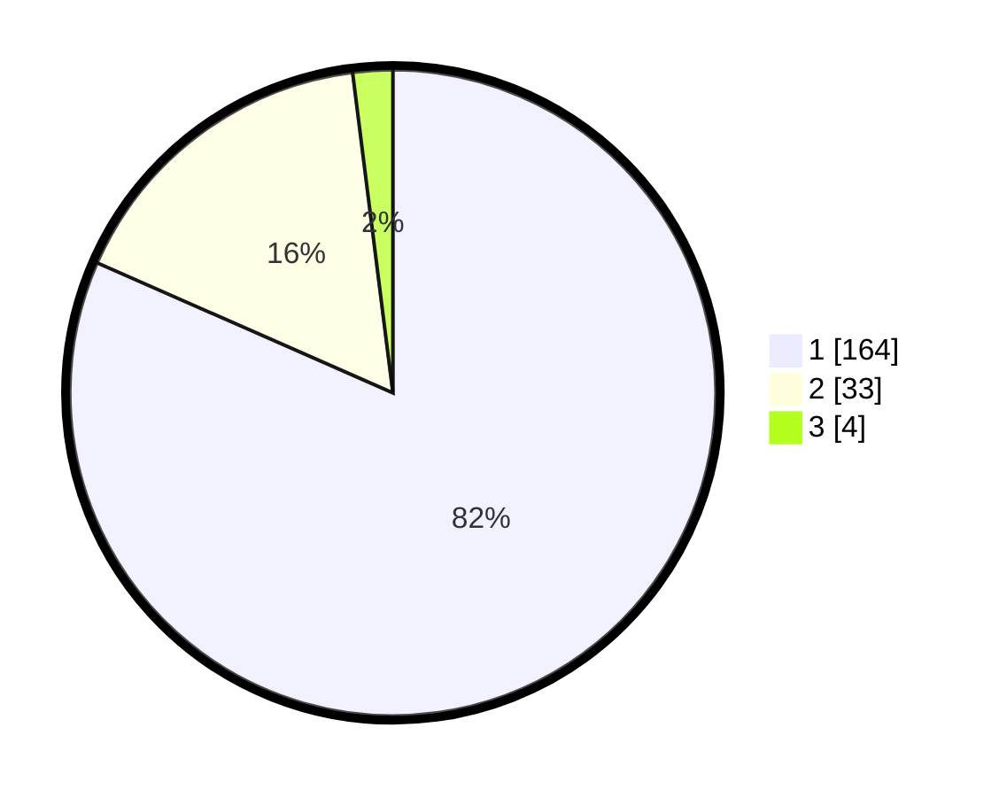

# Hasil

## Grafik

## Tabel

| No. | Nama Paslon    | Suara | Suara (raw) | Persentase |
|:--- |:-------------- | -----:| -----------:| ----------:|
| 1   | ANIES MUHAIMIN | 164   | [164][p-1]  | 81,59      |
| 2   | PRABOWO GIBRAN | 33    | [33][p-2]   | 16,42      |
| 3   | GANJAR MAHFUD  | 4     | [4][p-3]    | 1,99       |

[p-1]: https://github.com/gigit-pemilu/pemilu-2024-11-aceh/blob/main/pilpres/hitung-suara/sub/11-aceh/sub/03-aceh-timur/sub/15-banda-alam/sub/2012-panton-rayeuk-a/sub/001-tps/sub/paslon-1.txt
[p-2]: https://github.com/gigit-pemilu/pemilu-2024-11-aceh/blob/main/pilpres/hitung-suara/sub/11-aceh/sub/03-aceh-timur/sub/15-banda-alam/sub/2012-panton-rayeuk-a/sub/001-tps/sub/paslon-2.txt
[p-3]: https://github.com/gigit-pemilu/pemilu-2024-11-aceh/blob/main/pilpres/hitung-suara/sub/11-aceh/sub/03-aceh-timur/sub/15-banda-alam/sub/2012-panton-rayeuk-a/sub/001-tps/sub/paslon-3.txt

## Foto C Plano

https://sirekap-obj-formc.kpu.go.id/4d4c/pemilu/ppwp/11/03/15/20/12/1103152012001-20240215-092955--c70a0d24-9a72-4ab0-98ca-e56d2601d185.jpg

https://sirekap-obj-formc.kpu.go.id/4d4c/pemilu/ppwp/11/03/15/20/12/1103152012001-20240215-083511--80ba7b87-ab65-4d3f-aeb6-e7cafecaf18c.jpg

https://sirekap-obj-formc.kpu.go.id/4d4c/pemilu/ppwp/11/03/15/20/12/1103152012001-20240215-083606--21bc0573-9b7a-4893-931c-70647c944b1c.jpg

## Metadata

| Key        | Value               |
| ---------- | ------------------- |
| Time Stamp | 2024-02-24 22:31:28 |

