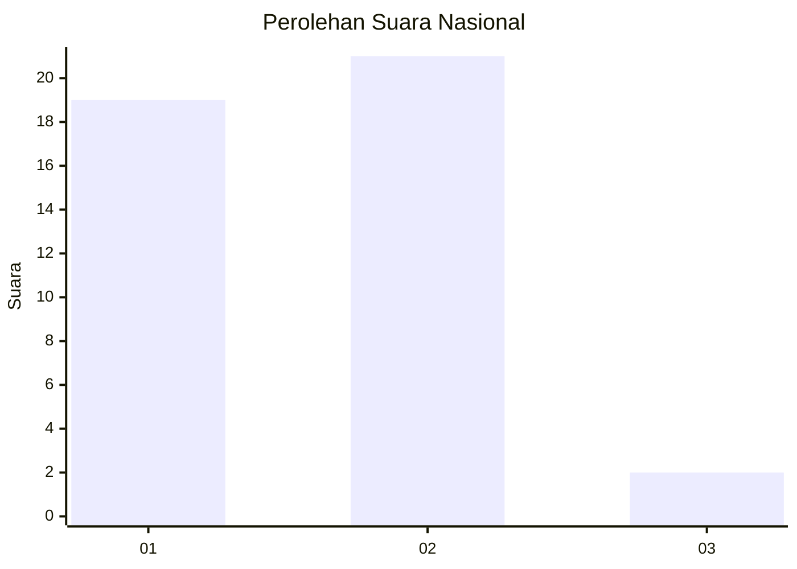
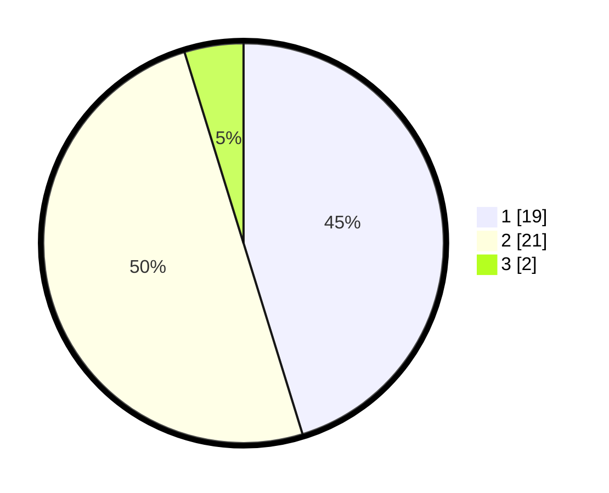

# Hasil

## Grafik

## Tabel

| No. | Nama Paslon    | Suara | Suara (raw) | Persentase |
|:--- |:-------------- | -----:| -----------:| ----------:|
| 1   | ANIES MUHAIMIN | 19    | [19][p-1]   | 45,24      |
| 2   | PRABOWO GIBRAN | 21    | [21][p-2]   | 50,00      |
| 3   | GANJAR MAHFUD  | 2     | [2][p-3]    | 4,76       |

[p-1]: https://github.com/gigit-pemilu/pemilu-2024/blob/main/pilpres/hitung-suara/sub/11-aceh/sub/03-aceh-timur/sub/15-banda-alam/sub/2012-panton-rayeuk-a/sub/002-tps/sub/paslon-1.txt
[p-2]: https://github.com/gigit-pemilu/pemilu-2024/blob/main/pilpres/hitung-suara/sub/11-aceh/sub/03-aceh-timur/sub/15-banda-alam/sub/2012-panton-rayeuk-a/sub/002-tps/sub/paslon-2.txt
[p-3]: https://github.com/gigit-pemilu/pemilu-2024/blob/main/pilpres/hitung-suara/sub/11-aceh/sub/03-aceh-timur/sub/15-banda-alam/sub/2012-panton-rayeuk-a/sub/002-tps/sub/paslon-3.txt

## Foto C Plano

https://sirekap-obj-formc.kpu.go.id/30f8/pemilu/ppwp/11/03/15/20/12/1103152012002-20240215-032830--cdf99b2d-60c0-4649-96c4-de88b00b868e.jpg

https://sirekap-obj-formc.kpu.go.id/30f8/pemilu/ppwp/11/03/15/20/12/1103152012002-20240215-032648--39f20fe2-9903-4a0a-81bf-03b2a21eefca.jpg

https://sirekap-obj-formc.kpu.go.id/30f8/pemilu/ppwp/11/03/15/20/12/1103152012002-20240215-033033--16ad0cf1-f445-4dac-83b5-1474d84a1726.jpg

## Metadata

| Key        | Value               |
| ---------- | ------------------- |
| Time Stamp | 2024-02-24 22:31:28 |

