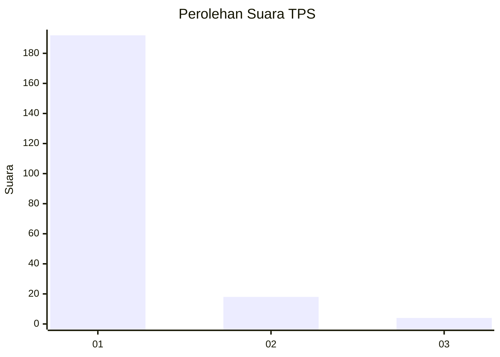
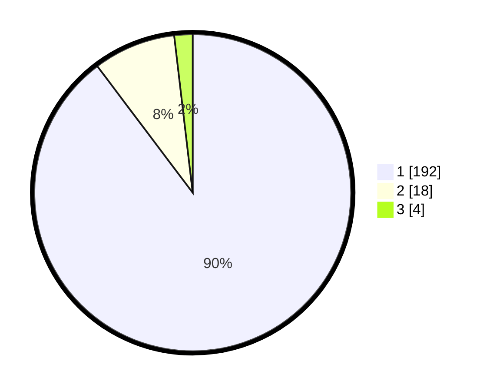

# Hasil

## Grafik

## Tabel

| No. | Nama Paslon    | Suara | Suara (raw) | Persentase |
|:--- |:-------------- | -----:| -----------:| ----------:|
| 1   | ANIES MUHAIMIN | 192   | [192][p-1]  | 89,72      |
| 2   | PRABOWO GIBRAN | 18    | [18][p-2]   | 8,41       |
| 3   | GANJAR MAHFUD  | 4     | [4][p-3]    | 1,87       |

[p-1]: https://github.com/gigit-pemilu/pemilu-2024-11-aceh/blob/main/pilpres/hitung-suara/sub/11-aceh/sub/03-aceh-timur/sub/15-banda-alam/sub/2014-panton-rayeuk-m/sub/002-tps/sub/paslon-1.txt
[p-2]: https://github.com/gigit-pemilu/pemilu-2024-11-aceh/blob/main/pilpres/hitung-suara/sub/11-aceh/sub/03-aceh-timur/sub/15-banda-alam/sub/2014-panton-rayeuk-m/sub/002-tps/sub/paslon-2.txt
[p-3]: https://github.com/gigit-pemilu/pemilu-2024-11-aceh/blob/main/pilpres/hitung-suara/sub/11-aceh/sub/03-aceh-timur/sub/15-banda-alam/sub/2014-panton-rayeuk-m/sub/002-tps/sub/paslon-3.txt

## Foto C Plano

https://sirekap-obj-formc.kpu.go.id/fbf5/pemilu/ppwp/11/03/15/20/14/1103152014002-20240215-053133--5f21f0c5-6d44-4733-8c94-59757102263b.jpg

https://sirekap-obj-formc.kpu.go.id/fbf5/pemilu/ppwp/11/03/15/20/14/1103152014002-20240215-052948--907ef0a9-182a-4a16-b177-cd33e769f791.jpg

https://sirekap-obj-formc.kpu.go.id/fbf5/pemilu/ppwp/11/03/15/20/14/1103152014002-20240215-053501--39211c5f-39e6-4eff-9cb5-9f53caae3e37.jpg

## Metadata

| Key        | Value               |
| ---------- | ------------------- |
| Time Stamp | 2024-02-24 22:31:28 |

