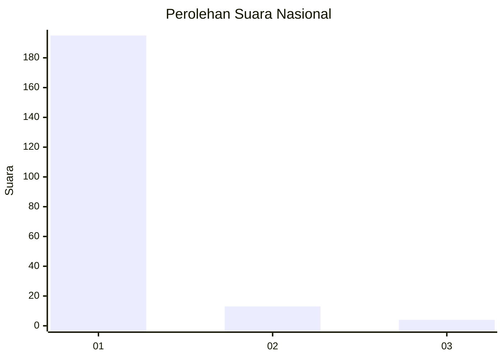
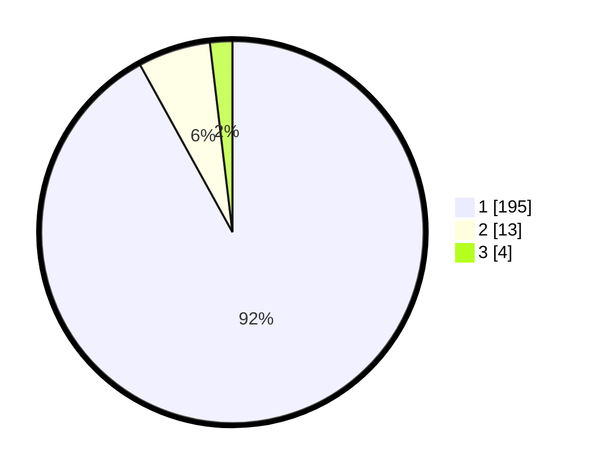

# Hasil

## Grafik

## Tabel

| No. | Nama Paslon    | Suara | Suara (raw) | Persentase |
|:--- |:-------------- | -----:| -----------:| ----------:|
| 1   | ANIES MUHAIMIN | 195   | [195][p-1]  | 91,98      |
| 2   | PRABOWO GIBRAN | 13    | [13][p-2]   | 6,13       |
| 3   | GANJAR MAHFUD  | 4     | [4][p-3]    | 1,89       |

[p-1]: https://github.com/gigit-pemilu/pemilu-2024/blob/main/pilpres/hitung-suara/sub/11-aceh/sub/03-aceh-timur/sub/15-banda-alam/sub/2014-panton-rayeuk-m/sub/003-tps/sub/paslon-1.txt
[p-2]: https://github.com/gigit-pemilu/pemilu-2024/blob/main/pilpres/hitung-suara/sub/11-aceh/sub/03-aceh-timur/sub/15-banda-alam/sub/2014-panton-rayeuk-m/sub/003-tps/sub/paslon-2.txt
[p-3]: https://github.com/gigit-pemilu/pemilu-2024/blob/main/pilpres/hitung-suara/sub/11-aceh/sub/03-aceh-timur/sub/15-banda-alam/sub/2014-panton-rayeuk-m/sub/003-tps/sub/paslon-3.txt

## Foto C Plano

https://sirekap-obj-formc.kpu.go.id/3128/pemilu/ppwp/11/03/15/20/14/1103152014003-20240215-053634--1c635d05-bbb5-4a28-969c-95196d4d5647.jpg

https://sirekap-obj-formc.kpu.go.id/3128/pemilu/ppwp/11/03/15/20/14/1103152014003-20240215-053741--3c97047c-2021-474c-9997-7cfbfad6c82e.jpg

https://sirekap-obj-formc.kpu.go.id/3128/pemilu/ppwp/11/03/15/20/14/1103152014003-20240215-053844--7a655b04-2e15-4ff5-9c78-3b97f3687f69.jpg

## Metadata

| Key        | Value               |
| ---------- | ------------------- |
| Time Stamp | 2024-02-24 22:31:28 |

