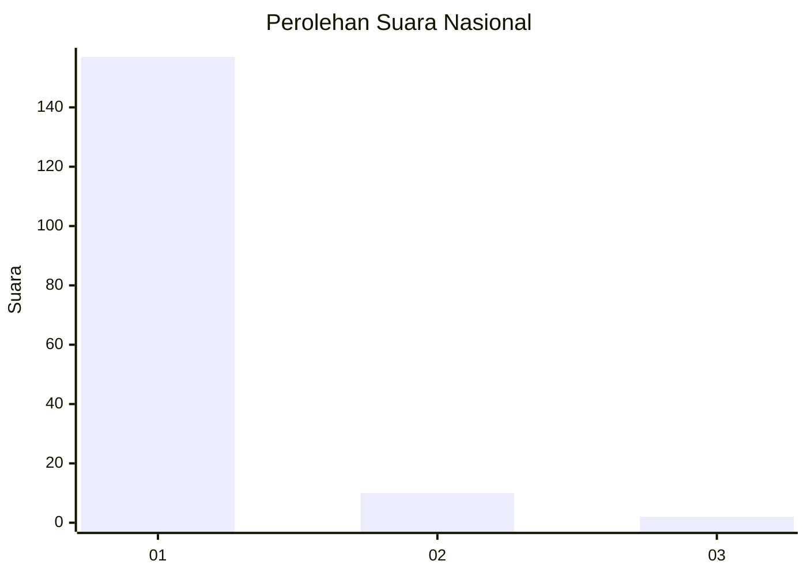
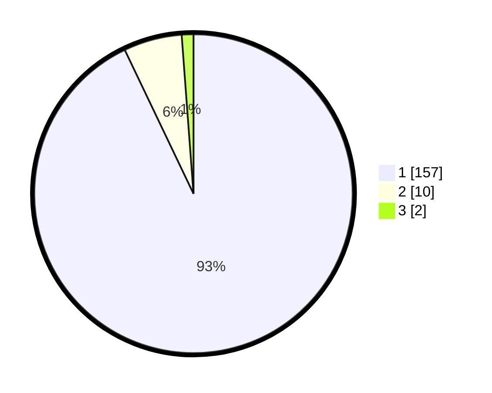

# Hasil

## Grafik

## Tabel

| No. | Nama Paslon    | Suara | Suara (raw) | Persentase |
|:--- |:-------------- | -----:| -----------:| ----------:|
| 1   | ANIES MUHAIMIN | 157   | [157][p-1]  | 92,90      |
| 2   | PRABOWO GIBRAN | 10    | [10][p-2]   | 5,92       |
| 3   | GANJAR MAHFUD  | 2     | [2][p-3]    | 1,18       |

[p-1]: https://github.com/gigit-pemilu/pemilu-2024/blob/main/pilpres/hitung-suara/sub/11-aceh/sub/03-aceh-timur/sub/15-banda-alam/sub/2014-panton-rayeuk-m/sub/004-tps/sub/paslon-1.txt
[p-2]: https://github.com/gigit-pemilu/pemilu-2024/blob/main/pilpres/hitung-suara/sub/11-aceh/sub/03-aceh-timur/sub/15-banda-alam/sub/2014-panton-rayeuk-m/sub/004-tps/sub/paslon-2.txt
[p-3]: https://github.com/gigit-pemilu/pemilu-2024/blob/main/pilpres/hitung-suara/sub/11-aceh/sub/03-aceh-timur/sub/15-banda-alam/sub/2014-panton-rayeuk-m/sub/004-tps/sub/paslon-3.txt

## Foto C Plano

https://sirekap-obj-formc.kpu.go.id/9f24/pemilu/ppwp/11/03/15/20/14/1103152014004-20240215-054522--1a3acdf2-5993-4c50-89f1-9181c6f52126.jpg

https://sirekap-obj-formc.kpu.go.id/9f24/pemilu/ppwp/11/03/15/20/14/1103152014004-20240215-054340--faa61c14-5adc-41b5-8d88-07e874580f59.jpg

https://sirekap-obj-formc.kpu.go.id/9f24/pemilu/ppwp/11/03/15/20/14/1103152014004-20240215-054720--1a9b73d8-1586-460f-b703-bb53b7048f32.jpg

## Metadata

| Key        | Value               |
| ---------- | ------------------- |
| Time Stamp | 2024-02-24 22:31:28 |

