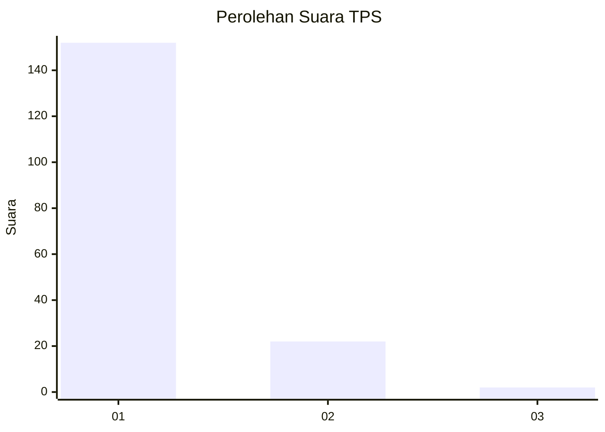
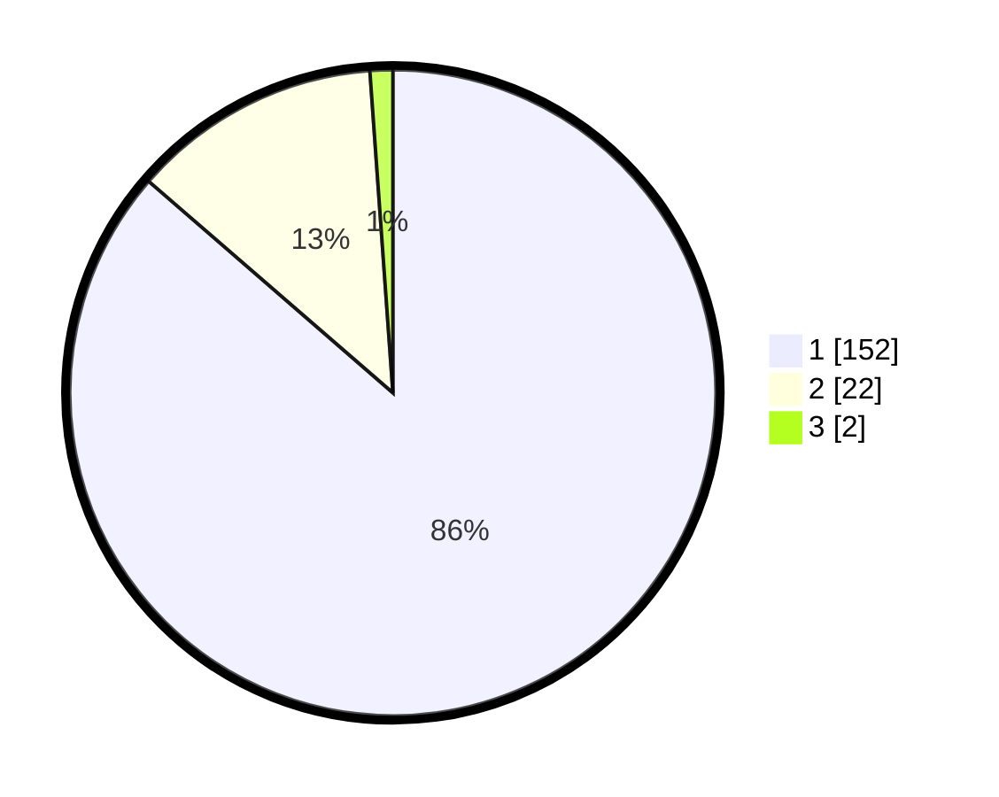

# Hasil

## Grafik

## Tabel

| No. | Nama Paslon    | Suara | Suara (raw) | Persentase |
|:--- |:-------------- | -----:| -----------:| ----------:|
| 1   | ANIES MUHAIMIN | 152   | [152][p-1]  | 86,36      |
| 2   | PRABOWO GIBRAN | 22    | [22][p-2]   | 12,50      |
| 3   | GANJAR MAHFUD  | 2     | [2][p-3]    | 1,14       |

[p-1]: https://github.com/gigit-pemilu/pemilu-2024-11-aceh/blob/main/pilpres/hitung-suara/sub/11-aceh/sub/03-aceh-timur/sub/16-peudawa/sub/2001-gampong-keude/sub/001-tps/sub/paslon-1.txt
[p-2]: https://github.com/gigit-pemilu/pemilu-2024-11-aceh/blob/main/pilpres/hitung-suara/sub/11-aceh/sub/03-aceh-timur/sub/16-peudawa/sub/2001-gampong-keude/sub/001-tps/sub/paslon-2.txt
[p-3]: https://github.com/gigit-pemilu/pemilu-2024-11-aceh/blob/main/pilpres/hitung-suara/sub/11-aceh/sub/03-aceh-timur/sub/16-peudawa/sub/2001-gampong-keude/sub/001-tps/sub/paslon-3.txt

## Foto C Plano

https://sirekap-obj-formc.kpu.go.id/2a47/pemilu/ppwp/11/03/16/20/01/1103162001001-20240219-161711--4d285ecf-e892-4d8f-8fa4-78937845428d.jpg

https://sirekap-obj-formc.kpu.go.id/2a47/pemilu/ppwp/11/03/16/20/01/1103162001001-20240219-161712--cf14240e-64c5-4236-959d-a61c8b61c9e2.jpg

https://sirekap-obj-formc.kpu.go.id/2a47/pemilu/ppwp/11/03/16/20/01/1103162001001-20240219-161711--4109002b-da50-44f2-a724-ec033e449078.jpg

## Metadata

| Key        | Value               |
| ---------- | ------------------- |
| Time Stamp | 2024-02-21 11:00:00 |

## DATA PEMILIH TETAP

Jumlah pemilih dalam DPT: **220**.
 * L: **100**.
 * P: **120**.

## DATA PENGGUNA HAK PILIH

Jumlah pengguna hak pilih dalam DPT: **165**.
 * L: **70**.
 * P: **95**.

Jumlah pengguna hak pilih dalam DPTb: **9**.
 * L: **0**.
 * P: **9**.

Jumlah pengguna hak pilih dalam DPK: **3**.
 * L: **1**.
 * P: **2**.

Jumlah pengguna hak pilih: **177**.
 * L: **71**.
 * P: **106**.

## JUMLAH SUARA SAH DAN TIDAK SAH

JUMLAH SELURUH SUARA SAH: **176**.

JUMLAH SUARA TIDAK SAH: **1**.

JUMLAH SELURUH SUARA SAH DAN SUARA TIDAK SAH: **177**.

