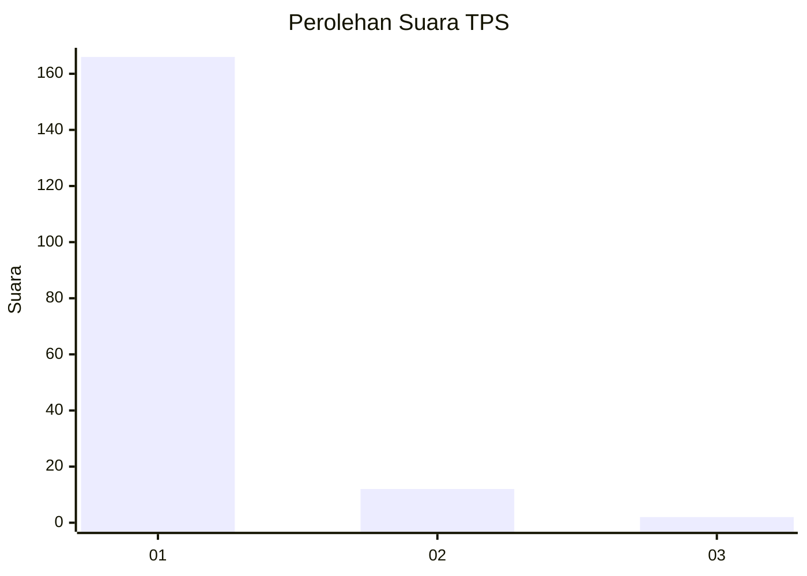
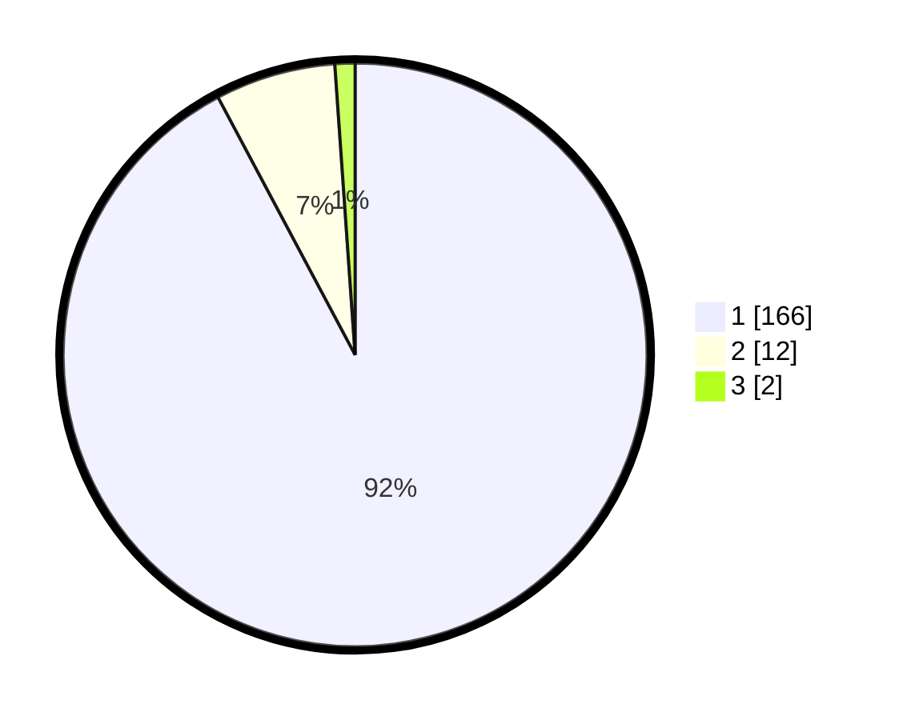

# Hasil

## Grafik

## Tabel

| No. | Nama Paslon    | Suara | Suara (raw) | Persentase |
|:--- |:-------------- | -----:| -----------:| ----------:|
| 1   | ANIES MUHAIMIN | 166   | [166][p-1]  | 92,22      |
| 2   | PRABOWO GIBRAN | 12    | [12][p-2]   | 6,67       |
| 3   | GANJAR MAHFUD  | 2     | [2][p-3]    | 1,11       |

[p-1]: https://github.com/gigit-pemilu/pemilu-2024-11-aceh/blob/main/pilpres/hitung-suara/sub/11-aceh/sub/03-aceh-timur/sub/16-peudawa/sub/2002-meunasah-krueng/sub/002-tps/sub/paslon-1.txt
[p-2]: https://github.com/gigit-pemilu/pemilu-2024-11-aceh/blob/main/pilpres/hitung-suara/sub/11-aceh/sub/03-aceh-timur/sub/16-peudawa/sub/2002-meunasah-krueng/sub/002-tps/sub/paslon-2.txt
[p-3]: https://github.com/gigit-pemilu/pemilu-2024-11-aceh/blob/main/pilpres/hitung-suara/sub/11-aceh/sub/03-aceh-timur/sub/16-peudawa/sub/2002-meunasah-krueng/sub/002-tps/sub/paslon-3.txt

## Foto C Plano

https://sirekap-obj-formc.kpu.go.id/fc59/pemilu/ppwp/11/03/16/20/02/1103162002002-20240219-135908--f6a38ccd-b00b-46bf-946b-9430d5b4230e.jpg

https://sirekap-obj-formc.kpu.go.id/fc59/pemilu/ppwp/11/03/16/20/02/1103162002002-20240219-135910--17519f3c-f832-45a1-98be-9a91be7ffd5f.jpg

https://sirekap-obj-formc.kpu.go.id/fc59/pemilu/ppwp/11/03/16/20/02/1103162002002-20240219-135909--1b0e7074-1fcd-4be3-b535-75c4944fd156.jpg

## Metadata

| Key        | Value               |
| ---------- | ------------------- |
| Time Stamp | 2024-02-21 15:00:00 |

## DATA PEMILIH TETAP

Jumlah pemilih dalam DPT: **235**.
 * L: **111**.
 * P: **124**.

## DATA PENGGUNA HAK PILIH

Jumlah pengguna hak pilih dalam DPT: **181**.
 * L: **74**.
 * P: **107**.

Jumlah pengguna hak pilih dalam DPTb: **0**.
 * L: **0**.
 * P: **0**.

Jumlah pengguna hak pilih dalam DPK: **4**.
 * L: **2**.
 * P: **2**.

Jumlah pengguna hak pilih: **185**.
 * L: **76**.
 * P: **109**.

## JUMLAH SUARA SAH DAN TIDAK SAH

JUMLAH SELURUH SUARA SAH: **180**.

JUMLAH SUARA TIDAK SAH: **5**.

JUMLAH SELURUH SUARA SAH DAN SUARA TIDAK SAH: **185**.

