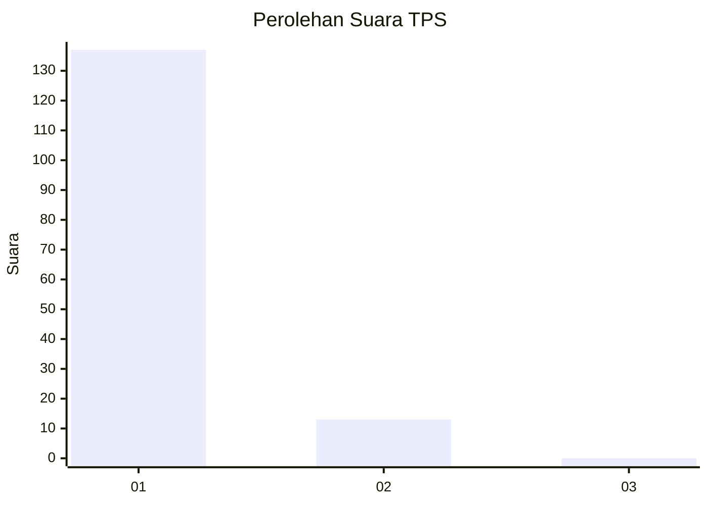
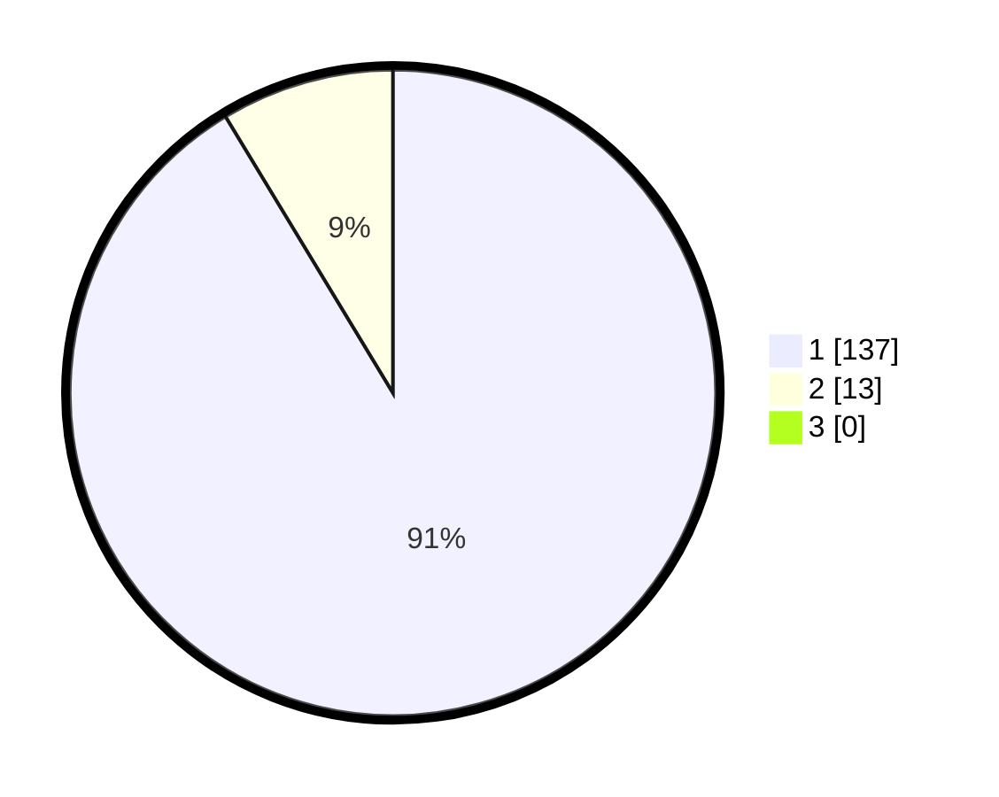

# Hasil

## Grafik

## Tabel

| No. | Nama Paslon    | Suara | Suara (raw) | Persentase |
|:--- |:-------------- | -----:| -----------:| ----------:|
| 1   | ANIES MUHAIMIN | 137   | [137][p-1]  | 91,33      |
| 2   | PRABOWO GIBRAN | 13    | [13][p-2]   | 8,67       |
| 3   | GANJAR MAHFUD  | 0     | [0][p-3]    | 0,00       |

[p-1]: https://github.com/gigit-pemilu/pemilu-2024-11-aceh/blob/main/pilpres/hitung-suara/sub/11-aceh/sub/03-aceh-timur/sub/16-peudawa/sub/2005-matang-rayeuk/sub/001-tps/sub/paslon-1.txt
[p-2]: https://github.com/gigit-pemilu/pemilu-2024-11-aceh/blob/main/pilpres/hitung-suara/sub/11-aceh/sub/03-aceh-timur/sub/16-peudawa/sub/2005-matang-rayeuk/sub/001-tps/sub/paslon-2.txt
[p-3]: https://github.com/gigit-pemilu/pemilu-2024-11-aceh/blob/main/pilpres/hitung-suara/sub/11-aceh/sub/03-aceh-timur/sub/16-peudawa/sub/2005-matang-rayeuk/sub/001-tps/sub/paslon-3.txt

## Foto C Plano

https://sirekap-obj-formc.kpu.go.id/3e7e/pemilu/ppwp/11/03/16/20/05/1103162005001-20240221-173606--d89dbcf5-6b2c-43b3-86c6-618c67eb932a.jpg

https://sirekap-obj-formc.kpu.go.id/3e7e/pemilu/ppwp/11/03/16/20/05/1103162005001-20240221-172851--2053c8b6-d7a2-4064-b828-3f4f5bb9881d.jpg

https://sirekap-obj-formc.kpu.go.id/3e7e/pemilu/ppwp/11/03/16/20/05/1103162005001-20240221-173014--ad6d7acb-d7bc-441f-a3ee-7567a0a80655.jpg

## Metadata

| Key        | Value               |
| ---------- | ------------------- |
| Time Stamp | 2024-02-25 12:00:00 |

