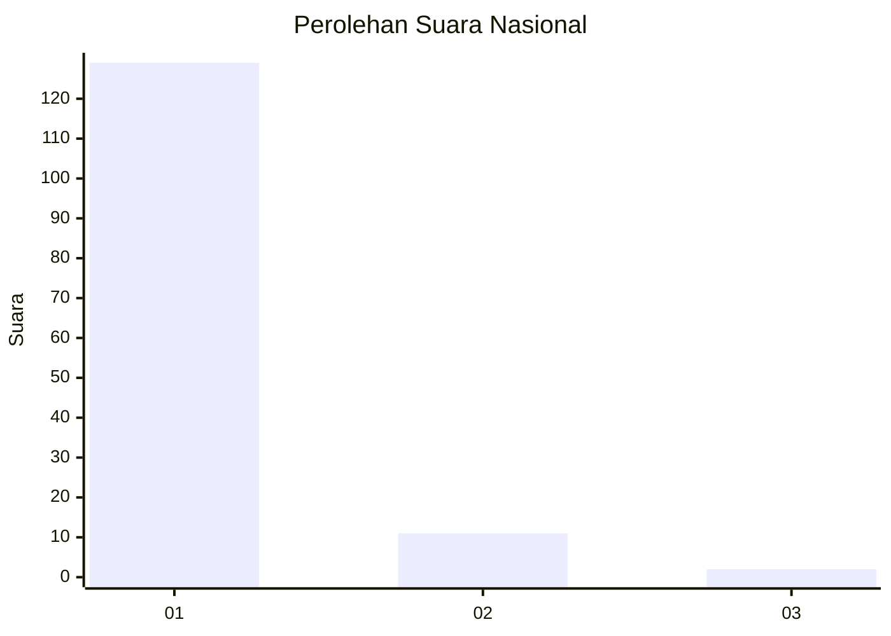
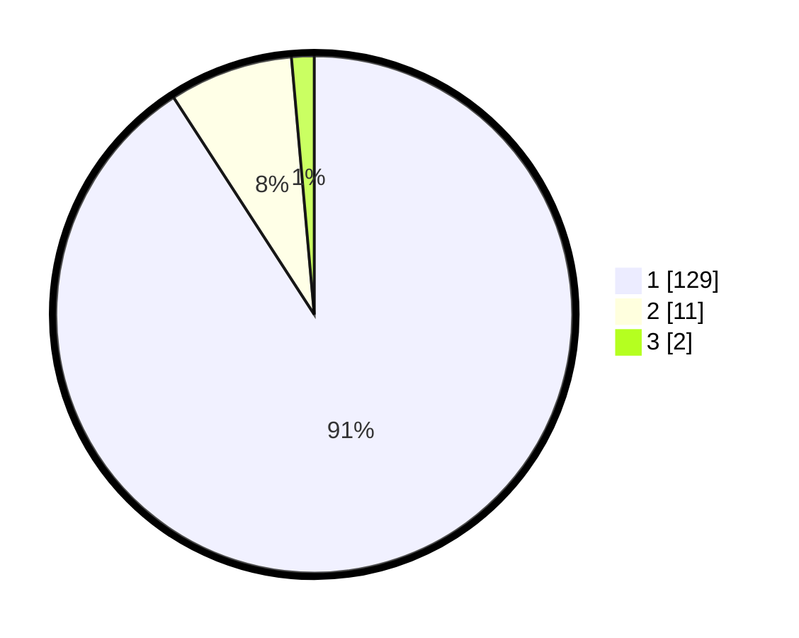

# Hasil

## Grafik

## Tabel

| No. | Nama Paslon    | Suara | Suara (raw) | Persentase |
|:--- |:-------------- | -----:| -----------:| ----------:|
| 1   | ANIES MUHAIMIN | 129   | [129][p-1]  | 90,85      |
| 2   | PRABOWO GIBRAN | 11    | [11][p-2]   | 7,75       |
| 3   | GANJAR MAHFUD  | 2     | [2][p-3]    | 1,41       |

[p-1]: https://github.com/gigit-pemilu/pemilu-2024/blob/main/pilpres/hitung-suara/sub/11-aceh/sub/03-aceh-timur/sub/16-peudawa/sub/2005-matang-rayeuk/sub/002-tps/sub/paslon-1.txt
[p-2]: https://github.com/gigit-pemilu/pemilu-2024/blob/main/pilpres/hitung-suara/sub/11-aceh/sub/03-aceh-timur/sub/16-peudawa/sub/2005-matang-rayeuk/sub/002-tps/sub/paslon-2.txt
[p-3]: https://github.com/gigit-pemilu/pemilu-2024/blob/main/pilpres/hitung-suara/sub/11-aceh/sub/03-aceh-timur/sub/16-peudawa/sub/2005-matang-rayeuk/sub/002-tps/sub/paslon-3.txt

## Foto C Plano

https://sirekap-obj-formc.kpu.go.id/eb1b/pemilu/ppwp/11/03/16/20/05/1103162005002-20240216-151235--684d29dc-6ca4-4fba-adb1-3434d5da20ab.jpg

https://sirekap-obj-formc.kpu.go.id/eb1b/pemilu/ppwp/11/03/16/20/05/1103162005002-20240216-151237--3ea12c10-a212-4017-b809-869ed620ba6f.jpg

https://sirekap-obj-formc.kpu.go.id/eb1b/pemilu/ppwp/11/03/16/20/05/1103162005002-20240216-151236--abd8b1a5-39c1-40c4-b247-46ffbe75f577.jpg

## Metadata

| Key        | Value               |
| ---------- | ------------------- |
| Time Stamp | 2024-02-17 16:00:02 |

## DATA PEMILIH TETAP

Jumlah pemilih dalam DPT: **189**.
 * L: **94**.
 * P: **95**.

## DATA PENGGUNA HAK PILIH

Jumlah pengguna hak pilih dalam DPT: **142**.
 * L: **66**.
 * P: **76**.

Jumlah pengguna hak pilih dalam DPTb: **0**.
 * L: **1**.
 * P: **0**.

Jumlah pengguna hak pilih dalam DPK: **0**.
 * L: **3**.
 * P: **0**.

Jumlah pengguna hak pilih: **146**.
 * L: **70**.
 * P: **76**.

## JUMLAH SUARA SAH DAN TIDAK SAH

JUMLAH SELURUH SUARA SAH: **142**.

JUMLAH SUARA TIDAK SAH: **4**.

JUMLAH SELURUH SUARA SAH DAN SUARA TIDAK SAH: **146**.

