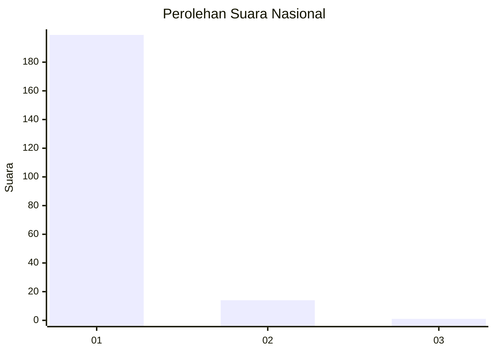
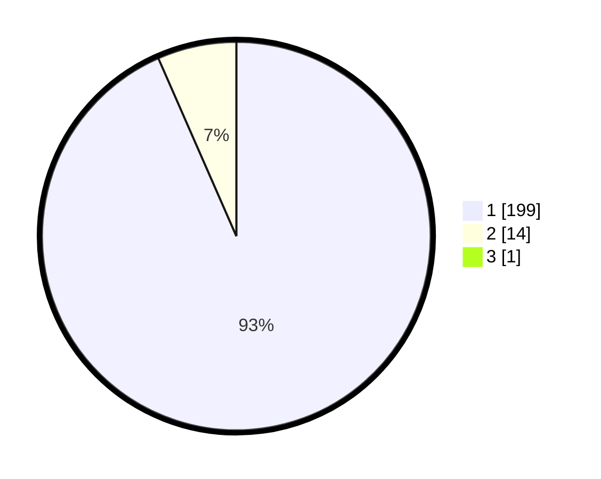

# Hasil

## Grafik

## Tabel

| No. | Nama Paslon    | Suara | Suara (raw) | Persentase |
|:--- |:-------------- | -----:| -----------:| ----------:|
| 1   | ANIES MUHAIMIN | 199   | [199][p-1]  | 92,99      |
| 2   | PRABOWO GIBRAN | 14    | [14][p-2]   | 6,54       |
| 3   | GANJAR MAHFUD  | 1     | [1][p-3]    | 0,47       |

[p-1]: https://github.com/gigit-pemilu/pemilu-2024/blob/main/pilpres/hitung-suara/sub/11-aceh/sub/03-aceh-timur/sub/16-peudawa/sub/2011-seuneubok-teungoh/sub/001-tps/sub/paslon-1.txt
[p-2]: https://github.com/gigit-pemilu/pemilu-2024/blob/main/pilpres/hitung-suara/sub/11-aceh/sub/03-aceh-timur/sub/16-peudawa/sub/2011-seuneubok-teungoh/sub/001-tps/sub/paslon-2.txt
[p-3]: https://github.com/gigit-pemilu/pemilu-2024/blob/main/pilpres/hitung-suara/sub/11-aceh/sub/03-aceh-timur/sub/16-peudawa/sub/2011-seuneubok-teungoh/sub/001-tps/sub/paslon-3.txt

## Foto C Plano

https://sirekap-obj-formc.kpu.go.id/5c8c/pemilu/ppwp/11/03/16/20/11/1103162011001-20240215-233644--be516fc3-e615-4ba7-a4b2-c8a556a6101c.jpg

https://sirekap-obj-formc.kpu.go.id/5c8c/pemilu/ppwp/11/03/16/20/11/1103162011001-20240215-233704--7cca5d1e-2297-40fe-92ff-1e19a5c29160.jpg

https://sirekap-obj-formc.kpu.go.id/5c8c/pemilu/ppwp/11/03/16/20/11/1103162011001-20240215-233719--f62641e7-6213-451f-b222-5571cad7379c.jpg

## Metadata

| Key        | Value               |
| ---------- | ------------------- |
| Time Stamp | 2024-02-24 22:31:28 |

