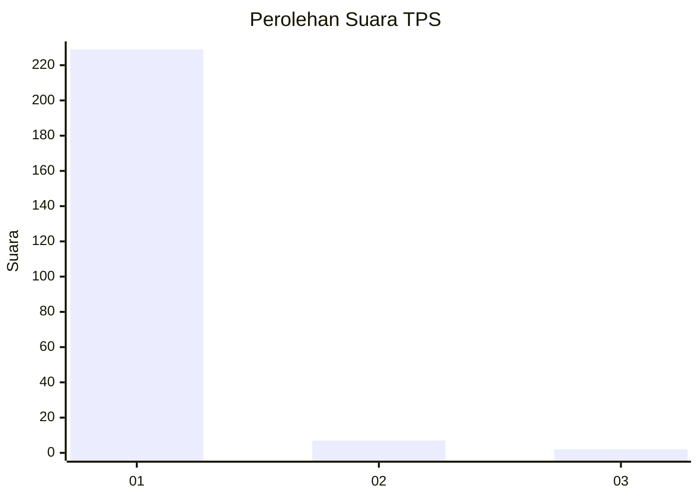
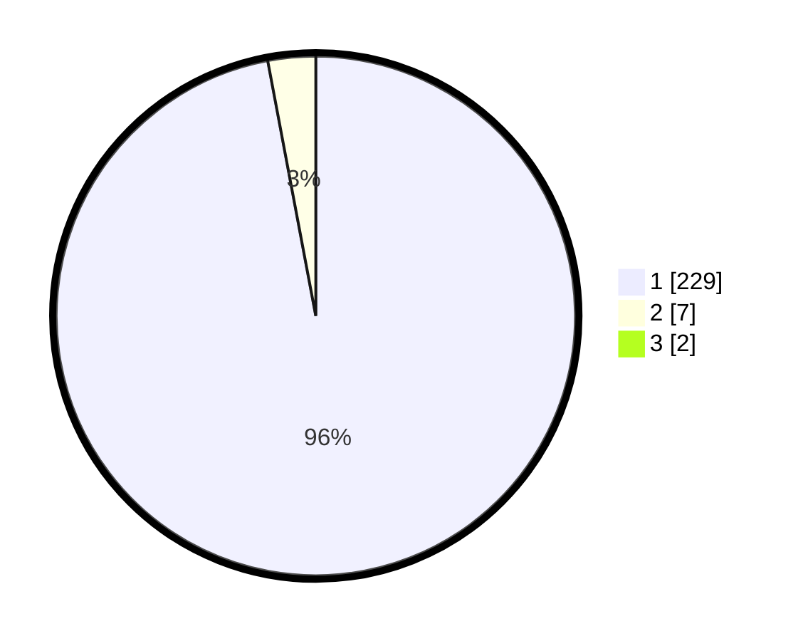

# Hasil

## Grafik

## Tabel

| No. | Nama Paslon    | Suara | Suara (raw) | Persentase |
|:--- |:-------------- | -----:| -----------:| ----------:|
| 1   | ANIES MUHAIMIN | 229   | [229][p-1]  | 96,22      |
| 2   | PRABOWO GIBRAN | 7     | [7][p-2]    | 2,94       |
| 3   | GANJAR MAHFUD  | 2     | [2][p-3]    | 0,84       |

[p-1]: https://github.com/gigit-pemilu/pemilu-2024-11-aceh/blob/main/pilpres/hitung-suara/sub/11-aceh/sub/03-aceh-timur/sub/16-peudawa/sub/2015-blang-buket/sub/001-tps/sub/paslon-1.txt
[p-2]: https://github.com/gigit-pemilu/pemilu-2024-11-aceh/blob/main/pilpres/hitung-suara/sub/11-aceh/sub/03-aceh-timur/sub/16-peudawa/sub/2015-blang-buket/sub/001-tps/sub/paslon-2.txt
[p-3]: https://github.com/gigit-pemilu/pemilu-2024-11-aceh/blob/main/pilpres/hitung-suara/sub/11-aceh/sub/03-aceh-timur/sub/16-peudawa/sub/2015-blang-buket/sub/001-tps/sub/paslon-3.txt

## Foto C Plano

https://sirekap-obj-formc.kpu.go.id/fac4/pemilu/ppwp/11/03/16/20/15/1103162015001-20240215-063619--b5ba81fb-bea3-4e5b-b1f5-82e352945d31.jpg

https://sirekap-obj-formc.kpu.go.id/fac4/pemilu/ppwp/11/03/16/20/15/1103162015001-20240214-202156--ff309329-5ee0-4aa7-a479-2c70302e8bb2.jpg

https://sirekap-obj-formc.kpu.go.id/fac4/pemilu/ppwp/11/03/16/20/15/1103162015001-20240215-032846--1c8cdab6-44f8-4887-af48-d910fec0a84b.jpg

## Metadata

| Key        | Value               |
| ---------- | ------------------- |
| Time Stamp | 2024-02-24 22:31:28 |

