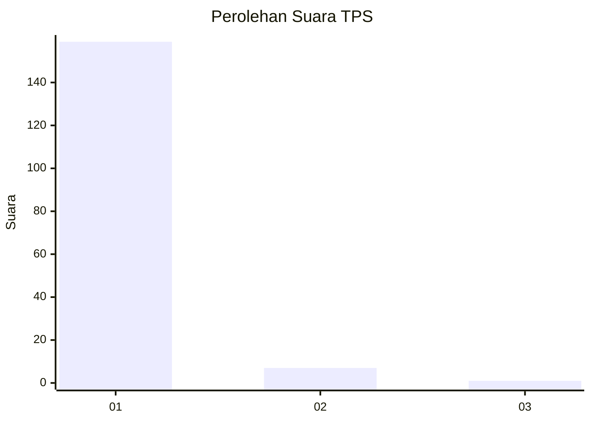
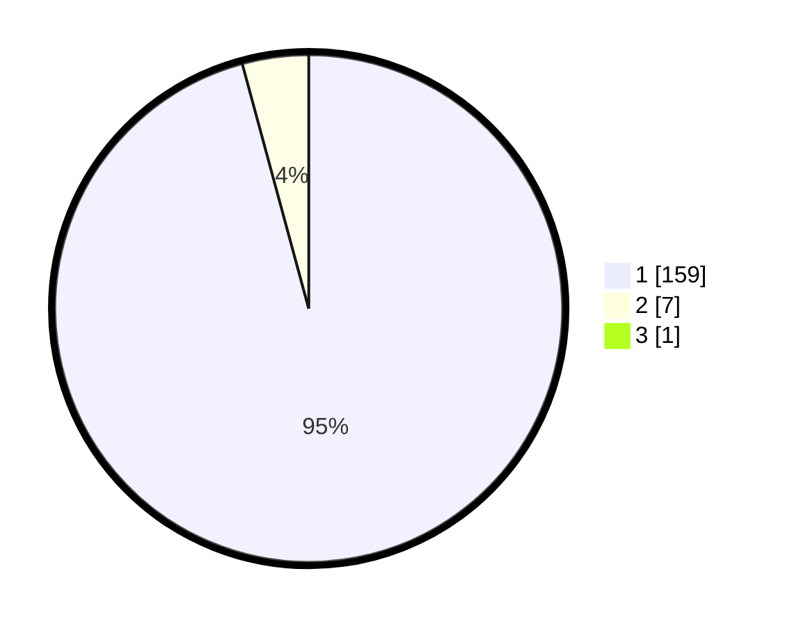

# Hasil

## Grafik

## Tabel

| No. | Nama Paslon    | Suara | Suara (raw) | Persentase |
|:--- |:-------------- | -----:| -----------:| ----------:|
| 1   | ANIES MUHAIMIN | 159   | [159][p-1]  | 95,21      |
| 2   | PRABOWO GIBRAN | 7     | [7][p-2]    | 4,19       |
| 3   | GANJAR MAHFUD  | 1     | [1][p-3]    | 0,60       |

[p-1]: https://github.com/gigit-pemilu/pemilu-2024-11-aceh/blob/main/pilpres/hitung-suara/sub/11-aceh/sub/03-aceh-timur/sub/17-peureulak-timur/sub/2001-babah-krueng/sub/002-tps/sub/paslon-1.txt
[p-2]: https://github.com/gigit-pemilu/pemilu-2024-11-aceh/blob/main/pilpres/hitung-suara/sub/11-aceh/sub/03-aceh-timur/sub/17-peureulak-timur/sub/2001-babah-krueng/sub/002-tps/sub/paslon-2.txt
[p-3]: https://github.com/gigit-pemilu/pemilu-2024-11-aceh/blob/main/pilpres/hitung-suara/sub/11-aceh/sub/03-aceh-timur/sub/17-peureulak-timur/sub/2001-babah-krueng/sub/002-tps/sub/paslon-3.txt

## Foto C Plano

https://sirekap-obj-formc.kpu.go.id/f4d8/pemilu/ppwp/11/03/17/20/01/1103172001002-20240220-103034--dfc38206-c82e-45b7-bdad-6f840532261d.jpg

https://sirekap-obj-formc.kpu.go.id/f4d8/pemilu/ppwp/11/03/17/20/01/1103172001002-20240220-103427--542d00af-7084-4a5e-abe6-55bf2228b244.jpg

https://sirekap-obj-formc.kpu.go.id/f4d8/pemilu/ppwp/11/03/17/20/01/1103172001002-20240220-103237--3193443d-b1b1-4c56-b159-f5fa5aa28899.jpg

## Metadata

| Key        | Value               |
| ---------- | ------------------- |
| Time Stamp | 2024-02-24 22:31:28 |

