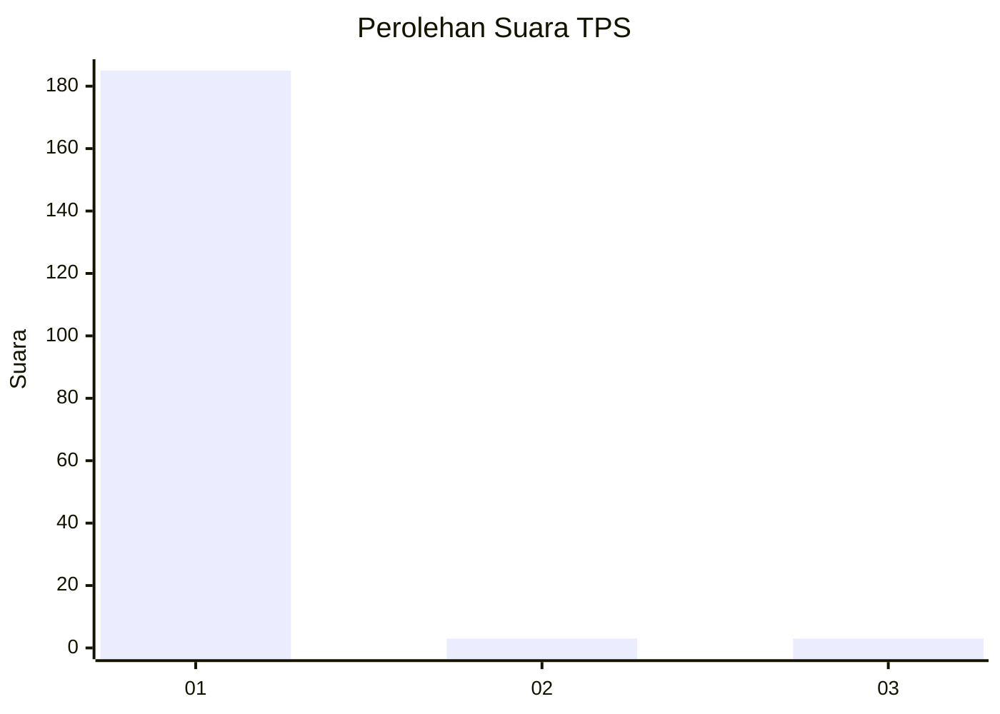
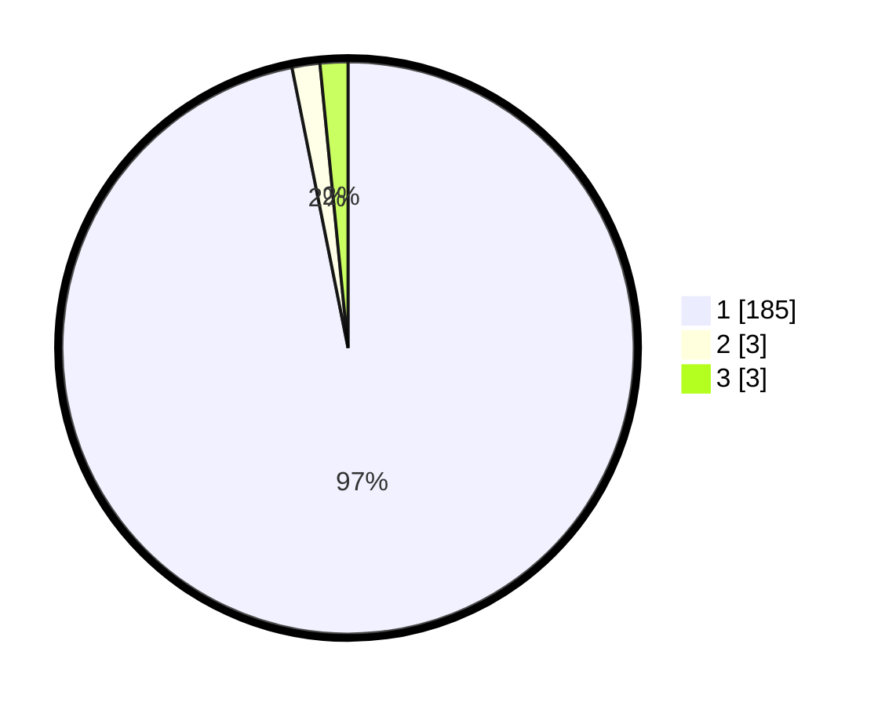

# Hasil

## Grafik

## Tabel

| No. | Nama Paslon    | Suara | Suara (raw) | Persentase |
|:--- |:-------------- | -----:| -----------:| ----------:|
| 1   | ANIES MUHAIMIN | 185   | [185][p-1]  | 96,86      |
| 2   | PRABOWO GIBRAN | 3     | [3][p-2]    | 1,57       |
| 3   | GANJAR MAHFUD  | 3     | [3][p-3]    | 1,57       |

[p-1]: https://github.com/gigit-pemilu/pemilu-2024-11-aceh/blob/main/pilpres/hitung-suara/sub/11-aceh/sub/03-aceh-timur/sub/17-peureulak-timur/sub/2002-kruet-lintang/sub/002-tps/sub/paslon-1.txt
[p-2]: https://github.com/gigit-pemilu/pemilu-2024-11-aceh/blob/main/pilpres/hitung-suara/sub/11-aceh/sub/03-aceh-timur/sub/17-peureulak-timur/sub/2002-kruet-lintang/sub/002-tps/sub/paslon-2.txt
[p-3]: https://github.com/gigit-pemilu/pemilu-2024-11-aceh/blob/main/pilpres/hitung-suara/sub/11-aceh/sub/03-aceh-timur/sub/17-peureulak-timur/sub/2002-kruet-lintang/sub/002-tps/sub/paslon-3.txt

## Foto C Plano

https://sirekap-obj-formc.kpu.go.id/fdb0/pemilu/ppwp/11/03/17/20/02/1103172002002-20240216-134518--6bf2e3ad-3f5b-4957-9fe6-542dcc5d27ab.jpg

https://sirekap-obj-formc.kpu.go.id/fdb0/pemilu/ppwp/11/03/17/20/02/1103172002002-20240216-134520--f342cc1e-107b-4ce6-a3e0-81eef53cb7c2.jpg

https://sirekap-obj-formc.kpu.go.id/fdb0/pemilu/ppwp/11/03/17/20/02/1103172002002-20240216-134519--ea3c0d93-1c2a-4529-82e8-fd841b1f479e.jpg

## Metadata

| Key        | Value               |
| ---------- | ------------------- |
| Time Stamp | 2024-02-17 16:00:02 |

## DATA PEMILIH TETAP

Jumlah pemilih dalam DPT: **231**.
 * L: **111**.
 * P: **120**.

## DATA PENGGUNA HAK PILIH

Jumlah pengguna hak pilih dalam DPT: **178**.
 * L: **85**.
 * P: **93**.

Jumlah pengguna hak pilih dalam DPTb: **4**.
 * L: **2**.
 * P: **2**.

Jumlah pengguna hak pilih dalam DPK: **12**.
 * L: **9**.
 * P: **3**.

Jumlah pengguna hak pilih: **194**.
 * L: **96**.
 * P: **98**.

## JUMLAH SUARA SAH DAN TIDAK SAH

JUMLAH SELURUH SUARA SAH: **191**.

JUMLAH SUARA TIDAK SAH: **3**.

JUMLAH SELURUH SUARA SAH DAN SUARA TIDAK SAH: **194**.

