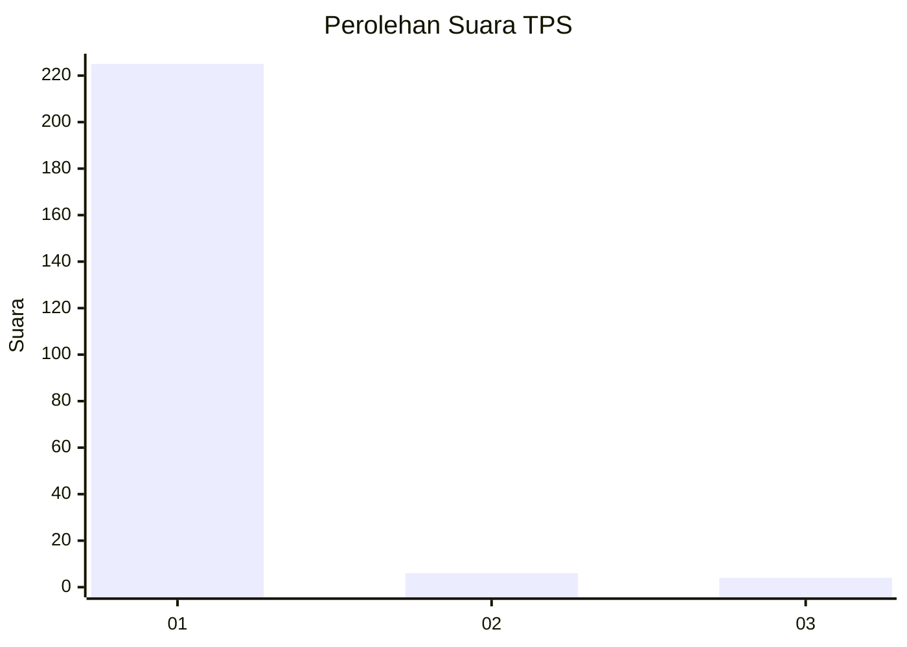
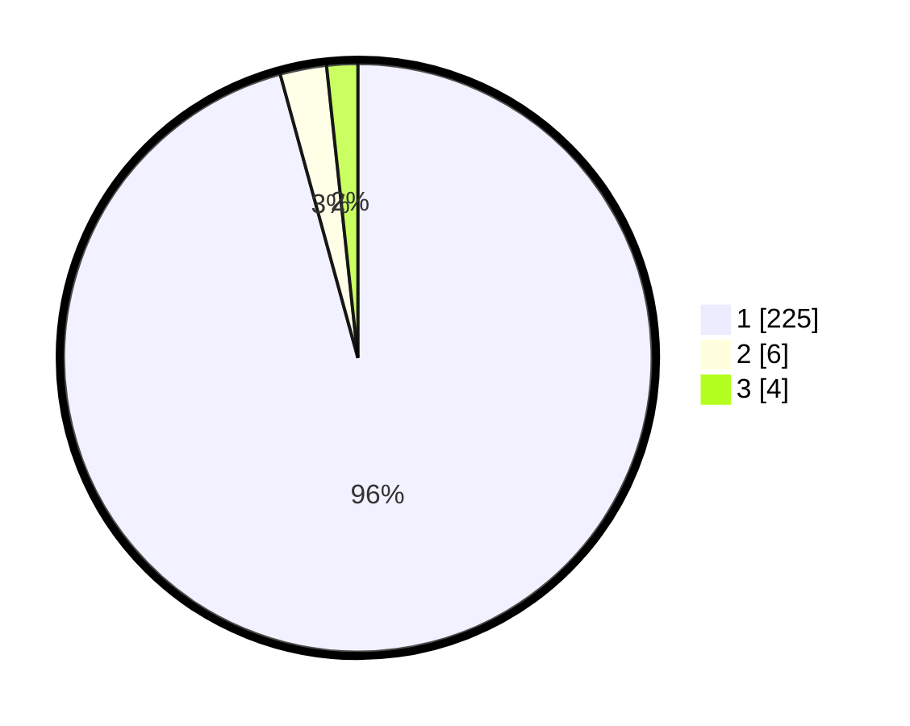

# Hasil

## Grafik

## Tabel

| No. | Nama Paslon    | Suara | Suara (raw) | Persentase |
|:--- |:-------------- | -----:| -----------:| ----------:|
| 1   | ANIES MUHAIMIN | 225   | [225][p-1]  | 95,74      |
| 2   | PRABOWO GIBRAN | 6     | [6][p-2]    | 2,55       |
| 3   | GANJAR MAHFUD  | 4     | [4][p-3]    | 1,70       |

[p-1]: https://github.com/gigit-pemilu/pemilu-2024-11-aceh/blob/main/pilpres/hitung-suara/sub/11-aceh/sub/03-aceh-timur/sub/17-peureulak-timur/sub/2003-jengki/sub/002-tps/sub/paslon-1.txt
[p-2]: https://github.com/gigit-pemilu/pemilu-2024-11-aceh/blob/main/pilpres/hitung-suara/sub/11-aceh/sub/03-aceh-timur/sub/17-peureulak-timur/sub/2003-jengki/sub/002-tps/sub/paslon-2.txt
[p-3]: https://github.com/gigit-pemilu/pemilu-2024-11-aceh/blob/main/pilpres/hitung-suara/sub/11-aceh/sub/03-aceh-timur/sub/17-peureulak-timur/sub/2003-jengki/sub/002-tps/sub/paslon-3.txt

## Foto C Plano

https://sirekap-obj-formc.kpu.go.id/697f/pemilu/ppwp/11/03/17/20/03/1103172003002-20240216-134804--709c096a-9f6b-422a-a5e3-bf4d404abf2d.jpg

https://sirekap-obj-formc.kpu.go.id/697f/pemilu/ppwp/11/03/17/20/03/1103172003002-20240216-134806--e173002e-885f-4de9-a6e4-68348efc36ee.jpg

https://sirekap-obj-formc.kpu.go.id/697f/pemilu/ppwp/11/03/17/20/03/1103172003002-20240216-134805--c2082658-93e5-4c2b-a527-8b3355baeabb.jpg

## Metadata

| Key        | Value               |
| ---------- | ------------------- |
| Time Stamp | 2024-02-17 16:00:02 |

## DATA PEMILIH TETAP

Jumlah pemilih dalam DPT: **274**.
 * L: **126**.
 * P: **148**.

## DATA PENGGUNA HAK PILIH

Jumlah pengguna hak pilih dalam DPT: **230**.
 * L: **102**.
 * P: **128**.

Jumlah pengguna hak pilih dalam DPTb: **5**.
 * L: **2**.
 * P: **3**.

Jumlah pengguna hak pilih dalam DPK: **0**.
 * L: **0**.
 * P: **0**.

Jumlah pengguna hak pilih: **235**.
 * L: **104**.
 * P: **131**.

## JUMLAH SUARA SAH DAN TIDAK SAH

JUMLAH SELURUH SUARA SAH: **235**.

JUMLAH SUARA TIDAK SAH: **0**.

JUMLAH SELURUH SUARA SAH DAN SUARA TIDAK SAH: **235**.

