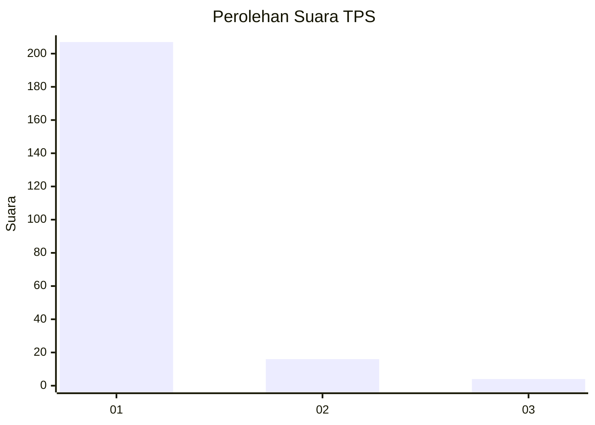
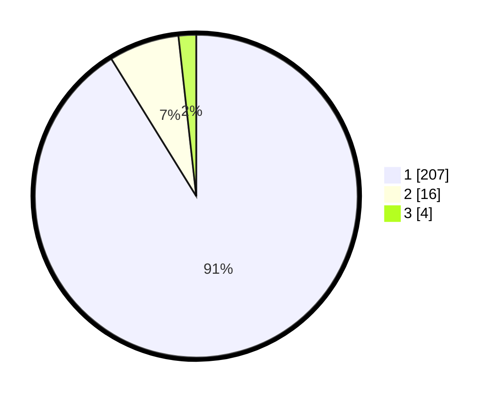

# Hasil

## Grafik

## Tabel

| No. | Nama Paslon    | Suara | Suara (raw) | Persentase |
|:--- |:-------------- | -----:| -----------:| ----------:|
| 1   | ANIES MUHAIMIN | 207   | [207][p-1]  | 91,19      |
| 2   | PRABOWO GIBRAN | 16    | [16][p-2]   | 7,05       |
| 3   | GANJAR MAHFUD  | 4     | [4][p-3]    | 1,76       |

[p-1]: https://github.com/gigit-pemilu/pemilu-2024-11-aceh/blob/main/pilpres/hitung-suara/sub/11-aceh/sub/03-aceh-timur/sub/17-peureulak-timur/sub/2006-seuneubok-teupin/sub/001-tps/sub/paslon-1.txt
[p-2]: https://github.com/gigit-pemilu/pemilu-2024-11-aceh/blob/main/pilpres/hitung-suara/sub/11-aceh/sub/03-aceh-timur/sub/17-peureulak-timur/sub/2006-seuneubok-teupin/sub/001-tps/sub/paslon-2.txt
[p-3]: https://github.com/gigit-pemilu/pemilu-2024-11-aceh/blob/main/pilpres/hitung-suara/sub/11-aceh/sub/03-aceh-timur/sub/17-peureulak-timur/sub/2006-seuneubok-teupin/sub/001-tps/sub/paslon-3.txt

## Foto C Plano

https://sirekap-obj-formc.kpu.go.id/10d0/pemilu/ppwp/11/03/17/20/06/1103172006001-20240215-000905--ba27aef0-57d3-4e2d-97df-ec887ddb9c1b.jpg

https://sirekap-obj-formc.kpu.go.id/10d0/pemilu/ppwp/11/03/17/20/06/1103172006001-20240215-001013--a3c5936f-19a2-415f-8fe4-5838b247a691.jpg

https://sirekap-obj-formc.kpu.go.id/10d0/pemilu/ppwp/11/03/17/20/06/1103172006001-20240215-001152--ed582a79-a11f-4ca3-9f60-610a804d6764.jpg

## Metadata

| Key        | Value               |
| ---------- | ------------------- |
| Time Stamp | 2024-02-24 22:31:28 |

