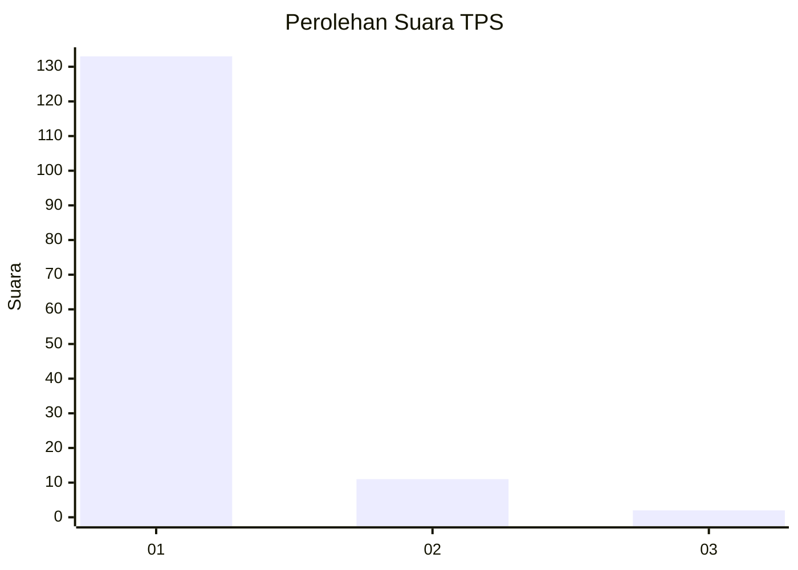
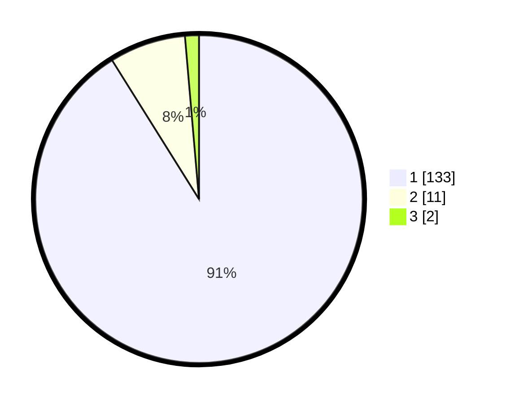

# Hasil

## Grafik

## Tabel

| No. | Nama Paslon    | Suara | Suara (raw) | Persentase |
|:--- |:-------------- | -----:| -----------:| ----------:|
| 1   | ANIES MUHAIMIN | 133   | [133][p-1]  | 91,10      |
| 2   | PRABOWO GIBRAN | 11    | [11][p-2]   | 7,53       |
| 3   | GANJAR MAHFUD  | 2     | [2][p-3]    | 1,37       |

[p-1]: https://github.com/gigit-pemilu/pemilu-2024-11-aceh/blob/main/pilpres/hitung-suara/sub/11-aceh/sub/03-aceh-timur/sub/17-peureulak-timur/sub/2007-seuneubok-teungoh/sub/003-tps/sub/paslon-1.txt
[p-2]: https://github.com/gigit-pemilu/pemilu-2024-11-aceh/blob/main/pilpres/hitung-suara/sub/11-aceh/sub/03-aceh-timur/sub/17-peureulak-timur/sub/2007-seuneubok-teungoh/sub/003-tps/sub/paslon-2.txt
[p-3]: https://github.com/gigit-pemilu/pemilu-2024-11-aceh/blob/main/pilpres/hitung-suara/sub/11-aceh/sub/03-aceh-timur/sub/17-peureulak-timur/sub/2007-seuneubok-teungoh/sub/003-tps/sub/paslon-3.txt

## Foto C Plano

https://sirekap-obj-formc.kpu.go.id/8868/pemilu/ppwp/11/03/17/20/07/1103172007003-20240215-075723--b9ee62d6-78b2-43d5-a4d9-3054281676c5.jpg

https://sirekap-obj-formc.kpu.go.id/8868/pemilu/ppwp/11/03/17/20/07/1103172007003-20240215-075938--e8bdb726-265a-413d-b39b-c86a01c51ed9.jpg

https://sirekap-obj-formc.kpu.go.id/8868/pemilu/ppwp/11/03/17/20/07/1103172007003-20240215-080138--09d46177-727b-44c5-a425-a47da4eaea34.jpg

## Metadata

| Key        | Value               |
| ---------- | ------------------- |
| Time Stamp | 2024-02-24 22:31:28 |

