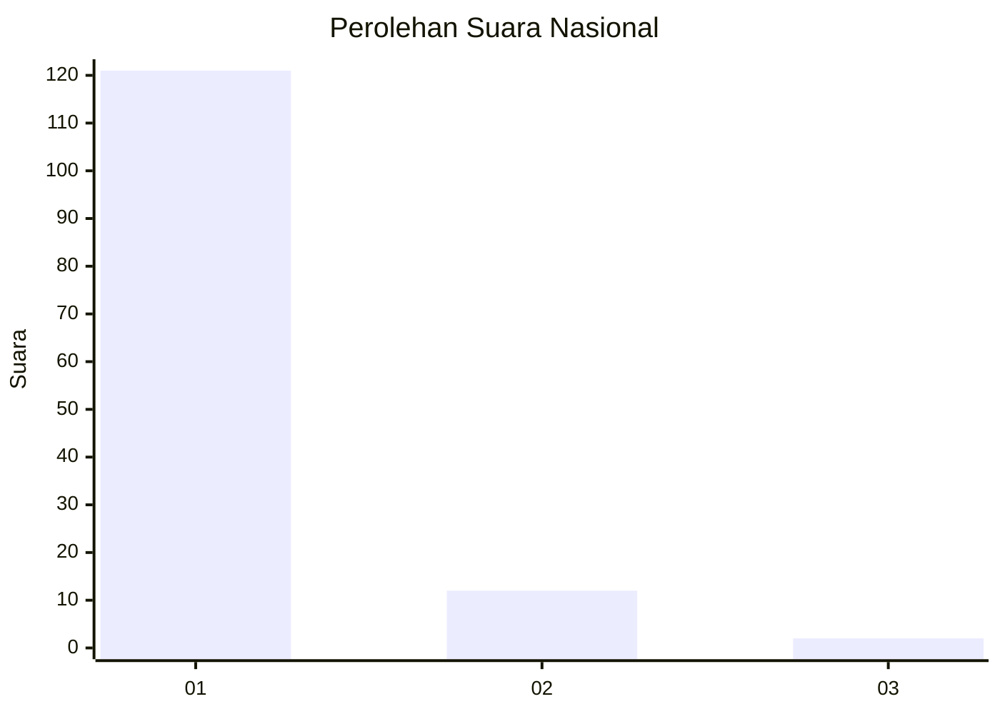
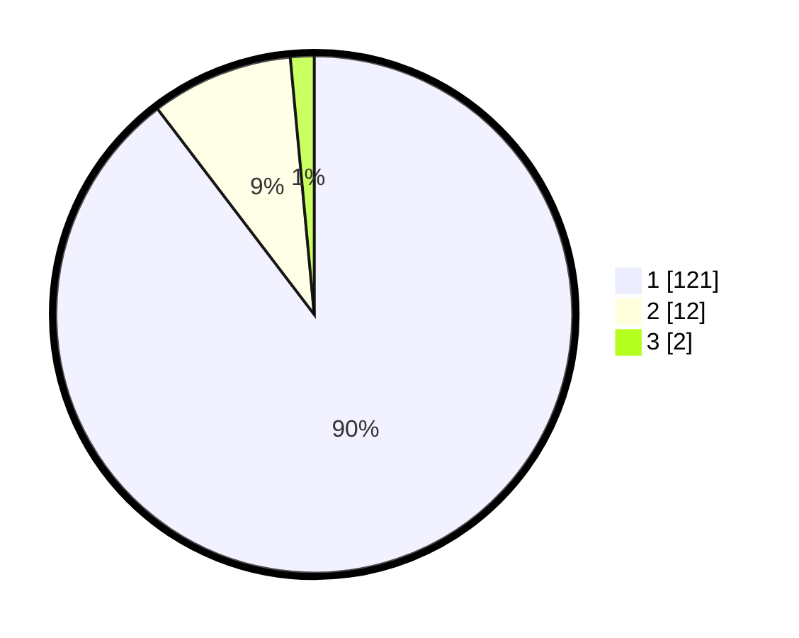

# Hasil

## Grafik

## Tabel

| No. | Nama Paslon    | Suara | Suara (raw) | Persentase |
|:--- |:-------------- | -----:| -----------:| ----------:|
| 1   | ANIES MUHAIMIN | 121   | [121][p-1]  | 89,63      |
| 2   | PRABOWO GIBRAN | 12    | [12][p-2]   | 8,89       |
| 3   | GANJAR MAHFUD  | 2     | [2][p-3]    | 1,48       |

[p-1]: https://github.com/gigit-pemilu/pemilu-2024/blob/main/pilpres/hitung-suara/sub/11-aceh/sub/03-aceh-timur/sub/17-peureulak-timur/sub/2009-seuneubok-punti/sub/002-tps/sub/paslon-1.txt
[p-2]: https://github.com/gigit-pemilu/pemilu-2024/blob/main/pilpres/hitung-suara/sub/11-aceh/sub/03-aceh-timur/sub/17-peureulak-timur/sub/2009-seuneubok-punti/sub/002-tps/sub/paslon-2.txt
[p-3]: https://github.com/gigit-pemilu/pemilu-2024/blob/main/pilpres/hitung-suara/sub/11-aceh/sub/03-aceh-timur/sub/17-peureulak-timur/sub/2009-seuneubok-punti/sub/002-tps/sub/paslon-3.txt

## Foto C Plano

https://sirekap-obj-formc.kpu.go.id/5bda/pemilu/ppwp/11/03/17/20/09/1103172009002-20240215-073228--12e3efd9-dfea-45c7-9053-4152274644c8.jpg

https://sirekap-obj-formc.kpu.go.id/5bda/pemilu/ppwp/11/03/17/20/09/1103172009002-20240215-073314--f40a7daf-c72a-4890-b3a4-0fb492dc5959.jpg

https://sirekap-obj-formc.kpu.go.id/5bda/pemilu/ppwp/11/03/17/20/09/1103172009002-20240215-073435--e9a4752d-ff16-491b-bb7c-fdd810a33c58.jpg

## Metadata

| Key        | Value               |
| ---------- | ------------------- |
| Time Stamp | 2024-02-24 22:31:28 |

