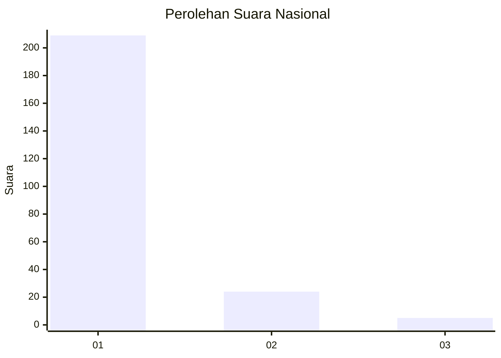
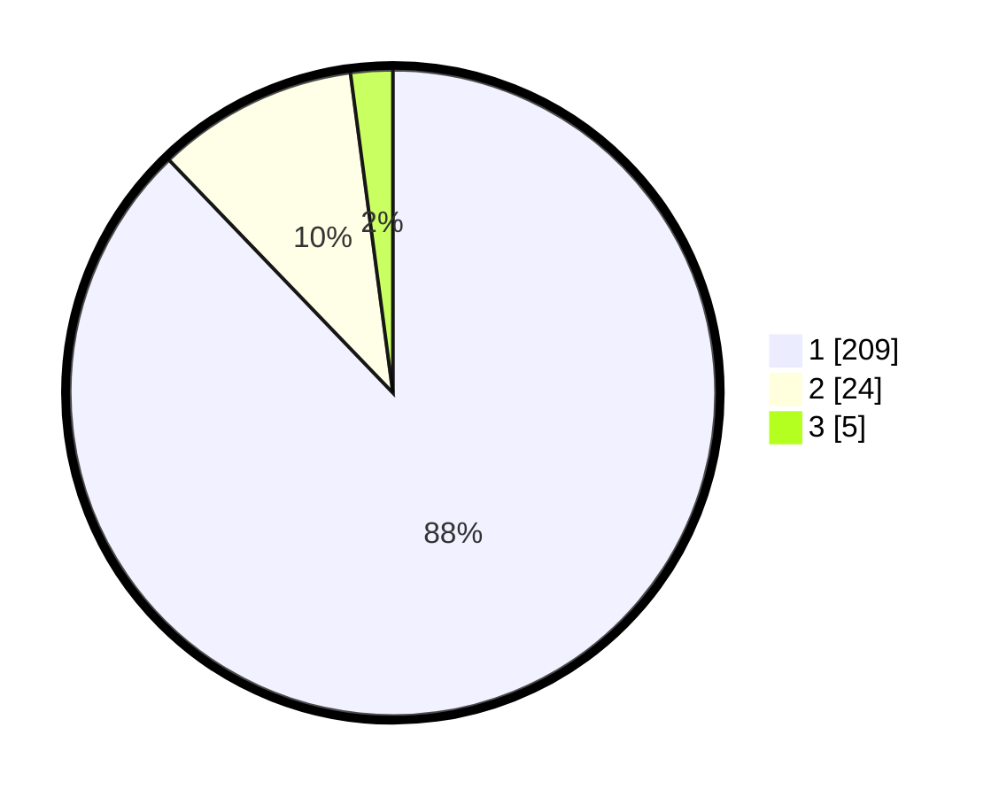

# Hasil

## Grafik

## Tabel

| No. | Nama Paslon    | Suara | Suara (raw) | Persentase |
|:--- |:-------------- | -----:| -----------:| ----------:|
| 1   | ANIES MUHAIMIN | 209   | [209][p-1]  | 87,82      |
| 2   | PRABOWO GIBRAN | 24    | [24][p-2]   | 10,08      |
| 3   | GANJAR MAHFUD  | 5     | [5][p-3]    | 2,10       |

[p-1]: https://github.com/gigit-pemilu/pemilu-2024/blob/main/pilpres/hitung-suara/sub/11-aceh/sub/03-aceh-timur/sub/17-peureulak-timur/sub/2010-seumatang-keude/sub/002-tps/sub/paslon-1.txt
[p-2]: https://github.com/gigit-pemilu/pemilu-2024/blob/main/pilpres/hitung-suara/sub/11-aceh/sub/03-aceh-timur/sub/17-peureulak-timur/sub/2010-seumatang-keude/sub/002-tps/sub/paslon-2.txt
[p-3]: https://github.com/gigit-pemilu/pemilu-2024/blob/main/pilpres/hitung-suara/sub/11-aceh/sub/03-aceh-timur/sub/17-peureulak-timur/sub/2010-seumatang-keude/sub/002-tps/sub/paslon-3.txt

## Foto C Plano

https://sirekap-obj-formc.kpu.go.id/7fb1/pemilu/ppwp/11/03/17/20/10/1103172010002-20240214-221240--27338db5-d3b7-4521-9e06-c3c8bef2bacc.jpg

https://sirekap-obj-formc.kpu.go.id/7fb1/pemilu/ppwp/11/03/17/20/10/1103172010002-20240214-221420--2912fe17-d3d2-42c8-af26-cc0892160c56.jpg

https://sirekap-obj-formc.kpu.go.id/7fb1/pemilu/ppwp/11/03/17/20/10/1103172010002-20240215-125319--1970f4a4-9f94-45f1-9fb3-d318da21bb45.jpg

## Metadata

| Key        | Value               |
| ---------- | ------------------- |
| Time Stamp | 2024-02-15 16:00:26 |

