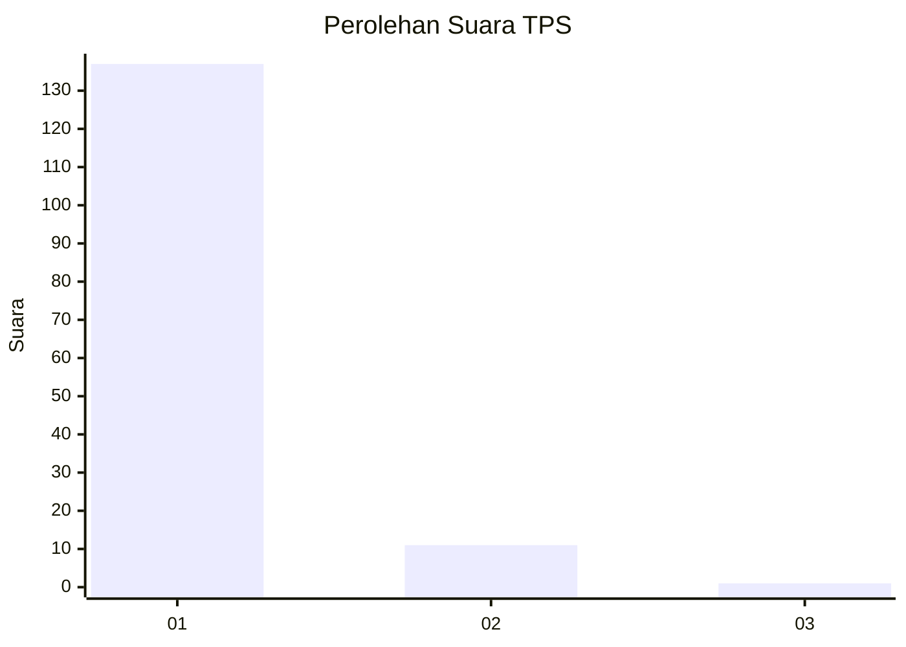
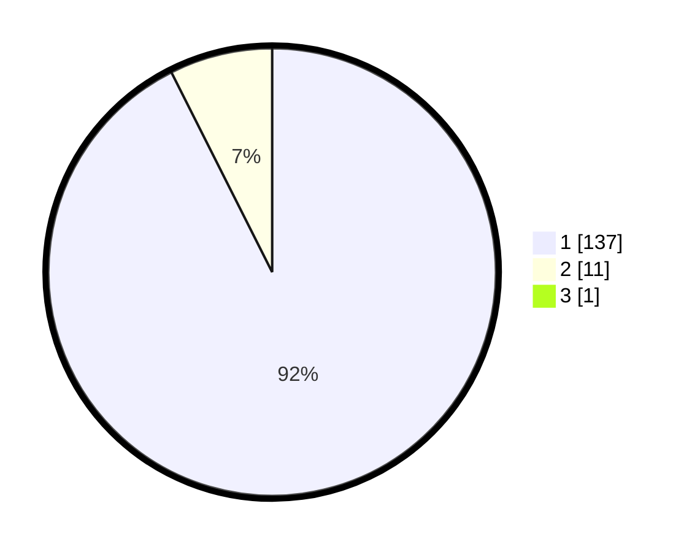

# Hasil

## Grafik

## Tabel

| No. | Nama Paslon    | Suara | Suara (raw) | Persentase |
|:--- |:-------------- | -----:| -----------:| ----------:|
| 1   | ANIES MUHAIMIN | 137   | [137][p-1]  | 91,95      |
| 2   | PRABOWO GIBRAN | 11    | [11][p-2]   | 7,38       |
| 3   | GANJAR MAHFUD  | 1     | [1][p-3]    | 0,67       |

[p-1]: https://github.com/gigit-pemilu/pemilu-2024-11-aceh/blob/main/pilpres/hitung-suara/sub/11-aceh/sub/03-aceh-timur/sub/17-peureulak-timur/sub/2011-seuneubok-jalan/sub/001-tps/sub/paslon-1.txt
[p-2]: https://github.com/gigit-pemilu/pemilu-2024-11-aceh/blob/main/pilpres/hitung-suara/sub/11-aceh/sub/03-aceh-timur/sub/17-peureulak-timur/sub/2011-seuneubok-jalan/sub/001-tps/sub/paslon-2.txt
[p-3]: https://github.com/gigit-pemilu/pemilu-2024-11-aceh/blob/main/pilpres/hitung-suara/sub/11-aceh/sub/03-aceh-timur/sub/17-peureulak-timur/sub/2011-seuneubok-jalan/sub/001-tps/sub/paslon-3.txt

## Foto C Plano

https://sirekap-obj-formc.kpu.go.id/30e6/pemilu/ppwp/11/03/17/20/11/1103172011001-20240215-130900--1221f57e-4638-470b-92be-f553b64a6a2f.jpg

https://sirekap-obj-formc.kpu.go.id/30e6/pemilu/ppwp/11/03/17/20/11/1103172011001-20240215-130456--8a2b60fc-e709-47a2-9f05-5429ae50bec5.jpg

https://sirekap-obj-formc.kpu.go.id/30e6/pemilu/ppwp/11/03/17/20/11/1103172011001-20240215-130205--9218d316-f068-42f0-9e6d-58b2702536d6.jpg

## Metadata

| Key        | Value               |
| ---------- | ------------------- |
| Time Stamp | 2024-02-25 12:00:00 |

