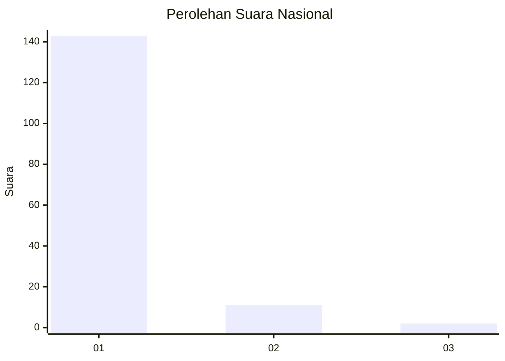
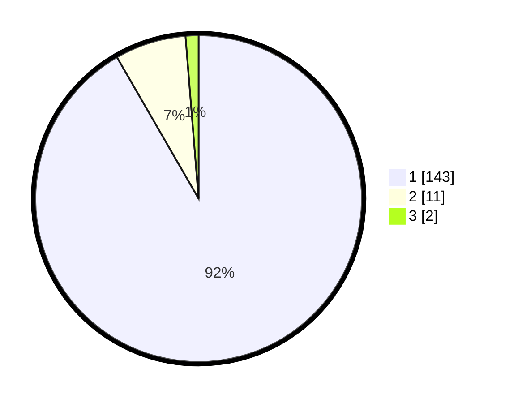

# Hasil

## Grafik

## Tabel

| No. | Nama Paslon    | Suara | Suara (raw) | Persentase |
|:--- |:-------------- | -----:| -----------:| ----------:|
| 1   | ANIES MUHAIMIN | 143   | [143][p-1]  | 91,67      |
| 2   | PRABOWO GIBRAN | 11    | [11][p-2]   | 7,05       |
| 3   | GANJAR MAHFUD  | 2     | [2][p-3]    | 1,28       |

[p-1]: https://github.com/gigit-pemilu/pemilu-2024/blob/main/pilpres/hitung-suara/sub/11-aceh/sub/03-aceh-timur/sub/17-peureulak-timur/sub/2011-seuneubok-jalan/sub/002-tps/sub/paslon-1.txt
[p-2]: https://github.com/gigit-pemilu/pemilu-2024/blob/main/pilpres/hitung-suara/sub/11-aceh/sub/03-aceh-timur/sub/17-peureulak-timur/sub/2011-seuneubok-jalan/sub/002-tps/sub/paslon-2.txt
[p-3]: https://github.com/gigit-pemilu/pemilu-2024/blob/main/pilpres/hitung-suara/sub/11-aceh/sub/03-aceh-timur/sub/17-peureulak-timur/sub/2011-seuneubok-jalan/sub/002-tps/sub/paslon-3.txt

## Foto C Plano

https://sirekap-obj-formc.kpu.go.id/8cce/pemilu/ppwp/11/03/17/20/11/1103172011002-20240215-163727--45dd5ffb-7913-46f6-aaeb-ad0e14cd80c7.jpg

https://sirekap-obj-formc.kpu.go.id/8cce/pemilu/ppwp/11/03/17/20/11/1103172011002-20240215-163823--68520972-f1ad-474f-adf4-b17881965044.jpg

https://sirekap-obj-formc.kpu.go.id/8cce/pemilu/ppwp/11/03/17/20/11/1103172011002-20240215-163926--469749cf-f583-4069-9dfc-e47198b0a354.jpg

## Metadata

| Key        | Value               |
| ---------- | ------------------- |
| Time Stamp | 2024-02-24 22:31:28 |

