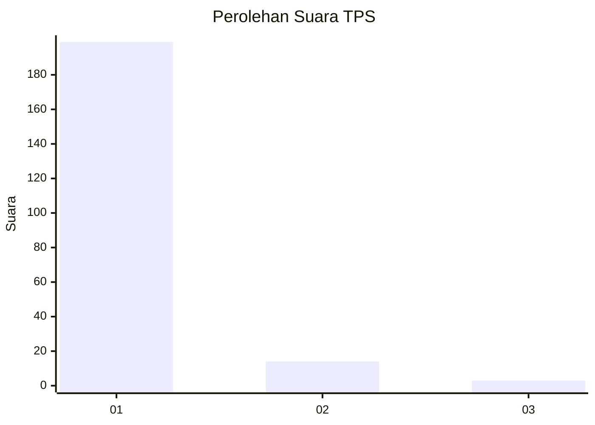
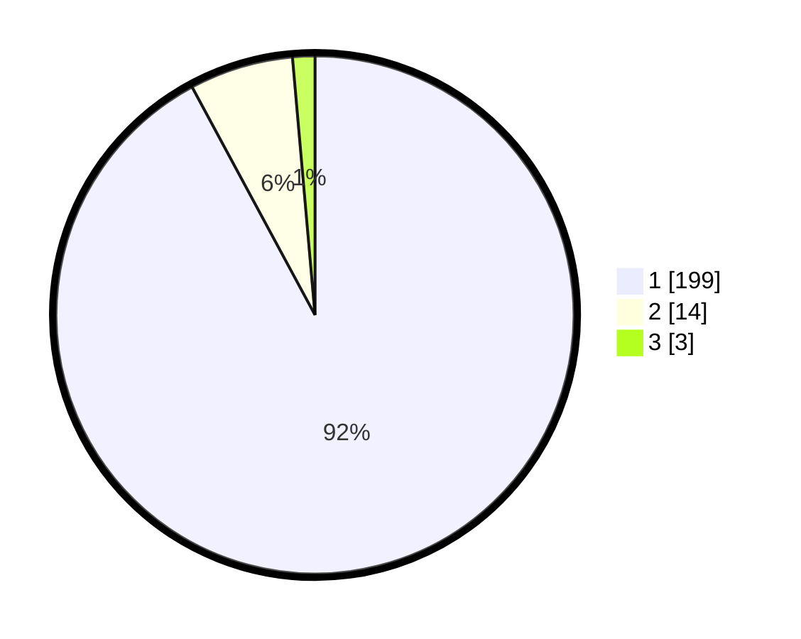

# Hasil

## Grafik

## Tabel

| No. | Nama Paslon    | Suara | Suara (raw) | Persentase |
|:--- |:-------------- | -----:| -----------:| ----------:|
| 1   | ANIES MUHAIMIN | 199   | [199][p-1]  | 92,13      |
| 2   | PRABOWO GIBRAN | 14    | [14][p-2]   | 6,48       |
| 3   | GANJAR MAHFUD  | 3     | [3][p-3]    | 1,39       |

[p-1]: https://github.com/gigit-pemilu/pemilu-2024-11-aceh/blob/main/pilpres/hitung-suara/sub/11-aceh/sub/03-aceh-timur/sub/17-peureulak-timur/sub/2012-seuneubok-paya/sub/001-tps/sub/paslon-1.txt
[p-2]: https://github.com/gigit-pemilu/pemilu-2024-11-aceh/blob/main/pilpres/hitung-suara/sub/11-aceh/sub/03-aceh-timur/sub/17-peureulak-timur/sub/2012-seuneubok-paya/sub/001-tps/sub/paslon-2.txt
[p-3]: https://github.com/gigit-pemilu/pemilu-2024-11-aceh/blob/main/pilpres/hitung-suara/sub/11-aceh/sub/03-aceh-timur/sub/17-peureulak-timur/sub/2012-seuneubok-paya/sub/001-tps/sub/paslon-3.txt

## Foto C Plano

https://sirekap-obj-formc.kpu.go.id/0309/pemilu/ppwp/11/03/17/20/12/1103172012001-20240215-044308--8f7e9d04-ba6e-492c-9bbe-9d7f5f6bd70b.jpg

https://sirekap-obj-formc.kpu.go.id/0309/pemilu/ppwp/11/03/17/20/12/1103172012001-20240215-044320--ce026eb0-263a-4e16-ab76-d1839d042a3f.jpg

https://sirekap-obj-formc.kpu.go.id/0309/pemilu/ppwp/11/03/17/20/12/1103172012001-20240215-044330--e20dcb92-0e24-488a-b6db-3c0d249bc216.jpg

## Metadata

| Key        | Value               |
| ---------- | ------------------- |
| Time Stamp | 2024-02-24 22:31:28 |

