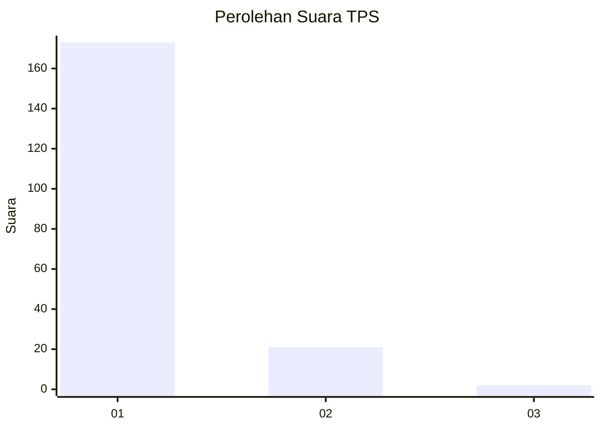
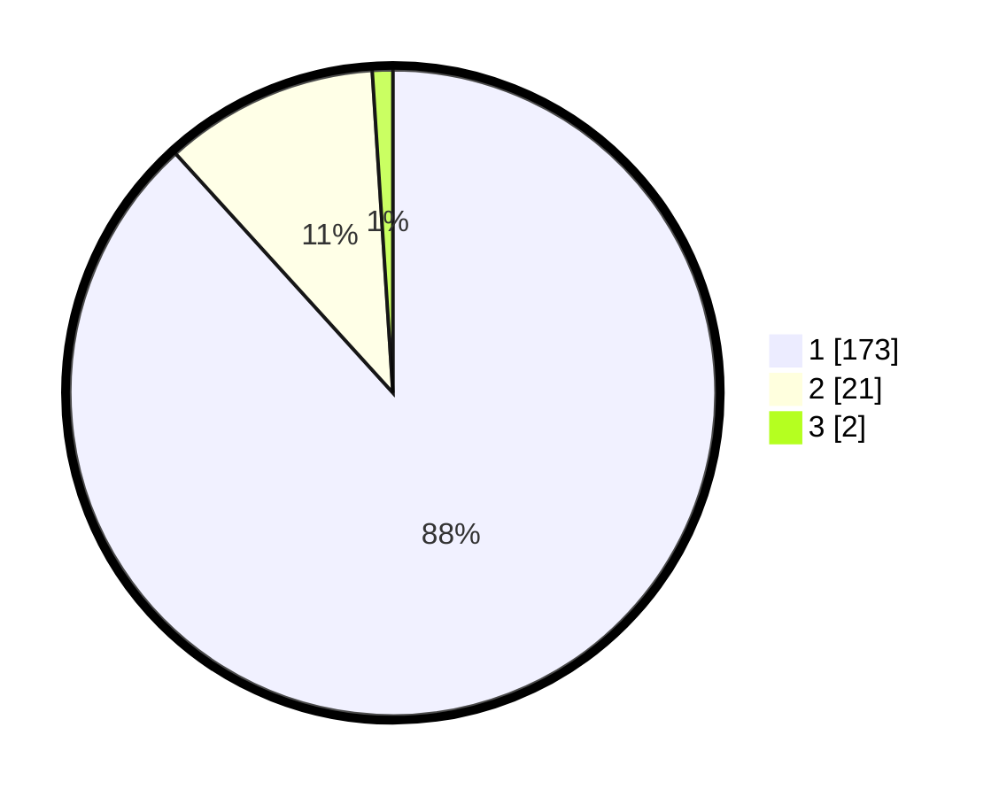

# Hasil

## Grafik

## Tabel

| No. | Nama Paslon    | Suara | Suara (raw) | Persentase |
|:--- |:-------------- | -----:| -----------:| ----------:|
| 1   | ANIES MUHAIMIN | 173   | [173][p-1]  | 88,27      |
| 2   | PRABOWO GIBRAN | 21    | [21][p-2]   | 10,71      |
| 3   | GANJAR MAHFUD  | 2     | [2][p-3]    | 1,02       |

[p-1]: https://github.com/gigit-pemilu/pemilu-2024-11-aceh/blob/main/pilpres/hitung-suara/sub/11-aceh/sub/03-aceh-timur/sub/17-peureulak-timur/sub/2013-alue-tho/sub/001-tps/sub/paslon-1.txt
[p-2]: https://github.com/gigit-pemilu/pemilu-2024-11-aceh/blob/main/pilpres/hitung-suara/sub/11-aceh/sub/03-aceh-timur/sub/17-peureulak-timur/sub/2013-alue-tho/sub/001-tps/sub/paslon-2.txt
[p-3]: https://github.com/gigit-pemilu/pemilu-2024-11-aceh/blob/main/pilpres/hitung-suara/sub/11-aceh/sub/03-aceh-timur/sub/17-peureulak-timur/sub/2013-alue-tho/sub/001-tps/sub/paslon-3.txt

## Foto C Plano

https://sirekap-obj-formc.kpu.go.id/36f7/pemilu/ppwp/11/03/17/20/13/1103172013001-20240215-012812--0ed01fa9-c1e6-420a-a113-333144ecb466.jpg

https://sirekap-obj-formc.kpu.go.id/36f7/pemilu/ppwp/11/03/17/20/13/1103172013001-20240214-213028--18ac679e-02a4-4fc2-b7c1-29ac614c952d.jpg

https://sirekap-obj-formc.kpu.go.id/36f7/pemilu/ppwp/11/03/17/20/13/1103172013001-20240214-213235--55ee810d-13c3-400a-8457-e922adef4cfe.jpg

## Metadata

| Key        | Value               |
| ---------- | ------------------- |
| Time Stamp | 2024-02-17 16:00:02 |

