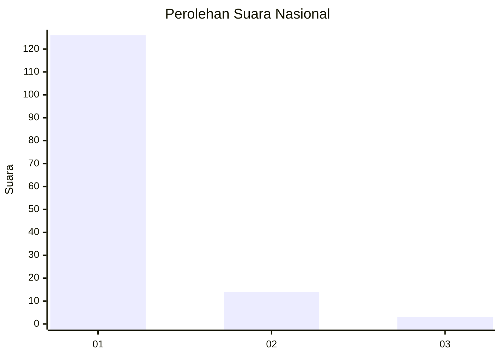
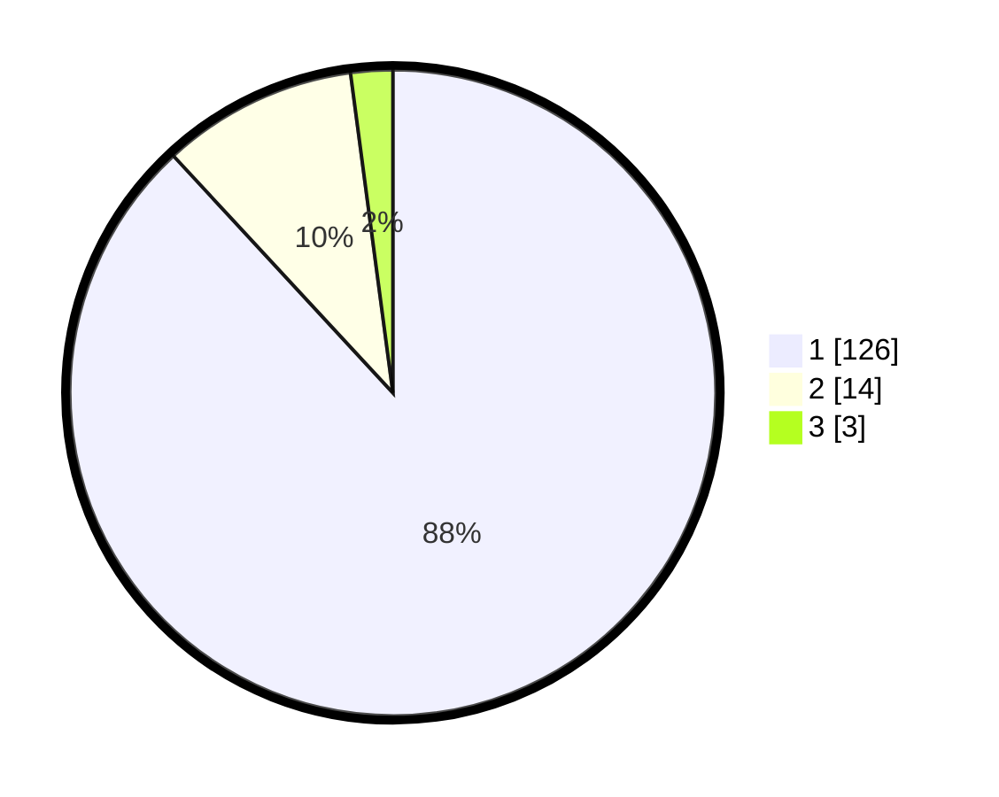

# Hasil

## Grafik

## Tabel

| No. | Nama Paslon    | Suara | Suara (raw) | Persentase |
|:--- |:-------------- | -----:| -----------:| ----------:|
| 1   | ANIES MUHAIMIN | 126   | [126][p-1]  | 88,11      |
| 2   | PRABOWO GIBRAN | 14    | [14][p-2]   | 9,79       |
| 3   | GANJAR MAHFUD  | 3     | [3][p-3]    | 2,10       |

[p-1]: https://github.com/gigit-pemilu/pemilu-2024/blob/main/pilpres/hitung-suara/sub/11-aceh/sub/03-aceh-timur/sub/17-peureulak-timur/sub/2015-alue-bu-alue-nireh/sub/001-tps/sub/paslon-1.txt
[p-2]: https://github.com/gigit-pemilu/pemilu-2024/blob/main/pilpres/hitung-suara/sub/11-aceh/sub/03-aceh-timur/sub/17-peureulak-timur/sub/2015-alue-bu-alue-nireh/sub/001-tps/sub/paslon-2.txt
[p-3]: https://github.com/gigit-pemilu/pemilu-2024/blob/main/pilpres/hitung-suara/sub/11-aceh/sub/03-aceh-timur/sub/17-peureulak-timur/sub/2015-alue-bu-alue-nireh/sub/001-tps/sub/paslon-3.txt

## Foto C Plano

https://sirekap-obj-formc.kpu.go.id/612a/pemilu/ppwp/11/03/17/20/15/1103172015001-20240214-202818--fdee8d96-6171-4814-a4e2-c48f635424f9.jpg

https://sirekap-obj-formc.kpu.go.id/612a/pemilu/ppwp/11/03/17/20/15/1103172015001-20240215-024126--a5e64b1a-6baf-4690-956d-9e5439d7be4c.jpg

https://sirekap-obj-formc.kpu.go.id/612a/pemilu/ppwp/11/03/17/20/15/1103172015001-20240215-024303--39e5f92c-fd55-4b23-8d6e-9a65ea10bc3c.jpg

## Metadata

| Key        | Value               |
| ---------- | ------------------- |
| Time Stamp | 2024-02-17 16:00:02 |

## DATA PEMILIH TETAP

Jumlah pemilih dalam DPT: **187**.
 * L: **94**.
 * P: **93**.

## DATA PENGGUNA HAK PILIH

Jumlah pengguna hak pilih dalam DPT: **140**.
 * L: **61**.
 * P: **79**.

Jumlah pengguna hak pilih dalam DPTb: **0**.
 * L: **0**.
 * P: **0**.

Jumlah pengguna hak pilih dalam DPK: **8**.
 * L: **4**.
 * P: **4**.

Jumlah pengguna hak pilih: **148**.
 * L: **65**.
 * P: **83**.

## JUMLAH SUARA SAH DAN TIDAK SAH

JUMLAH SELURUH SUARA SAH: **143**.

JUMLAH SUARA TIDAK SAH: **5**.

JUMLAH SELURUH SUARA SAH DAN SUARA TIDAK SAH: **148**.

