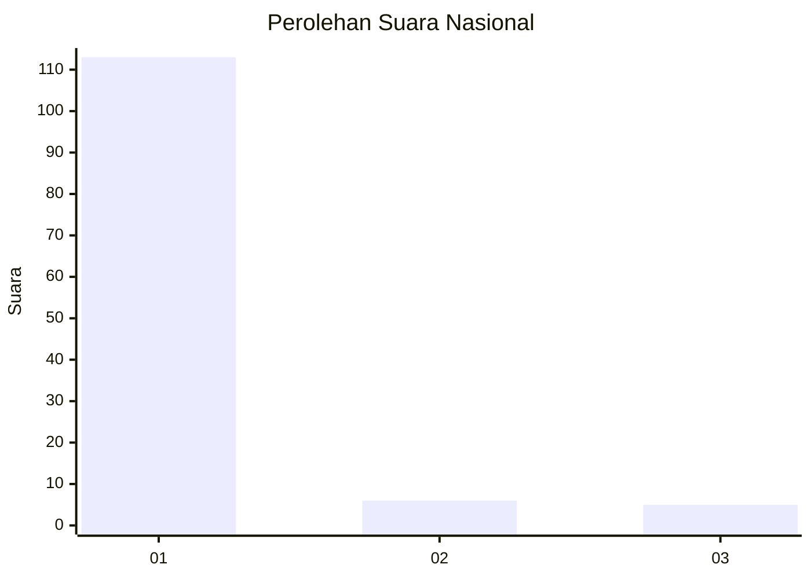
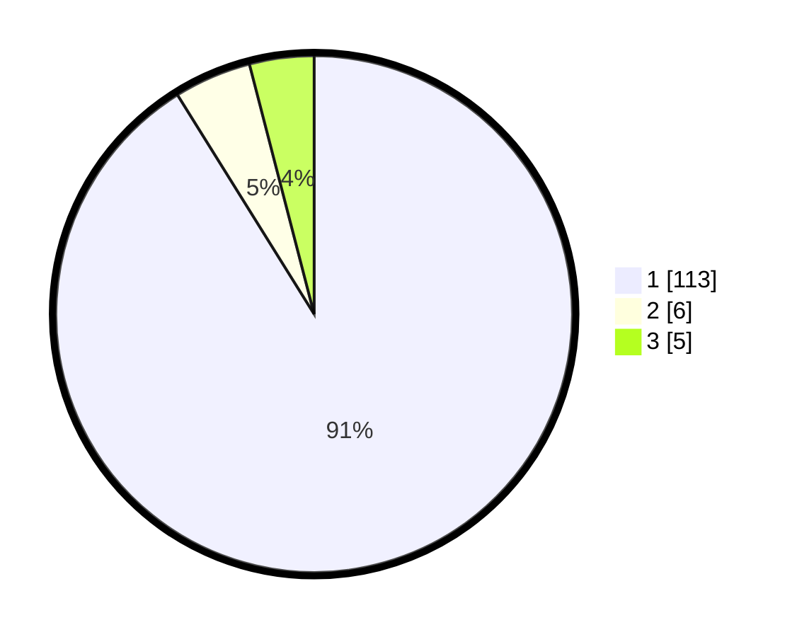

# Hasil

## Grafik

## Tabel

| No. | Nama Paslon    | Suara | Suara (raw) | Persentase |
|:--- |:-------------- | -----:| -----------:| ----------:|
| 1   | ANIES MUHAIMIN | 113   | [113][p-1]  | 91,13      |
| 2   | PRABOWO GIBRAN | 6     | [6][p-2]    | 4,84       |
| 3   | GANJAR MAHFUD  | 5     | [5][p-3]    | 4,03       |

[p-1]: https://github.com/gigit-pemilu/pemilu-2024/blob/main/pilpres/hitung-suara/sub/11-aceh/sub/03-aceh-timur/sub/17-peureulak-timur/sub/2015-alue-bu-alue-nireh/sub/002-tps/sub/paslon-1.txt
[p-2]: https://github.com/gigit-pemilu/pemilu-2024/blob/main/pilpres/hitung-suara/sub/11-aceh/sub/03-aceh-timur/sub/17-peureulak-timur/sub/2015-alue-bu-alue-nireh/sub/002-tps/sub/paslon-2.txt
[p-3]: https://github.com/gigit-pemilu/pemilu-2024/blob/main/pilpres/hitung-suara/sub/11-aceh/sub/03-aceh-timur/sub/17-peureulak-timur/sub/2015-alue-bu-alue-nireh/sub/002-tps/sub/paslon-3.txt

## Foto C Plano

https://sirekap-obj-formc.kpu.go.id/eeba/pemilu/ppwp/11/03/17/20/15/1103172015002-20240215-053136--34b4df83-a24a-42ce-8ca0-236ee0d2045b.jpg

https://sirekap-obj-formc.kpu.go.id/eeba/pemilu/ppwp/11/03/17/20/15/1103172015002-20240215-053246--499a2f82-4c95-4ab2-80f4-b7df3153c3da.jpg

https://sirekap-obj-formc.kpu.go.id/eeba/pemilu/ppwp/11/03/17/20/15/1103172015002-20240215-053352--63031bbd-cb3d-4a6e-b15e-5af0ca721d8e.jpg

## Metadata

| Key        | Value               |
| ---------- | ------------------- |
| Time Stamp | 2024-02-24 22:31:28 |

