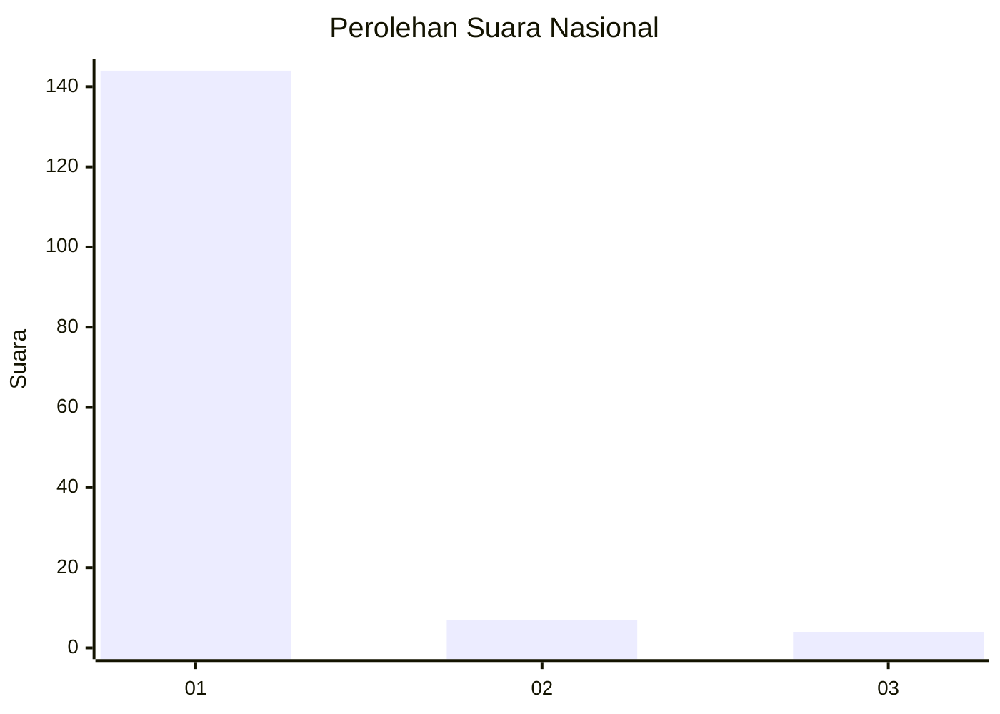
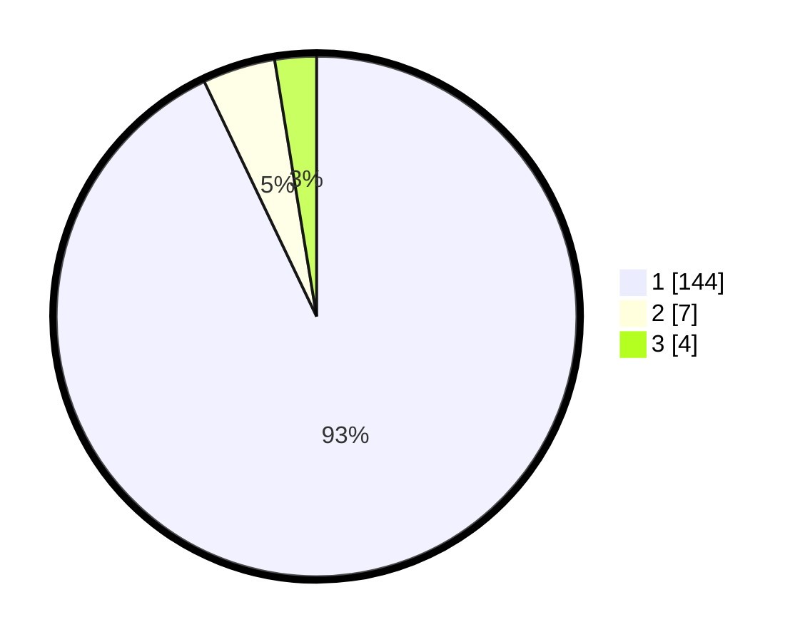

# Hasil

## Grafik

## Tabel

| No. | Nama Paslon    | Suara | Suara (raw) | Persentase |
|:--- |:-------------- | -----:| -----------:| ----------:|
| 1   | ANIES MUHAIMIN | 144   | [144][p-1]  | 92,90      |
| 2   | PRABOWO GIBRAN | 7     | [7][p-2]    | 4,52       |
| 3   | GANJAR MAHFUD  | 4     | [4][p-3]    | 2,58       |

[p-1]: https://github.com/gigit-pemilu/pemilu-2024/blob/main/pilpres/hitung-suara/sub/11-aceh/sub/03-aceh-timur/sub/17-peureulak-timur/sub/2016-seuneubok-dalam/sub/002-tps/sub/paslon-1.txt
[p-2]: https://github.com/gigit-pemilu/pemilu-2024/blob/main/pilpres/hitung-suara/sub/11-aceh/sub/03-aceh-timur/sub/17-peureulak-timur/sub/2016-seuneubok-dalam/sub/002-tps/sub/paslon-2.txt
[p-3]: https://github.com/gigit-pemilu/pemilu-2024/blob/main/pilpres/hitung-suara/sub/11-aceh/sub/03-aceh-timur/sub/17-peureulak-timur/sub/2016-seuneubok-dalam/sub/002-tps/sub/paslon-3.txt

## Foto C Plano

https://sirekap-obj-formc.kpu.go.id/03b9/pemilu/ppwp/11/03/17/20/16/1103172016002-20240215-002609--de9dd3fb-4dbc-4b8d-97d9-7a2f17944a29.jpg

https://sirekap-obj-formc.kpu.go.id/03b9/pemilu/ppwp/11/03/17/20/16/1103172016002-20240215-002728--b9a111e5-628d-407c-9c08-a301f3d41708.jpg

https://sirekap-obj-formc.kpu.go.id/03b9/pemilu/ppwp/11/03/17/20/16/1103172016002-20240215-002456--2ab3e8a9-a54e-4773-aff4-31e67087b3e7.jpg

## Metadata

| Key        | Value               |
| ---------- | ------------------- |
| Time Stamp | 2024-02-17 16:00:02 |

## DATA PEMILIH TETAP

Jumlah pemilih dalam DPT: **183**.
 * L: **91**.
 * P: **92**.

## DATA PENGGUNA HAK PILIH

Jumlah pengguna hak pilih dalam DPT: **153**.
 * L: **71**.
 * P: **82**.

Jumlah pengguna hak pilih dalam DPTb: **2**.
 * L: **0**.
 * P: **2**.

Jumlah pengguna hak pilih dalam DPK: **0**.
 * L: **0**.
 * P: **0**.

Jumlah pengguna hak pilih: **155**.
 * L: **71**.
 * P: **84**.

## JUMLAH SUARA SAH DAN TIDAK SAH

JUMLAH SELURUH SUARA SAH: **155**.

JUMLAH SUARA TIDAK SAH: **0**.

JUMLAH SELURUH SUARA SAH DAN SUARA TIDAK SAH: **155**.

