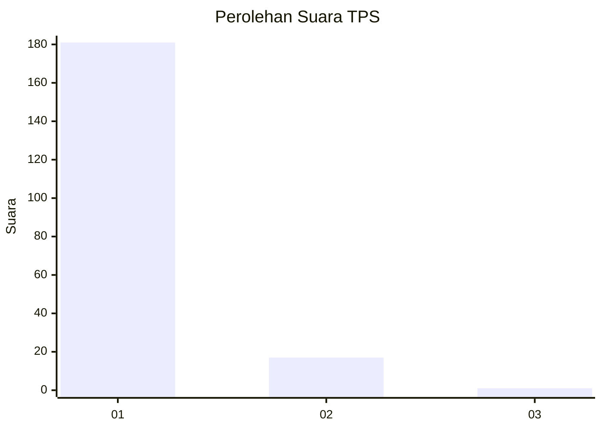
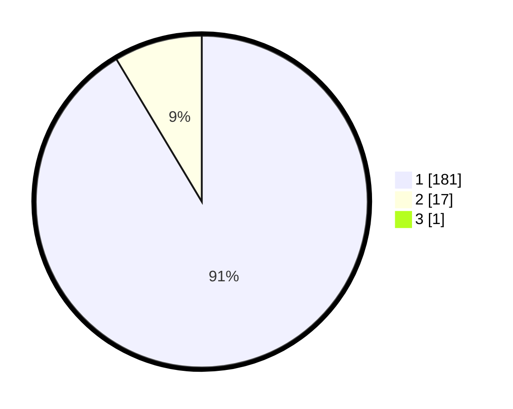

# Hasil

## Grafik

## Tabel

| No. | Nama Paslon    | Suara | Suara (raw) | Persentase |
|:--- |:-------------- | -----:| -----------:| ----------:|
| 1   | ANIES MUHAIMIN | 181   | [181][p-1]  | 90,95      |
| 2   | PRABOWO GIBRAN | 17    | [17][p-2]   | 8,54       |
| 3   | GANJAR MAHFUD  | 1     | [1][p-3]    | 0,50       |

[p-1]: https://github.com/gigit-pemilu/pemilu-2024-11-aceh/blob/main/pilpres/hitung-suara/sub/11-aceh/sub/03-aceh-timur/sub/18-peureulak-barat/sub/2001-beusa-seberang/sub/003-tps/sub/paslon-1.txt
[p-2]: https://github.com/gigit-pemilu/pemilu-2024-11-aceh/blob/main/pilpres/hitung-suara/sub/11-aceh/sub/03-aceh-timur/sub/18-peureulak-barat/sub/2001-beusa-seberang/sub/003-tps/sub/paslon-2.txt
[p-3]: https://github.com/gigit-pemilu/pemilu-2024-11-aceh/blob/main/pilpres/hitung-suara/sub/11-aceh/sub/03-aceh-timur/sub/18-peureulak-barat/sub/2001-beusa-seberang/sub/003-tps/sub/paslon-3.txt

## Foto C Plano

https://sirekap-obj-formc.kpu.go.id/ae9e/pemilu/ppwp/11/03/18/20/01/1103182001003-20240215-012032--20376d38-6dee-45eb-9106-0ad93e73e6f7.jpg

https://sirekap-obj-formc.kpu.go.id/ae9e/pemilu/ppwp/11/03/18/20/01/1103182001003-20240215-012547--db6e568e-9652-486a-a028-0a1a57a62e55.jpg

## Metadata

| Key        | Value               |
| ---------- | ------------------- |
| Time Stamp | 2024-02-16 10:30:29 |

