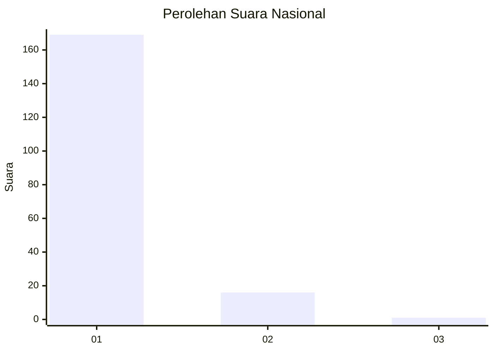
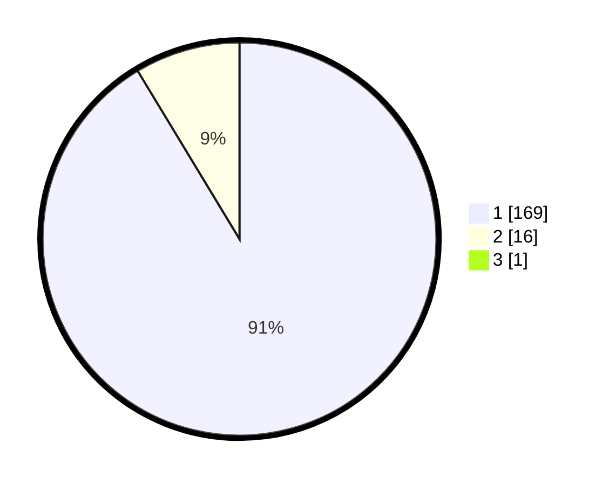

# Hasil

## Grafik

## Tabel

| No. | Nama Paslon    | Suara | Suara (raw) | Persentase |
|:--- |:-------------- | -----:| -----------:| ----------:|
| 1   | ANIES MUHAIMIN | 169   | [169][p-1]  | 90,86      |
| 2   | PRABOWO GIBRAN | 16    | [16][p-2]   | 8,60       |
| 3   | GANJAR MAHFUD  | 1     | [1][p-3]    | 0,54       |

[p-1]: https://github.com/gigit-pemilu/pemilu-2024/blob/main/pilpres/hitung-suara/sub/11-aceh/sub/03-aceh-timur/sub/18-peureulak-barat/sub/2001-beusa-seberang/sub/004-tps/sub/paslon-1.txt
[p-2]: https://github.com/gigit-pemilu/pemilu-2024/blob/main/pilpres/hitung-suara/sub/11-aceh/sub/03-aceh-timur/sub/18-peureulak-barat/sub/2001-beusa-seberang/sub/004-tps/sub/paslon-2.txt
[p-3]: https://github.com/gigit-pemilu/pemilu-2024/blob/main/pilpres/hitung-suara/sub/11-aceh/sub/03-aceh-timur/sub/18-peureulak-barat/sub/2001-beusa-seberang/sub/004-tps/sub/paslon-3.txt

## Foto C Plano

https://sirekap-obj-formc.kpu.go.id/ef63/pemilu/ppwp/11/03/18/20/01/1103182001004-20240215-051142--6142aa81-1b52-4cd8-895a-a11bc10d487c.jpg

https://sirekap-obj-formc.kpu.go.id/ef63/pemilu/ppwp/11/03/18/20/01/1103182001004-20240215-051249--9752847f-81b3-4931-87d2-2e9de12e87dc.jpg

https://sirekap-obj-formc.kpu.go.id/ef63/pemilu/ppwp/11/03/18/20/01/1103182001004-20240215-051347--b3e85353-bda9-4d94-b8cf-6d3c2316a5f2.jpg

## Metadata

| Key        | Value               |
| ---------- | ------------------- |
| Time Stamp | 2024-02-24 22:31:28 |

