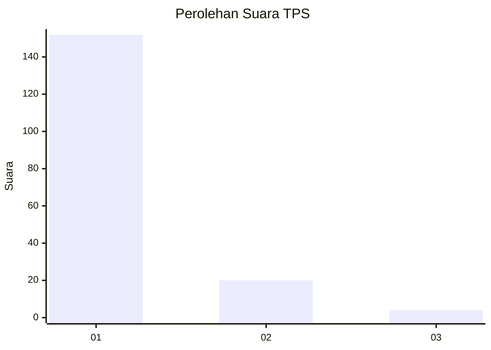
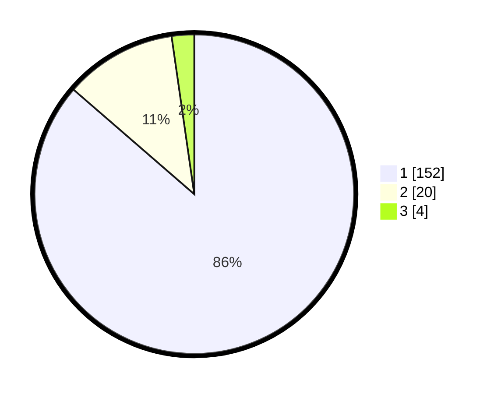

# Hasil

## Grafik

## Tabel

| No. | Nama Paslon    | Suara | Suara (raw) | Persentase |
|:--- |:-------------- | -----:| -----------:| ----------:|
| 1   | ANIES MUHAIMIN | 152   | [152][p-1]  | 86,36      |
| 2   | PRABOWO GIBRAN | 20    | [20][p-2]   | 11,36      |
| 3   | GANJAR MAHFUD  | 4     | [4][p-3]    | 2,27       |

[p-1]: https://github.com/gigit-pemilu/pemilu-2024-11-aceh/blob/main/pilpres/hitung-suara/sub/11-aceh/sub/03-aceh-timur/sub/18-peureulak-barat/sub/2001-beusa-seberang/sub/006-tps/sub/paslon-1.txt
[p-2]: https://github.com/gigit-pemilu/pemilu-2024-11-aceh/blob/main/pilpres/hitung-suara/sub/11-aceh/sub/03-aceh-timur/sub/18-peureulak-barat/sub/2001-beusa-seberang/sub/006-tps/sub/paslon-2.txt
[p-3]: https://github.com/gigit-pemilu/pemilu-2024-11-aceh/blob/main/pilpres/hitung-suara/sub/11-aceh/sub/03-aceh-timur/sub/18-peureulak-barat/sub/2001-beusa-seberang/sub/006-tps/sub/paslon-3.txt

## Foto C Plano

https://sirekap-obj-formc.kpu.go.id/84af/pemilu/ppwp/11/03/18/20/01/1103182001006-20240215-015515--fe6cb9fc-997c-42f5-99ef-8e9dc6f571c1.jpg

https://sirekap-obj-formc.kpu.go.id/84af/pemilu/ppwp/11/03/18/20/01/1103182001006-20240214-204432--2926084a-0938-4574-b71e-5dba5bcde876.jpg

## Metadata

| Key        | Value               |
| ---------- | ------------------- |
| Time Stamp | 2024-02-24 22:31:28 |

