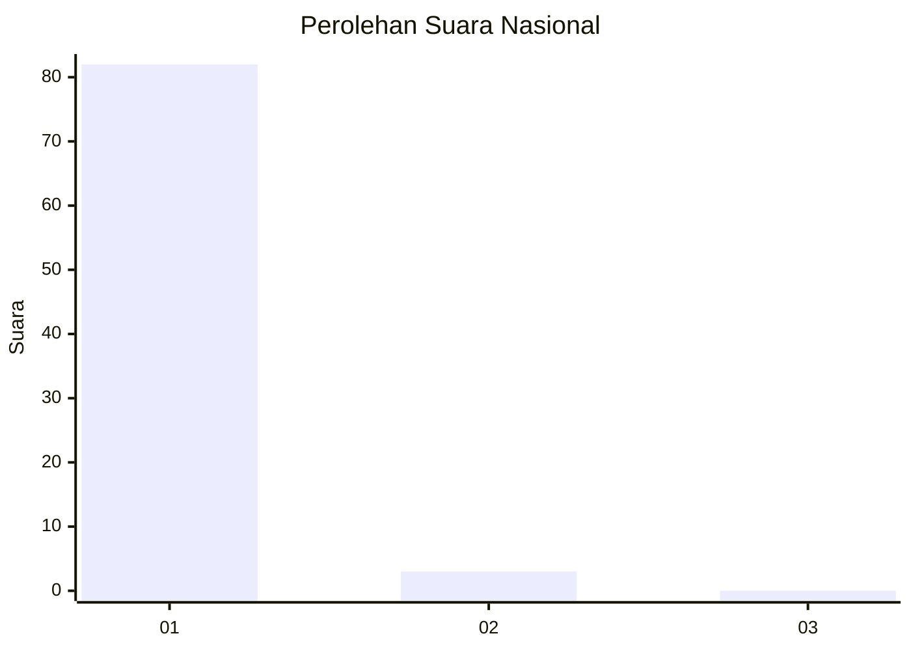
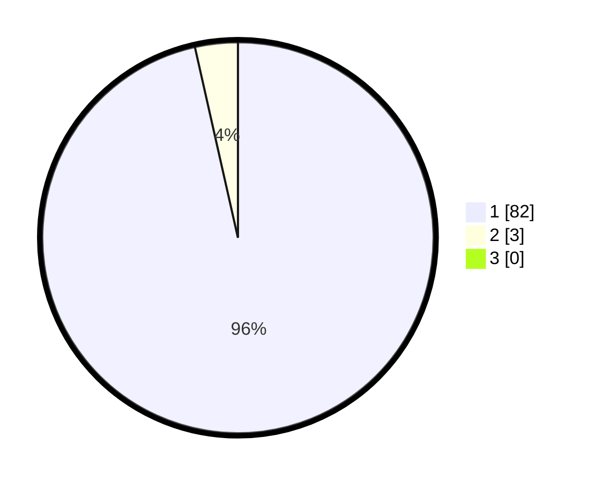

# Hasil

## Grafik

## Tabel

| No. | Nama Paslon    | Suara | Suara (raw) | Persentase |
|:--- |:-------------- | -----:| -----------:| ----------:|
| 1   | ANIES MUHAIMIN | 82    | [82][p-1]   | 96,47      |
| 2   | PRABOWO GIBRAN | 3     | [3][p-2]    | 3,53       |
| 3   | GANJAR MAHFUD  | 0     | [0][p-3]    | 0,00       |

[p-1]: https://github.com/gigit-pemilu/pemilu-2024/blob/main/pilpres/hitung-suara/sub/11-aceh/sub/03-aceh-timur/sub/18-peureulak-barat/sub/2002-mon-geudong/sub/002-tps/sub/paslon-1.txt
[p-2]: https://github.com/gigit-pemilu/pemilu-2024/blob/main/pilpres/hitung-suara/sub/11-aceh/sub/03-aceh-timur/sub/18-peureulak-barat/sub/2002-mon-geudong/sub/002-tps/sub/paslon-2.txt
[p-3]: https://github.com/gigit-pemilu/pemilu-2024/blob/main/pilpres/hitung-suara/sub/11-aceh/sub/03-aceh-timur/sub/18-peureulak-barat/sub/2002-mon-geudong/sub/002-tps/sub/paslon-3.txt

## Foto C Plano

https://sirekap-obj-formc.kpu.go.id/7f33/pemilu/ppwp/11/03/18/20/02/1103182002002-20240215-014444--e097d10c-8898-4375-82e5-314b5cf2076e.jpg

https://sirekap-obj-formc.kpu.go.id/7f33/pemilu/ppwp/11/03/18/20/02/1103182002002-20240215-015014--1164e493-654c-4dab-8c44-b49586c68ff8.jpg

https://sirekap-obj-formc.kpu.go.id/7f33/pemilu/ppwp/11/03/18/20/02/1103182002002-20240215-014609--ee8ef79f-6555-4178-a714-bae0707fc417.jpg

## Metadata

| Key        | Value               |
| ---------- | ------------------- |
| Time Stamp | 2024-02-17 16:00:02 |

## DATA PEMILIH TETAP

Jumlah pemilih dalam DPT: **102**.
 * L: **52**.
 * P: **50**.

## DATA PENGGUNA HAK PILIH

Jumlah pengguna hak pilih dalam DPT: **85**.
 * L: **41**.
 * P: **44**.

Jumlah pengguna hak pilih dalam DPTb: **0**.
 * L: **0**.
 * P: **0**.

Jumlah pengguna hak pilih dalam DPK: **1**.
 * L: **0**.
 * P: **1**.

Jumlah pengguna hak pilih: **85**.
 * L: **41**.
 * P: **44**.

## JUMLAH SUARA SAH DAN TIDAK SAH

JUMLAH SELURUH SUARA SAH: **85**.

JUMLAH SUARA TIDAK SAH: **0**.

JUMLAH SELURUH SUARA SAH DAN SUARA TIDAK SAH: **85**.

