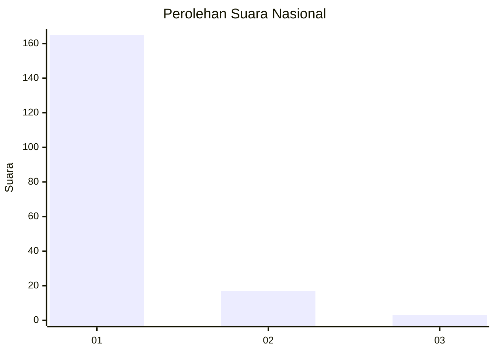
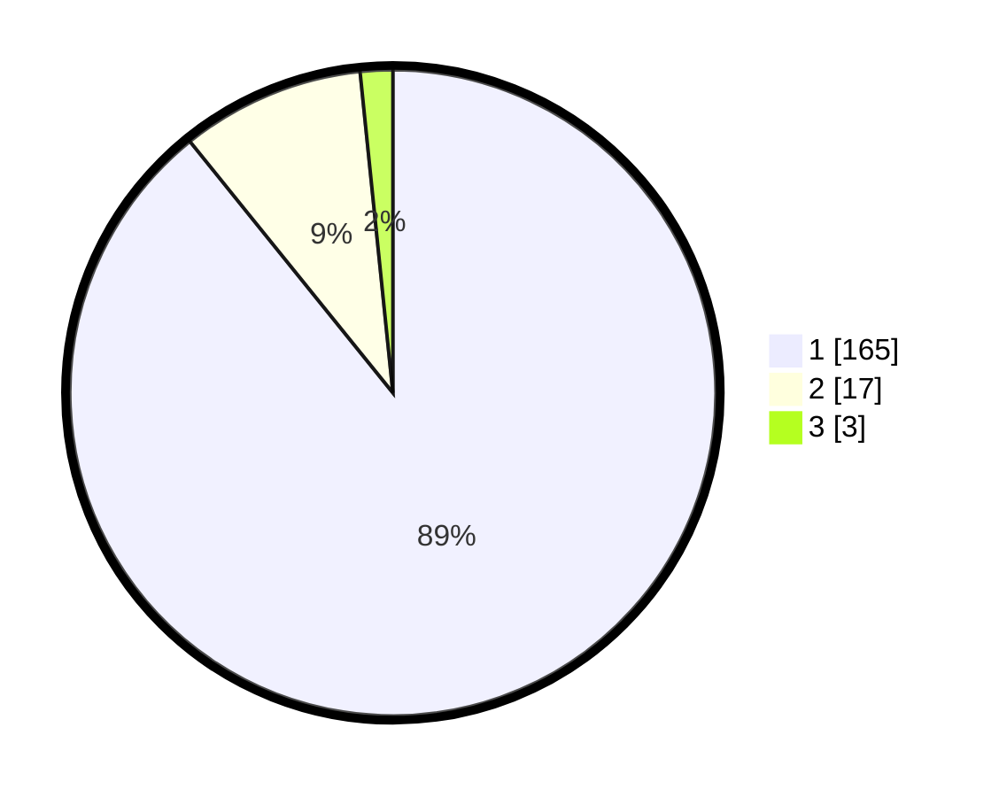

# Hasil

## Grafik

## Tabel

| No. | Nama Paslon    | Suara | Suara (raw) | Persentase |
|:--- |:-------------- | -----:| -----------:| ----------:|
| 1   | ANIES MUHAIMIN | 165   | [165][p-1]  | 89,19      |
| 2   | PRABOWO GIBRAN | 17    | [17][p-2]   | 9,19       |
| 3   | GANJAR MAHFUD  | 3     | [3][p-3]    | 1,62       |

[p-1]: https://github.com/gigit-pemilu/pemilu-2024/blob/main/pilpres/hitung-suara/sub/11-aceh/sub/03-aceh-timur/sub/18-peureulak-barat/sub/2004-teumpeun/sub/002-tps/sub/paslon-1.txt
[p-2]: https://github.com/gigit-pemilu/pemilu-2024/blob/main/pilpres/hitung-suara/sub/11-aceh/sub/03-aceh-timur/sub/18-peureulak-barat/sub/2004-teumpeun/sub/002-tps/sub/paslon-2.txt
[p-3]: https://github.com/gigit-pemilu/pemilu-2024/blob/main/pilpres/hitung-suara/sub/11-aceh/sub/03-aceh-timur/sub/18-peureulak-barat/sub/2004-teumpeun/sub/002-tps/sub/paslon-3.txt

## Foto C Plano

https://sirekap-obj-formc.kpu.go.id/b152/pemilu/ppwp/11/03/18/20/04/1103182004002-20240215-011103--aab36a16-5150-4c47-b9e6-588f1d03f4b7.jpg

https://sirekap-obj-formc.kpu.go.id/b152/pemilu/ppwp/11/03/18/20/04/1103182004002-20240215-040209--d235feb5-13a7-4f17-a83c-90b638ec6130.jpg

https://sirekap-obj-formc.kpu.go.id/b152/pemilu/ppwp/11/03/18/20/04/1103182004002-20240215-040350--2d7dc483-382f-48a3-895f-a6150c17eee6.jpg

## Metadata

| Key        | Value               |
| ---------- | ------------------- |
| Time Stamp | 2024-02-15 12:00:28 |

