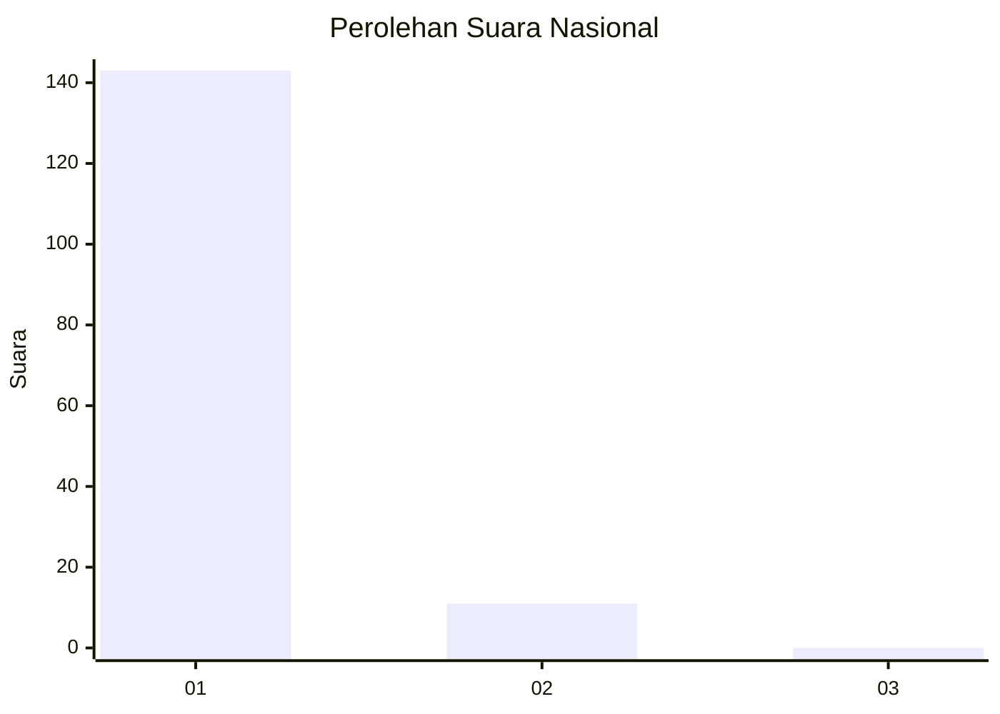
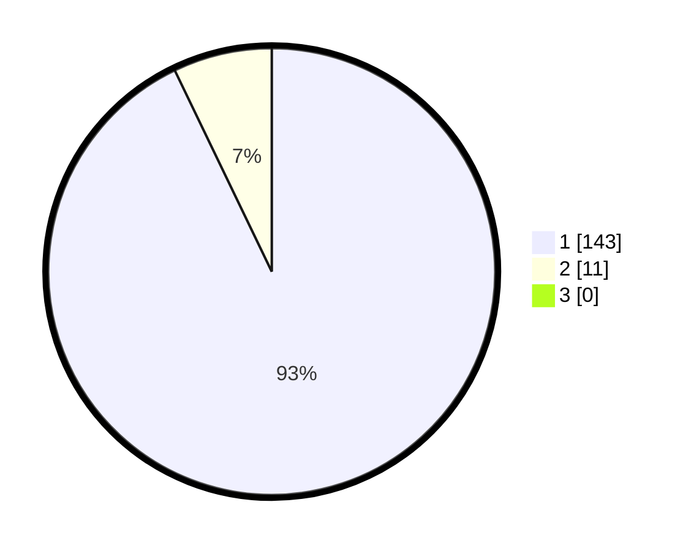

# Hasil

## Grafik

## Tabel

| No. | Nama Paslon    | Suara | Suara (raw) | Persentase |
|:--- |:-------------- | -----:| -----------:| ----------:|
| 1   | ANIES MUHAIMIN | 143   | [143][p-1]  | 92,86      |
| 2   | PRABOWO GIBRAN | 11    | [11][p-2]   | 7,14       |
| 3   | GANJAR MAHFUD  | 0     | [0][p-3]    | 0,00       |

[p-1]: https://github.com/gigit-pemilu/pemilu-2024/blob/main/pilpres/hitung-suara/sub/11-aceh/sub/03-aceh-timur/sub/18-peureulak-barat/sub/2006-alue-bu-jalan/sub/002-tps/sub/paslon-1.txt
[p-2]: https://github.com/gigit-pemilu/pemilu-2024/blob/main/pilpres/hitung-suara/sub/11-aceh/sub/03-aceh-timur/sub/18-peureulak-barat/sub/2006-alue-bu-jalan/sub/002-tps/sub/paslon-2.txt
[p-3]: https://github.com/gigit-pemilu/pemilu-2024/blob/main/pilpres/hitung-suara/sub/11-aceh/sub/03-aceh-timur/sub/18-peureulak-barat/sub/2006-alue-bu-jalan/sub/002-tps/sub/paslon-3.txt

## Foto C Plano

https://sirekap-obj-formc.kpu.go.id/429d/pemilu/ppwp/11/03/18/20/06/1103182006002-20240215-022429--23fefdae-2e97-4016-a8e7-21bca1fbb225.jpg

https://sirekap-obj-formc.kpu.go.id/429d/pemilu/ppwp/11/03/18/20/06/1103182006002-20240215-022531--d00f022d-1d8b-422b-8671-01d598a03515.jpg

https://sirekap-obj-formc.kpu.go.id/429d/pemilu/ppwp/11/03/18/20/06/1103182006002-20240215-022659--487e0fff-6441-4243-8574-12be2b7169eb.jpg

## Metadata

| Key        | Value               |
| ---------- | ------------------- |
| Time Stamp | 2024-02-24 22:31:28 |

