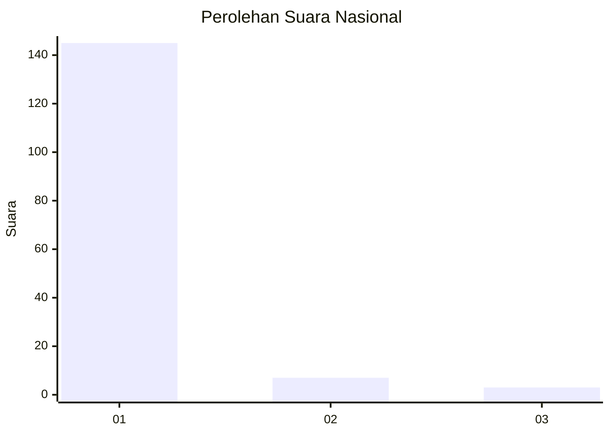
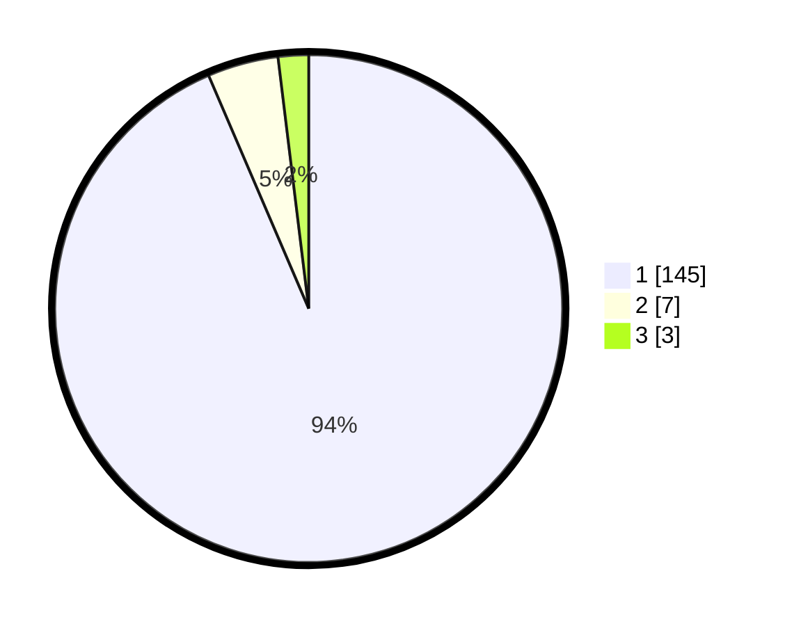

# Hasil

## Grafik

## Tabel

| No. | Nama Paslon    | Suara | Suara (raw) | Persentase |
|:--- |:-------------- | -----:| -----------:| ----------:|
| 1   | ANIES MUHAIMIN | 145   | [145][p-1]  | 93,55      |
| 2   | PRABOWO GIBRAN | 7     | [7][p-2]    | 4,52       |
| 3   | GANJAR MAHFUD  | 3     | [3][p-3]    | 1,94       |

[p-1]: https://github.com/gigit-pemilu/pemilu-2024/blob/main/pilpres/hitung-suara/sub/11-aceh/sub/03-aceh-timur/sub/18-peureulak-barat/sub/2006-alue-bu-jalan/sub/003-tps/sub/paslon-1.txt
[p-2]: https://github.com/gigit-pemilu/pemilu-2024/blob/main/pilpres/hitung-suara/sub/11-aceh/sub/03-aceh-timur/sub/18-peureulak-barat/sub/2006-alue-bu-jalan/sub/003-tps/sub/paslon-2.txt
[p-3]: https://github.com/gigit-pemilu/pemilu-2024/blob/main/pilpres/hitung-suara/sub/11-aceh/sub/03-aceh-timur/sub/18-peureulak-barat/sub/2006-alue-bu-jalan/sub/003-tps/sub/paslon-3.txt

## Foto C Plano

https://sirekap-obj-formc.kpu.go.id/b593/pemilu/ppwp/11/03/18/20/06/1103182006003-20240215-010027--89cd1cb7-8df1-4aa6-9499-9c022421de52.jpg

https://sirekap-obj-formc.kpu.go.id/b593/pemilu/ppwp/11/03/18/20/06/1103182006003-20240215-010549--0dd5d437-58f4-4768-8f09-9b3a1d37f5fb.jpg

https://sirekap-obj-formc.kpu.go.id/b593/pemilu/ppwp/11/03/18/20/06/1103182006003-20240215-010623--fb03a8a2-4cfc-43ba-b275-d67e9edc032b.jpg

## Metadata

| Key        | Value               |
| ---------- | ------------------- |
| Time Stamp | 2024-02-25 22:00:00 |

