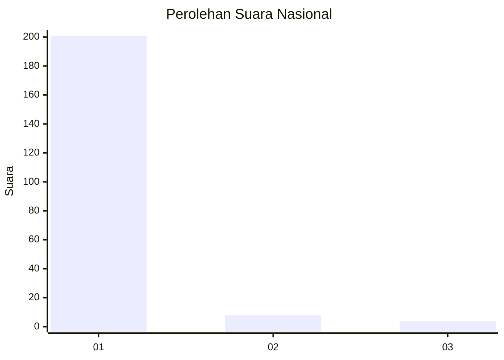
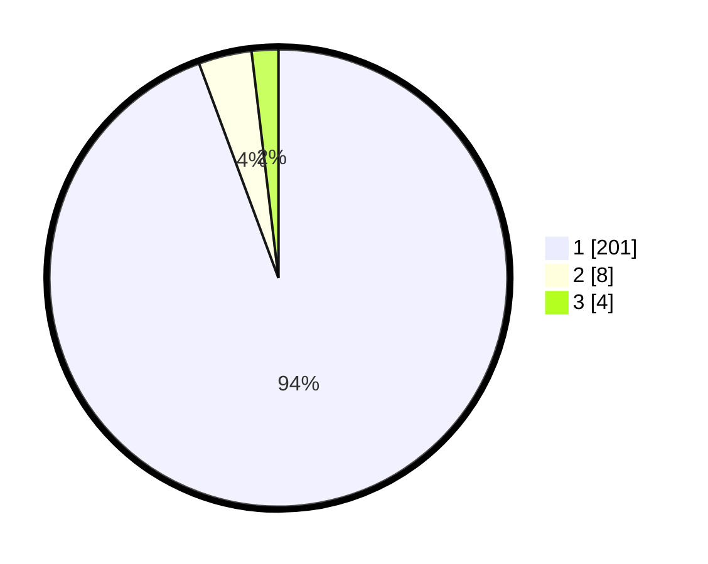

# Hasil

## Grafik

## Tabel

| No. | Nama Paslon    | Suara | Suara (raw) | Persentase |
|:--- |:-------------- | -----:| -----------:| ----------:|
| 1   | ANIES MUHAIMIN | 201   | [201][p-1]  | 94,37      |
| 2   | PRABOWO GIBRAN | 8     | [8][p-2]    | 3,76       |
| 3   | GANJAR MAHFUD  | 4     | [4][p-3]    | 1,88       |

[p-1]: https://github.com/gigit-pemilu/pemilu-2024/blob/main/pilpres/hitung-suara/sub/11-aceh/sub/03-aceh-timur/sub/18-peureulak-barat/sub/2012-paya-biek/sub/001-tps/sub/paslon-1.txt
[p-2]: https://github.com/gigit-pemilu/pemilu-2024/blob/main/pilpres/hitung-suara/sub/11-aceh/sub/03-aceh-timur/sub/18-peureulak-barat/sub/2012-paya-biek/sub/001-tps/sub/paslon-2.txt
[p-3]: https://github.com/gigit-pemilu/pemilu-2024/blob/main/pilpres/hitung-suara/sub/11-aceh/sub/03-aceh-timur/sub/18-peureulak-barat/sub/2012-paya-biek/sub/001-tps/sub/paslon-3.txt

## Foto C Plano

https://sirekap-obj-formc.kpu.go.id/ab9c/pemilu/ppwp/11/03/18/20/12/1103182012001-20240215-113418--fb599d29-492b-4283-a9b2-a2a1e63d6942.jpg

https://sirekap-obj-formc.kpu.go.id/ab9c/pemilu/ppwp/11/03/18/20/12/1103182012001-20240215-111247--ff70bc91-8c4e-4d20-92cd-4a1deb6303e7.jpg

https://sirekap-obj-formc.kpu.go.id/ab9c/pemilu/ppwp/11/03/18/20/12/1103182012001-20240215-132914--22d5e526-e2a9-4665-89f3-10f0c77460be.jpg

## Metadata

| Key        | Value               |
| ---------- | ------------------- |
| Time Stamp | 2024-02-25 12:00:00 |

