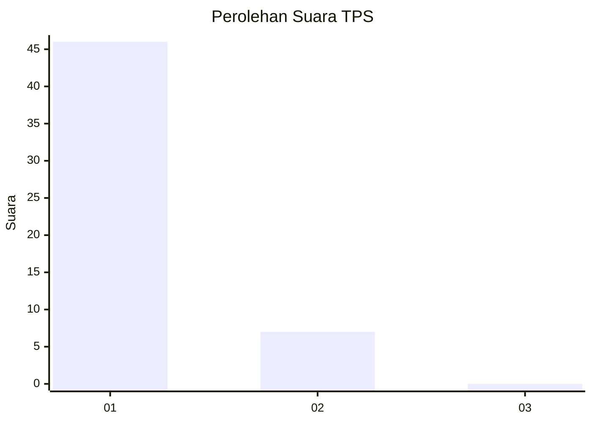
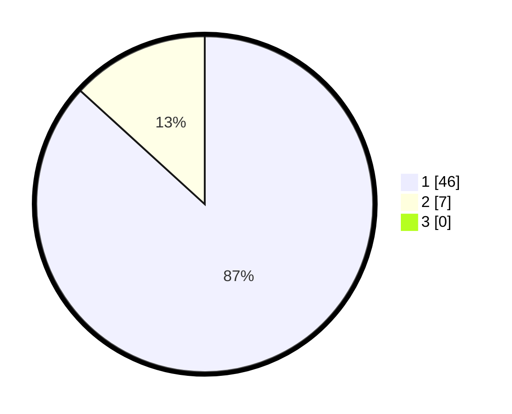

# Hasil

## Grafik

## Tabel

| No. | Nama Paslon    | Suara | Suara (raw) | Persentase |
|:--- |:-------------- | -----:| -----------:| ----------:|
| 1   | ANIES MUHAIMIN | 46    | [46][p-1]   | 86,79      |
| 2   | PRABOWO GIBRAN | 7     | [7][p-2]    | 13,21      |
| 3   | GANJAR MAHFUD  | 0     | [0][p-3]    | 0,00       |

[p-1]: https://github.com/gigit-pemilu/pemilu-2024-11-aceh/blob/main/pilpres/hitung-suara/sub/11-aceh/sub/03-aceh-timur/sub/19-sungai-raya/sub/2001-alue-rangan/sub/002-tps/sub/paslon-1.txt
[p-2]: https://github.com/gigit-pemilu/pemilu-2024-11-aceh/blob/main/pilpres/hitung-suara/sub/11-aceh/sub/03-aceh-timur/sub/19-sungai-raya/sub/2001-alue-rangan/sub/002-tps/sub/paslon-2.txt
[p-3]: https://github.com/gigit-pemilu/pemilu-2024-11-aceh/blob/main/pilpres/hitung-suara/sub/11-aceh/sub/03-aceh-timur/sub/19-sungai-raya/sub/2001-alue-rangan/sub/002-tps/sub/paslon-3.txt

## Foto C Plano

https://sirekap-obj-formc.kpu.go.id/f34a/pemilu/ppwp/11/03/19/20/01/1103192001002-20240218-220937--7847b9ea-9a45-48fa-8f37-70f7e1cafaf9.jpg

https://sirekap-obj-formc.kpu.go.id/f34a/pemilu/ppwp/11/03/19/20/01/1103192001002-20240218-220938--583518fc-3c18-445f-9192-27bd4a0f60f2.jpg

https://sirekap-obj-formc.kpu.go.id/f34a/pemilu/ppwp/11/03/19/20/01/1103192001002-20240218-220938--95a71901-1087-4a22-9e88-f05ad178b21f.jpg

## Metadata

| Key        | Value               |
| ---------- | ------------------- |
| Time Stamp | 2024-02-21 04:00:00 |

## DATA PEMILIH TETAP

Jumlah pemilih dalam DPT: **81**.
 * L: **43**.
 * P: **38**.

## DATA PENGGUNA HAK PILIH

Jumlah pengguna hak pilih dalam DPT: **55**.
 * L: **30**.
 * P: **25**.

Jumlah pengguna hak pilih dalam DPTb: **0**.
 * L: **0**.
 * P: **0**.

Jumlah pengguna hak pilih dalam DPK: **2**.
 * L: **2**.
 * P: **0**.

Jumlah pengguna hak pilih: **57**.
 * L: **32**.
 * P: **25**.

## JUMLAH SUARA SAH DAN TIDAK SAH

JUMLAH SELURUH SUARA SAH: **53**.

JUMLAH SUARA TIDAK SAH: **4**.

JUMLAH SELURUH SUARA SAH DAN SUARA TIDAK SAH: **57**.

