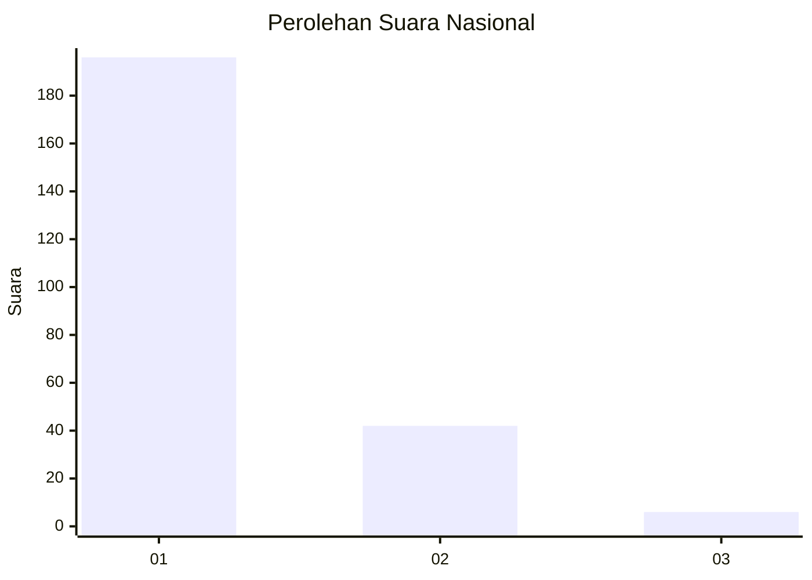
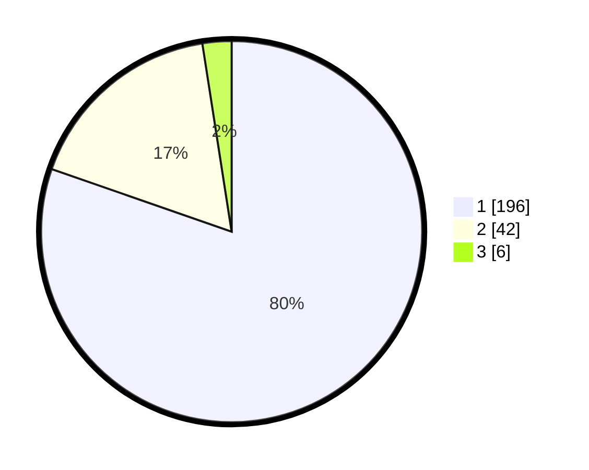

# Hasil

## Grafik

## Tabel

| No. | Nama Paslon    | Suara | Suara (raw) | Persentase |
|:--- |:-------------- | -----:| -----------:| ----------:|
| 1   | ANIES MUHAIMIN | 196   | [196][p-1]  | 80,33      |
| 2   | PRABOWO GIBRAN | 42    | [42][p-2]   | 17,21      |
| 3   | GANJAR MAHFUD  | 6     | [6][p-3]    | 2,46       |

[p-1]: https://github.com/gigit-pemilu/pemilu-2024/blob/main/pilpres/hitung-suara/sub/11-aceh/sub/03-aceh-timur/sub/19-sungai-raya/sub/2003-labuhan-keudee/sub/001-tps/sub/paslon-1.txt
[p-2]: https://github.com/gigit-pemilu/pemilu-2024/blob/main/pilpres/hitung-suara/sub/11-aceh/sub/03-aceh-timur/sub/19-sungai-raya/sub/2003-labuhan-keudee/sub/001-tps/sub/paslon-2.txt
[p-3]: https://github.com/gigit-pemilu/pemilu-2024/blob/main/pilpres/hitung-suara/sub/11-aceh/sub/03-aceh-timur/sub/19-sungai-raya/sub/2003-labuhan-keudee/sub/001-tps/sub/paslon-3.txt

## Foto C Plano

https://sirekap-obj-formc.kpu.go.id/c9dc/pemilu/ppwp/11/03/19/20/03/1103192003001-20240214-210147--3d9478a9-c708-4783-a65a-8abbca8514ec.jpg

https://sirekap-obj-formc.kpu.go.id/c9dc/pemilu/ppwp/11/03/19/20/03/1103192003001-20240214-210202--c4609812-283d-4a6b-a662-3a69edd9803f.jpg

https://sirekap-obj-formc.kpu.go.id/c9dc/pemilu/ppwp/11/03/19/20/03/1103192003001-20240214-210217--3e880598-8903-466e-b071-6f3fbc6edc0e.jpg

## Metadata

| Key        | Value               |
| ---------- | ------------------- |
| Time Stamp | 2024-02-19 06:16:00 |

## DATA PEMILIH TETAP

Jumlah pemilih dalam DPT: **246**.
 * L: **110**.
 * P: **136**.

## DATA PENGGUNA HAK PILIH

Jumlah pengguna hak pilih dalam DPT: **246**.
 * L: **110**.
 * P: **136**.

Jumlah pengguna hak pilih dalam DPTb: **0**.
 * L: **0**.
 * P: **0**.

Jumlah pengguna hak pilih dalam DPK: **0**.
 * L: **0**.
 * P: **0**.

Jumlah pengguna hak pilih: **246**.
 * L: **110**.
 * P: **136**.

## JUMLAH SUARA SAH DAN TIDAK SAH

JUMLAH SELURUH SUARA SAH: **244**.

JUMLAH SUARA TIDAK SAH: **2**.

JUMLAH SELURUH SUARA SAH DAN SUARA TIDAK SAH: **246**.

