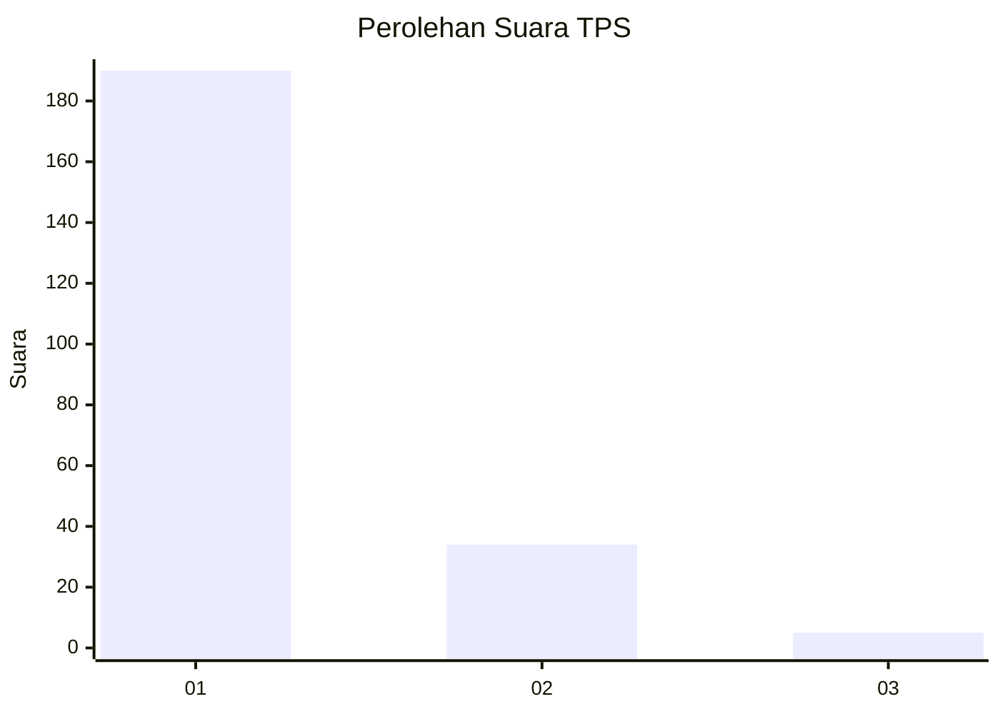
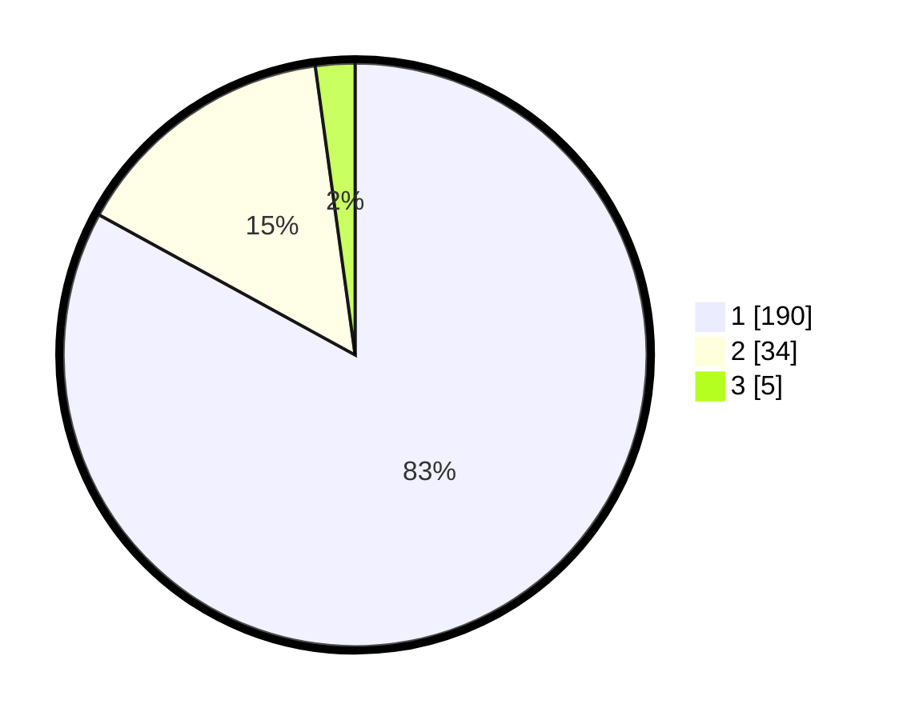

# Hasil

## Grafik

## Tabel

| No. | Nama Paslon    | Suara | Suara (raw) | Persentase |
|:--- |:-------------- | -----:| -----------:| ----------:|
| 1   | ANIES MUHAIMIN | 190   | [190][p-1]  | 82,97      |
| 2   | PRABOWO GIBRAN | 34    | [34][p-2]   | 14,85      |
| 3   | GANJAR MAHFUD  | 5     | [5][p-3]    | 2,18       |

[p-1]: https://github.com/gigit-pemilu/pemilu-2024-11-aceh/blob/main/pilpres/hitung-suara/sub/11-aceh/sub/03-aceh-timur/sub/19-sungai-raya/sub/2003-labuhan-keudee/sub/005-tps/sub/paslon-1.txt
[p-2]: https://github.com/gigit-pemilu/pemilu-2024-11-aceh/blob/main/pilpres/hitung-suara/sub/11-aceh/sub/03-aceh-timur/sub/19-sungai-raya/sub/2003-labuhan-keudee/sub/005-tps/sub/paslon-2.txt
[p-3]: https://github.com/gigit-pemilu/pemilu-2024-11-aceh/blob/main/pilpres/hitung-suara/sub/11-aceh/sub/03-aceh-timur/sub/19-sungai-raya/sub/2003-labuhan-keudee/sub/005-tps/sub/paslon-3.txt

## Foto C Plano

https://sirekap-obj-formc.kpu.go.id/6f6a/pemilu/ppwp/11/03/19/20/03/1103192003005-20240214-203805--cf80d37c-026b-4595-a6d1-20c3e477b100.jpg

https://sirekap-obj-formc.kpu.go.id/6f6a/pemilu/ppwp/11/03/19/20/03/1103192003005-20240214-204002--85af1f01-4244-4777-b140-fa94db7eb502.jpg

https://sirekap-obj-formc.kpu.go.id/6f6a/pemilu/ppwp/11/03/19/20/03/1103192003005-20240214-204204--8710114d-79df-42ff-801d-d44ac2e92449.jpg

## Metadata

| Key        | Value               |
| ---------- | ------------------- |
| Time Stamp | 2024-02-24 22:31:28 |

