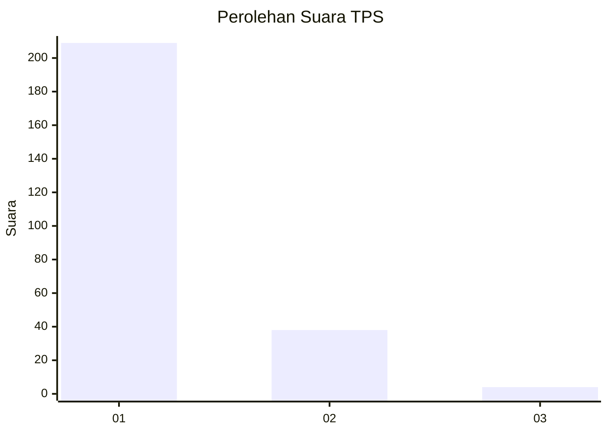
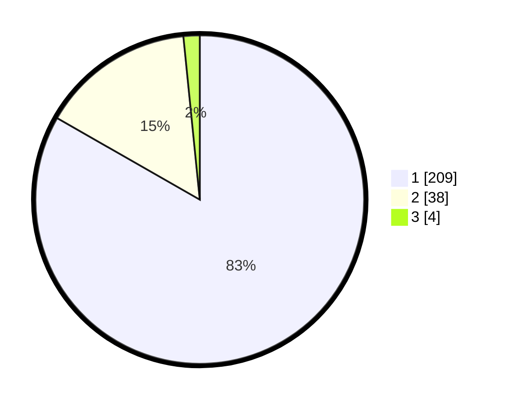

# Hasil

## Grafik

## Tabel

| No. | Nama Paslon    | Suara | Suara (raw) | Persentase |
|:--- |:-------------- | -----:| -----------:| ----------:|
| 1   | ANIES MUHAIMIN | 209   | [209][p-1]  | 83,27      |
| 2   | PRABOWO GIBRAN | 38    | [38][p-2]   | 15,14      |
| 3   | GANJAR MAHFUD  | 4     | [4][p-3]    | 1,59       |

[p-1]: https://github.com/gigit-pemilu/pemilu-2024-11-aceh/blob/main/pilpres/hitung-suara/sub/11-aceh/sub/03-aceh-timur/sub/19-sungai-raya/sub/2003-labuhan-keudee/sub/008-tps/sub/paslon-1.txt
[p-2]: https://github.com/gigit-pemilu/pemilu-2024-11-aceh/blob/main/pilpres/hitung-suara/sub/11-aceh/sub/03-aceh-timur/sub/19-sungai-raya/sub/2003-labuhan-keudee/sub/008-tps/sub/paslon-2.txt
[p-3]: https://github.com/gigit-pemilu/pemilu-2024-11-aceh/blob/main/pilpres/hitung-suara/sub/11-aceh/sub/03-aceh-timur/sub/19-sungai-raya/sub/2003-labuhan-keudee/sub/008-tps/sub/paslon-3.txt

## Foto C Plano

https://sirekap-obj-formc.kpu.go.id/e699/pemilu/ppwp/11/03/19/20/03/1103192003008-20240214-212057--6d577606-7cf4-4bd1-b8ea-446d5bb19dd4.jpg

https://sirekap-obj-formc.kpu.go.id/e699/pemilu/ppwp/11/03/19/20/03/1103192003008-20240214-211948--8eb7f2a5-45c4-410e-8f11-11283c877ae5.jpg

https://sirekap-obj-formc.kpu.go.id/e699/pemilu/ppwp/11/03/19/20/03/1103192003008-20240214-212323--f845d874-3e9a-4cfc-ab9c-dba02b5168c7.jpg

## Metadata

| Key        | Value               |
| ---------- | ------------------- |
| Time Stamp | 2024-02-24 22:31:28 |

