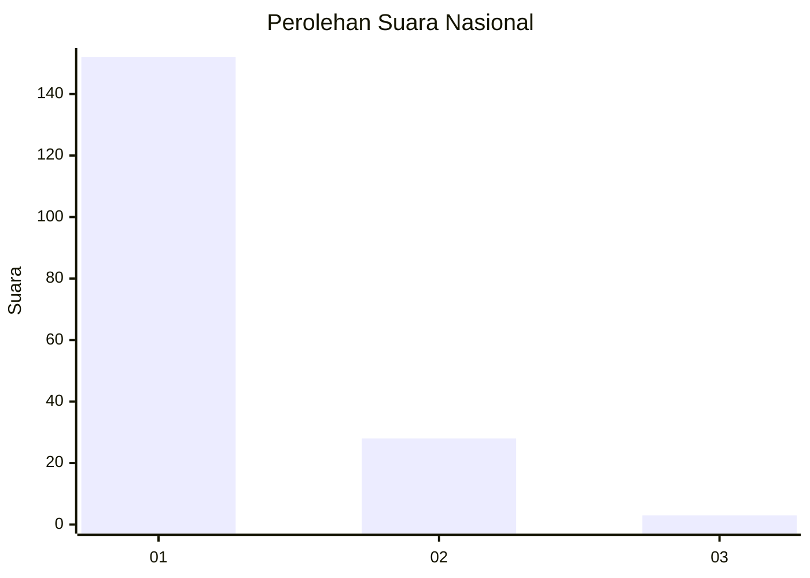
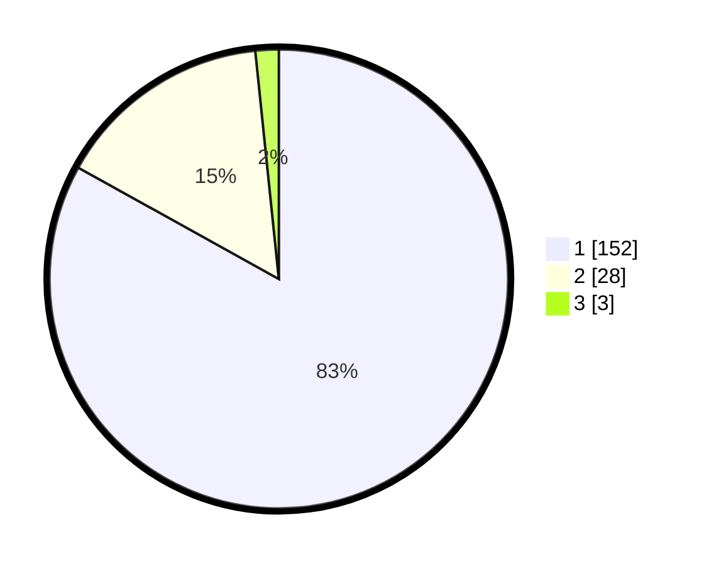

# Hasil

## Grafik

## Tabel

| No. | Nama Paslon    | Suara | Suara (raw) | Persentase |
|:--- |:-------------- | -----:| -----------:| ----------:|
| 1   | ANIES MUHAIMIN | 152   | [152][p-1]  | 83,06      |
| 2   | PRABOWO GIBRAN | 28    | [28][p-2]   | 15,30      |
| 3   | GANJAR MAHFUD  | 3     | [3][p-3]    | 1,64       |

[p-1]: https://github.com/gigit-pemilu/pemilu-2024/blob/main/pilpres/hitung-suara/sub/11-aceh/sub/03-aceh-timur/sub/19-sungai-raya/sub/2004-buket-seulamat/sub/002-tps/sub/paslon-1.txt
[p-2]: https://github.com/gigit-pemilu/pemilu-2024/blob/main/pilpres/hitung-suara/sub/11-aceh/sub/03-aceh-timur/sub/19-sungai-raya/sub/2004-buket-seulamat/sub/002-tps/sub/paslon-2.txt
[p-3]: https://github.com/gigit-pemilu/pemilu-2024/blob/main/pilpres/hitung-suara/sub/11-aceh/sub/03-aceh-timur/sub/19-sungai-raya/sub/2004-buket-seulamat/sub/002-tps/sub/paslon-3.txt

## Foto C Plano

https://sirekap-obj-formc.kpu.go.id/cc53/pemilu/ppwp/11/03/19/20/04/1103192004002-20240215-061515--b2a7c3cf-3a18-43d5-aa36-0a948f8453b2.jpg

https://sirekap-obj-formc.kpu.go.id/cc53/pemilu/ppwp/11/03/19/20/04/1103192004002-20240215-061733--6dd37eea-7826-4bbc-abde-51cb46e9468d.jpg

https://sirekap-obj-formc.kpu.go.id/cc53/pemilu/ppwp/11/03/19/20/04/1103192004002-20240215-061937--d207f825-d440-4421-a585-9a87e47c111c.jpg

## Metadata

| Key        | Value               |
| ---------- | ------------------- |
| Time Stamp | 2024-02-24 22:31:28 |

